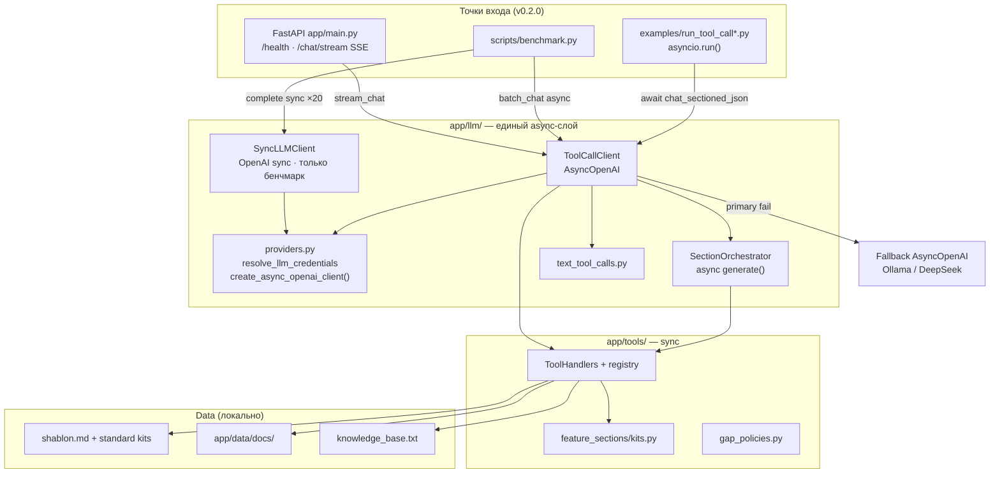
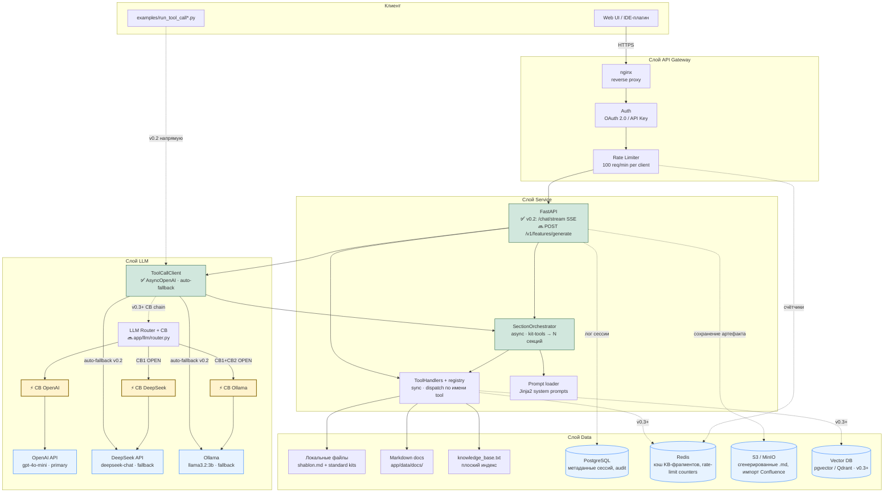
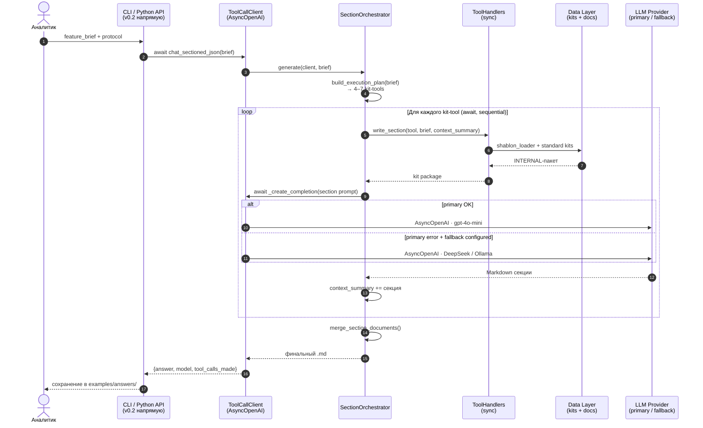
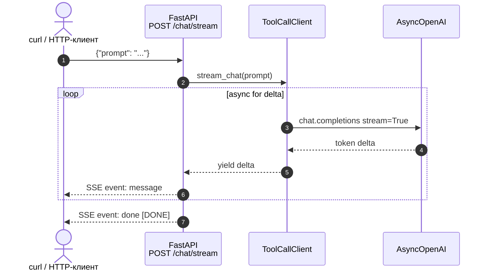
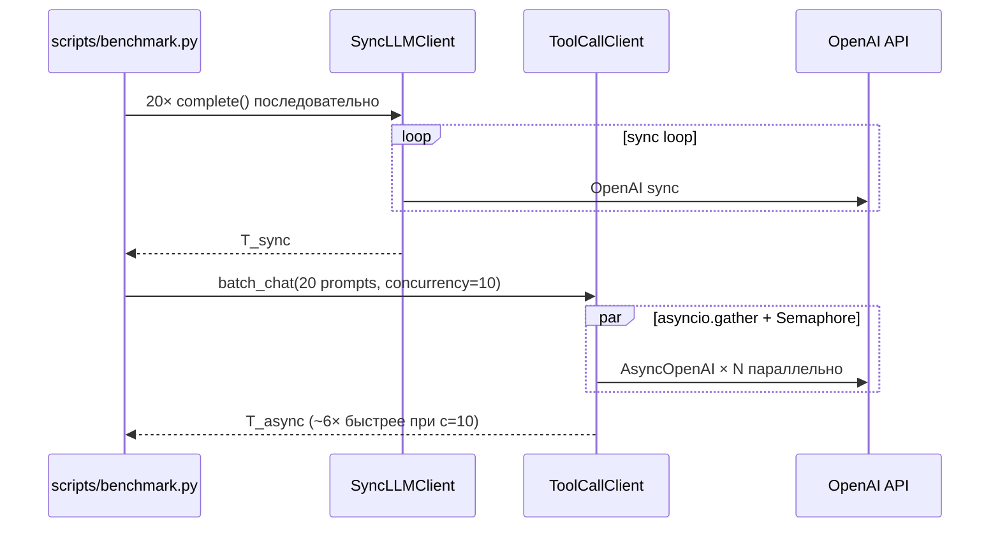

# Архитектура DocIntel (m3_b3)

**DocIntel** — AI-ассистент системного аналитика с циклом **LLM tool calling**: генерация документации фичи по корпоративному шаблону и standard kits, поиск по проектной документации (заглушка).

Документ описывает **целевую production-архитектуру** дипломного проекта и отмечает, что уже реализовано в коде. Текущая версия репозитория — **v0.2.0**.

---

## Что изменилось в архитектуре (v0.2.0 vs v0.1.0)

| Область | v0.1.0 (m3_b1) | v0.2.0 (m3_b3) |
|---------|----------------|----------------|
| LLM-слой | Синхронный `OpenAI` в `ToolCallClient` | **Async** `AsyncOpenAI` — единый `ToolCallClient` |
| Точки входа | Только CLI / Python API | + **FastAPI** (`/health`, `/chat/stream` SSE) |
| Параллелизм | Нет | `asyncio.gather` + `Semaphore` в `batch_chat()` |
| Fallback | Ручной `provider="primary"\|"fallback"` | **Auto-fallback** primary → Ollama/DeepSeek при ошибке + ручной выбор |
| Дублирование | Планировался отдельный `app/services/` | **Убрано** — всё в `app/llm/` |
| Бенчмарк | Нет | `SyncLLMClient` (baseline) vs `ToolCallClient.batch_chat()` |
| Sectioned flow | Sync `chat_sectioned()` | Async `await chat_sectioned_json()` — **логика та же**, последовательно |
| Tool handlers | Sync | Sync (без изменений — работа с файлами) |

**Не изменилось:** kit-tools, GAP-политики, `build_execution_plan`, последовательная оркестрация секций (зависимость `context_summary`), заглушка `search_kb`.

---

## Текущая реализация v0.2.0 (слой LLM и точки входа)

**Ключевой принцип v0.2.0:** один класс `ToolCallClient` обслуживает DocIntel (sectioned), бенчмарк (`complete` / `batch_chat`) и SSE (`stream_chat`). Синхронный код остаётся только в handlers и в `SyncLLMClient` для сравнения производительности.

---

## Диаграмма компонентов (целевая production)

**Условные обозначения**

| Символ | Значение |
|--------|----------|
| ✅ v0.2 | Реализовано в текущем коде |
| ⚡ CB | Circuit Breaker (один экземпляр на провайдера) — **план v0.3** |
| Сплошная стрелка | Реализовано или заложено в текущем коде |
| Пунктир | Планируется в дорожной карте (v0.3–v1.0) |

---

## Поток: генерация документации фичи (sectioned)

Сценарий: аналитик отправляет **feature brief** → получает **единый Markdown-документ**. В v0.2.0 все LLM-вызовы — **async**, секции — **последовательно**.

**Соответствие коду (v0.2.0):** шаги 3–18 — `SectionOrchestrator.generate()` + async `ToolCallClient`; CLI/examples вызывают оркестратор **напрямую**, минуя Gateway. HTTP endpoint для полной генерации фичи — **ещё не реализован** (только SSE для простых промптов).

---

## Поток: SSE-стрим (v0.2.0)

Отдельный сценарий — **не** sectioned DocIntel, а демонстрация `stream_chat()` через FastAPI.

Заголовки ответа: `X-Accel-Buffering: no`, `Cache-Control: no-cache` — для корректной работы через nginx.

---

## Поток: бенчмарк sync vs async (v0.2.0)

---

## Точки отказоустойчивости

| # | Точка | Механизм | Где в коде / план |
|---|-------|----------|-------------------|
| 1 | **Rate Limiter** (Gateway) | 100 req/min → HTTP 429 | План: nginx + Redis |
| 2 | **Auth fallback** | IdP недоступен → 401 closed | План: Gateway |
| 3 | **CB OpenAI / DeepSeek / Ollama** | 50% errors / 30 s → OPEN | План: `app/llm/router.py` |
| 4 | **Auto-fallback primary → fallback** | При exception в `_create_completion` | ✅ `app/llm/client.py` |
| 5 | **Ручной выбор провайдера** | `provider="primary"\|"fallback"` | ✅ `ToolCallClient.__init__` |
| 6 | **Concurrency limit** | `Semaphore(LLM_CONCURRENCY)` | ✅ `batch_chat`, `complete` |
| 7 | **Sectioned orchestration** | 4–7 коротких вызовов вместо одного контекста | ✅ `section_orchestrator.py` |
| 8 | **Timeout per section** | `SUPPORT_TIMEOUT_SECONDS` (180–300 с) | ✅ `config.py` |
| 9 | **Business timeout** | `asyncio.timeout(LLM_BUSINESS_TIMEOUT)` | ✅ `complete()` |
| 10 | **SDK retry** | `max_retries=LLM_MAX_RETRIES` (429/5xx) | ✅ `create_async_openai_client()` |
| 11 | **GAP-политики** | Неизвестные факты → `GAP-*` | ✅ `gap_policies.py` |
| 12 | **Кэш KB** | Redis cache-aside | План: v0.3 |

---

## ADR-001: Паттерн взаимодействия клиента с сервисом

**Status:** Accepted (уточнён в v0.2.0)  
**Date:** 2026-06-19

### Context

| Параметр | Значение |
|----------|----------|
| **Сценарий** | Агент с tool calling: brief → plan kit-tools → handler (kits) + LLM (Markdown). Вспомогательно: `search_kb` (заглушка). |
| **Нагрузка (целевая)** | 5–20 RPM на инстанс |
| **Sectioned-режим** | 4–7 async-вызовов **последовательно** (`await` в цикле) |
| **Batch-режим (v0.2)** | N **независимых** промптов параллельно — только бенчмарк / utility, не DocIntel |

### Decision

1. **Генерация документа фичи** — **Request-Response** (async внутри, один артефакт наружу). Sectioned flow не стримится по секциям.
2. **Простые промпты (v0.2)** — дополнительно реализован **SSE** (`POST /chat/stream`) для демонстрации `stream_chat()`. Это **не** меняет основной DocIntel-flow.
3. Tool calling по-прежнему требует **полного ответа модели** перед dispatch handler — streaming несовместим с native tool calls в одном round-trip.

### Изменение относительно v0.1.0

В v0.1.0 SSE отвергался как избыточный для DocIntel. В v0.2.0 SSE добавлен **изолированно** для `stream_chat()` (учебный модуль async LLM), без интеграции в sectioned orchestrator.

### Consequences

**Выиграно:** простая отладка sectioned flow; параллелизм там, где секции независимы (`batch_chat`); TTFT-метрики через SSE.

**Trade-offs:** длинный CLI-запрос (до 8 мин) без прогресса «секция 3 из 7»; при обрыве — потеря всей генерации (mitigation: черновики в Redis — v0.4+).

---

## ADR-002: Стратегия fault tolerance для LLM-провайдеров

**Status:** Accepted (частично реализовано в v0.2.0)  
**Date:** 2026-06-19

### Decision

| Роль | Провайдер | Модель |
|------|-----------|--------|
| **Primary** | OpenAI API | `gpt-4o-mini` |
| **Fallback** | DeepSeek **или** Ollama (`FALLBACK_BACKEND`) | `deepseek-chat` / `llama3.2:3b` |

**Реализация v0.2.0:**

- `ToolCallClient` при `provider="primary"` создаёт второй `AsyncOpenAI` для fallback.
- При **любом exception** в `_create_completion()` — повторный вызов через fallback-клиент (если настроен).
- Ручной режим: `ToolCallClient(provider="fallback")` — только Ollama/DeepSeek без primary.
- **Circuit Breaker** и полноценный **LLM Router** — по-прежнему план (`app/llm/router.py`, v0.3).

**Удалено в v0.2.0:** поддержка Anthropic как отдельного провайдера.

---

## Потенциальные точки отказа

### API Gateway

| При выпадении | Паттерн смягчения | Graceful degradation |
|---------------|-------------------|----------------------|
| nginx / LB недоступен | Health checks + второй ingress | 502; CLI v0.2 работает напрямую с Python API |
| Auth (IdP) недоступен | Cached JWKS | **Closed failure:** 401 |
| Rate limiter (Redis) недоступен | Fail-open in-memory | Сервис жив, алерт ops |

### Service

| При выпадении | Паттерн смягчения | Graceful degradation |
|---------------|-------------------|----------------------|
| FastAPI crash | 2+ replicas, K8s probes | Retry; 503 |
| SSE client disconnect | `request.is_disconnected()` | ✅ генератор останавливается (`app/main.py`) |
| OOM на большом brief | Лимит body 32 KB | 413 |

### LLM

| При выпадении | Паттерн смягчения | Graceful degradation |
|---------------|-------------------|----------------------|
| **OpenAI недоступен** | Auto-fallback v0.2 → DeepSeek/Ollama | ✅ прозрачно в `_create_completion` |
| **Все провайдеры недоступны** | Exception → caller | CLI/API возвращает ошибку |
| Timeout одной секции | Per-section timeout | Частичный документ (план v0.4) |
| Rate limit 429 | SDK retry + fallback | ✅ `max_retries` + auto-fallback |

### Data

| При выпадении | Паттерн смягчения | Graceful degradation |
|---------------|-------------------|----------------------|
| **kits / shablon.md** | Git-versioned mount | **Hard failure:** 500 |
| **Markdown docs** | S3 replica (план) | `search_kb` — «не найдено»; генерация по brief OK |
| **PostgreSQL / Redis / S3** | План v0.3–v1.0 | Генерация без persistence |

---

## Маппинг на текущий код (v0.2.0)

| Компонент | Файл / модуль | Статус |
|-----------|---------------|--------|
| ToolCallClient (async) | `app/llm/client.py` | ✅ |
| SyncLLMClient (benchmark) | `app/llm/client.py` | ✅ baseline only |
| AsyncOpenAI factory | `app/llm/providers.py` | ✅ |
| SectionOrchestrator | `app/llm/section_orchestrator.py` | ✅ async |
| Text tool calls parser | `app/llm/text_tool_calls.py` | ✅ |
| ToolHandlers / registry | `app/tools/registry.py` | ✅ sync |
| FastAPI + SSE | `app/main.py`, `app/schemas/chat.py` | ✅ partial |
| Бенчмарк | `scripts/benchmark.py` | ✅ |
| Standard kits + shablon | `feature-methodology-project/` | ✅ |
| search_kb (token overlap) | `app/tools/search_kb/handler.py` | ⚠️ заглушка |
| LLM Router + Circuit Breaker | — | 🔜 v0.3 |
| POST /v1/features/generate | — | 🔜 |
| API Gateway (nginx) | — | 🔜 |
| PostgreSQL / Redis / S3 | — | 🔜 v0.3–v1.0 |
| ~~app/services/~~ | удалён в v0.2.0 | — |

---

## Связанные документы

- [README.md](../README.md) — установка, tools, переменные окружения, таблица «Что изменилось в v0.2.0»
- [scripts/benchmark_results.md](../scripts/benchmark_results.md) — результаты sync vs async
- [Дорожная карта](../README.md#дорожная-карта) — v0.3 … v1.0
