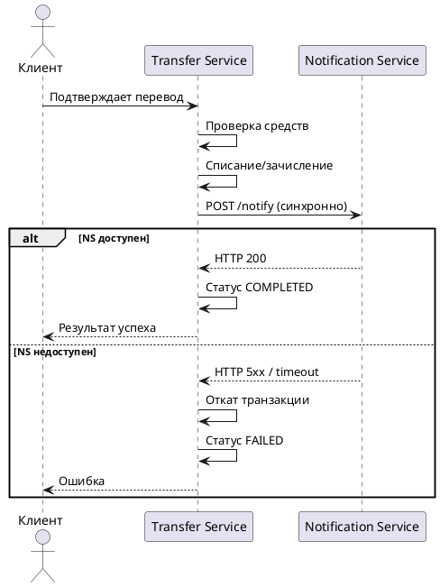
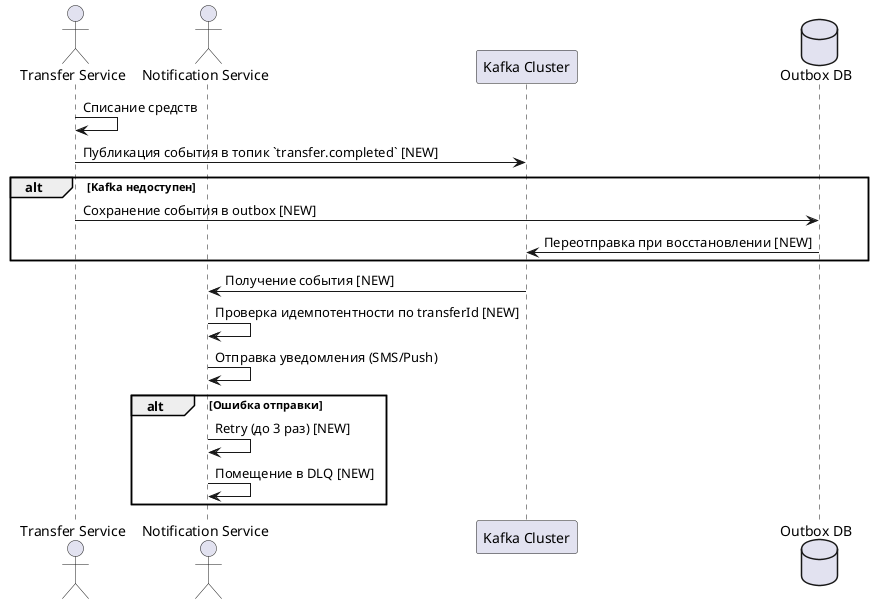

# Асинхронная отправка уведомлений по переводам

## 1. Бизнес-требования

### 1.1. Цель

**Какую бизнес-проблему решает:**
Синхронный вызов Notification Service после P2P-перевода увеличивает latency операции и создаёт каскадные отказы при недоступности Notification Service.

**Какую ценность приносит пользователю:**
Снижение времени выполнения перевода и повышение доступности сервиса переводов (перевод не откатывается при недоступности уведомлений).

**Какие метрики улучшает:**
Latency операции перевода (p95/p99), доступность Transfer Service, процент успешных переводов. Целевые значения: GAP-REQ-001.

**Источник требования:** Product request (описание пользователя)

**Стейкхолдеры:**

| Стейкхолдер | Роль | Интерес / ожидание | Влияние / ответственность |
|-------------|------|--------------------|---------------------------|
| Команда Transfer Service | Владелец producer | Снизить latency, исключить каскадные отказы | Реализует публикацию события в Kafka |
| Команда Notification Service | Владелец consumer | Получать события асинхронно, гарантировать доставку уведомлений | Реализует идемпотентную обработку и retry |
| Команда платформы Kafka | Владелец инфраструктуры | Обеспечить работу топика `transfer.completed` | Настройка retention, мониторинг, DLQ |
| Product Owner сервиса переводов | Владелец продукта | Повысить стабильность и скорость переводов | Принимает функциональный результат |

**Задача в Jira:** GAP-REQ-002

**SMART-цель:**

| Критерий | Описание |
|----------|----------|
| Specific | Перевести отправку уведомлений о P2P-переводах на асинхронную модель через Kafka |
| Measurable | GAP-REQ-001 |
| Achievable | Достижимо при наличии корпоративного Kafka-кластера и готовности команд Transfer Service и Notification Service |
| Relevant | Снижает latency и повышает отказоустойчивость сервиса переводов |
| Time-bound | GAP-REQ-003 |

**Бизнес-правила и ограничения:**

| ID | Правило / Ограничение | Источник | Применяется к |
|----|----------------------|----------|---------------|
| BR-01 | При недоступности Kafka перевод не откатывается — уведомление best-effort | Описание пользователя | Transfer Service |
| BR-02 | Гарантия доставки at-least-once | Описание пользователя | Kafka, Notification Service |
| BR-03 | Идемпотентная обработка по transferId | Описание пользователя | Notification Service |
| BR-04 | DLQ для сообщений после 3 неудачных retry | Описание пользователя | Notification Service, Kafka |
| BR-05 | Retention топика 7 дней | Описание пользователя | Kafka |
| CN-01 | Событие должно попадать в outbox при недоступности Kafka и переотправляться позже | Описание пользователя | Transfer Service |

**Gaps и допущения:**

| ID | Тип | Где обнаружено | Что не хватает / что предполагается | Как закрыть |
|----|-----|----------------|-------------------------------------|-------------|
| GAP-REQ-001 | Gap | SMART — Measurable | Не указаны целевые значения метрик (latency p95/p99, доступность, процент успешных переводов) | Уточнить у Product Owner |
| GAP-REQ-002 | Gap | Задача в Jira | Отсутствует ссылка на задачу в Jira | Добавить ссылку после создания задачи |
| GAP-REQ-003 | Gap | SMART — Time-bound | Не указан срок реализации (релиз, квартал или дата) | Уточнить у Product Owner |

## 2. Ограничения и допущения

| Ограничение/допущение | Тип | Описание | Обоснование |
|----------------------|-----|----------|-------------|
| Использование корпоративного Kafka-кластера | Техническое | Transfer Service и Notification Service используют существующий корпоративный Kafka-кластер | Описание пользователя |
| Формат события: transferId, clientId, amount, currency, completedAt, channel | Техническое | Событие содержит указанные поля | Описание пользователя |
| Гарантия at-least-once | Техническое | Kafka гарантирует доставку минимум один раз | Описание пользователя |
| Идемпотентность по transferId | Техническое | Notification Service обрабатывает каждое событие идемпотентно | Описание пользователя |
| 3 retry перед DLQ | Техническое | Максимум 3 повторные попытки обработки | Описание пользователя |
| Retention 7 дней | Техническое | Сообщения в топике хранятся 7 дней | Описание пользователя |
| Outbox pattern при недоступности Kafka | Архитектурное | Событие сохраняется в outbox и переотправляется позже | Описание пользователя |
| Best-effort для уведомлений | Бизнес-ограничение | Уведомление не критично для успеха перевода | Описание пользователя |

**Gaps и допущения:**

| ID | Тип | Где обнаружено | Что не хватает / что предполагается | Как закрыть |
|----|-----|----------------|-------------------------------------|-------------|
| Gaps не выявлены | - | - | - | - |

### 1.2. Процесс/Сервис AS IS

> **Kit (Use Case):** `use-case-standard-kit` — вариант **AS IS**
> **Kit (диаграмма, опционально):** `uml-diagram-standard-kit`
> **Покрывает стандарты:** СТД-ASIS-00…06, СТД-UC-01/02, СТД-УСЛОВ-01/02, СТД-АЛГ-01–06, СТД-АЛЬТ-01–03.

**Как работает сейчас:**

После успешного выполнения P2P-перевода между счетами клиента Transfer Service синхронно вызывает Notification Service по REST для отправки уведомления. Операция перевода считается завершённой только после получения ответа от Notification Service. При недоступности Notification Service перевод не завершается, возникает каскадный отказ.

**Use Case AS IS:**

| Элемент | Значение |
|---------|----------|
| Название | Выполнить P2P-перевод с синхронным уведомлением |
| Актор(ы) | Клиент (физическое лицо, авторизован в мобильном банке) |
| Триггер | Клиент подтверждает P2P-перевод между своими счетами |
| Предусловия | См. таблицу предусловий ниже |
| Постусловия | См. таблицу постусловий ниже |
| Бизнес-правила | BR-01, BR-02, BR-03, BR-04, BR-05, CN-01 (см. раздел 1.1) |

**Предусловия AS IS:**

| № | Предусловие | Проверяемое условие |
|---|-------------|---------------------|
| 1 | Клиент авторизован в мобильном банке | session.status = ACTIVE, session.role = CLIENT |
| 2 | У клиента есть хотя бы 2 активных счёта | accounts.count(status = ACTIVE) ≥ 2 |
| 3 | Счёт-источник не заблокирован | sourceAccount.status ∈ {ACTIVE} |
| 4 | На счёте-источнике достаточно средств | sourceAccount.availableBalance ≥ transferAmount |
| 5 | Notification Service доступен | HTTP-статус 200 при health-check |

**Постусловия AS IS:**

| Исход | Постусловие |
|-------|-------------|
| Успех | Средства списаны со счёта-источника, зачислены на счёт-получатель. Транзакция создана в статусе COMPLETED. Уведомление отправлено клиенту. Запись в истории операций создана |
| Неуспех (бизнес) | Средства не списаны. Транзакция создана в статусе FAILED с кодом ошибки. Клиент уведомлён о причине |
| Неуспех (техн.) | Средства не списаны (транзакция откачена). Транзакция в статусе FAILED. Клиент не уведомлён. Alert в мониторинг |

**Основной сценарий AS IS:**

```
Шаг 1:  Клиент выбирает счёт-источник и счёт-получатель из списка своих активных счетов
Шаг 2:  Клиент вводит сумму перевода
Шаг 3:  Система проверяет достаточность средств на счёте-источнике
          ЕСЛИ [BR-01] средств достаточно
            ТО сценарий продолжается с шага 4
          ИНАЧЕ
            ПЕРЕЙТИ К альтернативному сценарию 3a
Шаг 4:  Система списывает сумму со счёта-источника и зачисляет на счёт-получатель
Шаг 5:  Система (Transfer Service) синхронно вызывает Notification Service по REST
          ЕСЛИ [BR-02] Notification Service доступен и возвращает HTTP 200
            ТО сценарий продолжается с шага 6
          ИНАЧЕ
            ПЕРЕЙТИ К альтернативному сценарию 5a
Шаг 6:  Система завершает транзакцию со статусом COMPLETED
Шаг 7:  Система отображает клиенту результат перевода
```

**Альтернативные сценарии AS IS:**

```
3a. Недостаточно средств (бизнес-альтернатива):
  3a.1. Система отображает сообщение об ошибке «Недостаточно средств»
  3a.2. Сценарий завершается неуспешно

5a. Notification Service недоступен (техническая альтернатива):
  5a.1. Система откатывает транзакцию (средства не списаны)
  5a.2. Система создаёт транзакцию в статусе FAILED
  5a.3. Система отправляет alert в мониторинг
  5a.4. Система отображает клиенту сообщение об ошибке «Сервис временно недоступен»
  5a.5. Сценарий завершается неуспешно
```

**Таблица проблем AS IS:**

| Проблема | Влияние на бизнес | Частота | Стоимость проблемы | Приоритет |
|----------|-------------------|---------|-------------------|-----------|
| Синхронный вызов Notification Service увеличивает latency операции | Ухудшение UX, рост времени ответа API | Каждый перевод | GAP-REQ-001: целевые значения latency не указаны | Высокий |
| Каскадный отказ при недоступности Notification Service | Перевод не выполняется, клиент не может перевести средства | При недоступности Notification Service | GAP-REQ-001: целевые значения доступности не указаны | Критический |
| Отсутствие повторной отправки уведомления при сбое | Клиент не получает уведомление о переводе | При сбое Notification Service | GAP-REQ-001: процент успешных уведомлений не указан | Средний |

**Диаграмма AS IS (желательно):**



**Gaps и допущения:**

| ID | Тип | Где обнаружено | Что не хватает / что предполагается | Как закрыть |
|----|-----|----------------|-------------------------------------|-------------|
| GAP-REQ-001 | Gap | Таблица проблем AS IS | Не указаны целевые значения метрик (latency p95/p99, доступность, процент успешных переводов) | Уточнить у Product Owner |
| GAP-REQ-002 | Gap | Задача в Jira | Отсутствует ссылка на задачу в Jira | Добавить ссылку после создания задачи |
| GAP-REQ-003 | Gap | SMART — Time-bound | Не указан срок реализации (релиз, квартал или дата) | Уточнить у Product Owner |
| GAP-UC-001 | Gap | Основной сценарий, шаг 5 | Не указан таймаут синхронного вызова REST | Уточнить у архитектора |
| GAP-UC-002 | Gap | Альтернативный сценарий 5a | Не указано поведение при частичной недоступности (например, timeout) | Уточнить у архитектора |

### 1.3. Процесс/Сервис TO BE

> **Kit (Use Case):** `use-case-standard-kit` — вариант **TO BE** — **обязательны таблица Use Case и сценарии**
> **Kit (диаграмма, опционально):** `uml-diagram-standard-kit`
> **Покрывает стандарты:** СТД-TOBE-00…06, СТД-UC-01/02, СТД-СВЯЗЬ-01–03.

**Целевое состояние:**

После успешного списания средств Transfer Service асинхронно публикует событие в топик Kafka `transfer.completed`. Notification Service подписывается на топик, обрабатывает событие и отправляет клиенту уведомление (SMS и/или push). При недоступности Kafka событие сохраняется в outbox и переотправляется позже. Перевод не откатывается при недоступности Kafka или Notification Service.

**Ключевые изменения:**
- Замена синхронного REST-вызова на асинхронную публикацию события в Kafka
- Введение outbox-паттерна для гарантии доставки при недоступности Kafka
- Введение DLQ для сообщений, не обработанных после 3 retry
- Идемпотентная обработка событий на стороне Notification Service

**Use Case TO BE:**

| Элемент | Значение |
|---------|----------|
| Название | Асинхронная отправка уведомления о переводе |
| Актор(ы) | Transfer Service (producer), Notification Service (consumer) |
| Триггер | Успешное списание средств в Transfer Service |
| Предусловия | См. таблицу предусловий ниже |
| Постусловия | См. таблицу постусловий ниже |
| Бизнес-правила | BR-01, BR-02, BR-03 (см. раздел 1.1) |

**Предусловия TO BE:**

| № | Предусловие | Проверяемое условие |
|---|-------------|---------------------|
| 1 | Транзакция перевода успешно завершена (средства списаны) | transfer.status = COMPLETED |
| 2 | Kafka-кластер доступен (для публикации события) | kafka.cluster.status = AVAILABLE |
| 3 | Notification Service подписан на топик `transfer.completed` | consumer.subscription.topic = 'transfer.completed' |

**Постусловия TO BE:**

| Исход | Постусловие |
|-------|-------------|
| Успех | Событие опубликовано в топик `transfer.completed`. Notification Service обработал событие и отправил уведомление клиенту. |
| Неуспех (бизнес) | Событие опубликовано в топик `transfer.completed`. Notification Service не смог обработать событие после 3 retry — сообщение помещено в DLQ. |
| Неуспех (техн.) | Событие сохранено в outbox. При восстановлении доступности Kafka событие будет переотправлено. |

**Бизнес-правила TO BE:**

| ID | Правило | Применяется на шаге |
|----|---------|---------------------|
| BR-01 | Гарантия доставки at-least-once | Шаг 2, Шаг 4 |
| BR-02 | Идемпотентная обработка по transferId | Шаг 4 |
| BR-03 | Максимальное количество retry: 3 | Шаг 5 |

**Основной сценарий TO BE:**

```
Шаг 1:  Transfer Service завершает списание средств по переводу
Шаг 2:  Transfer Service формирует событие с полями: transferId, clientId, amount, currency, completedAt, channel
          ЕСЛИ Kafka-кластер доступен
            ТО Transfer Service публикует событие в топик `transfer.completed`
          ИНАЧЕ
            ПЕРЕЙТИ К альтернативному сценарию 2a
Шаг 3:  Notification Service получает событие из топика `transfer.completed`
Шаг 4:  Notification Service проверяет идемпотентность по transferId
          ЕСЛИ [BR-02] событие с таким transferId уже обработано
            ТО ПЕРЕЙТИ К альтернативному сценарию 4a
          ИНАЧЕ
            сценарий продолжается с шага 5
Шаг 5:  Notification Service отправляет уведомление клиенту (SMS и/или push согласно channel)
          ЕСЛИ отправка успешна
            ТО Notification Service фиксирует обработку события (commit offset)
          ИНАЧЕ
            ПЕРЕЙТИ К альтернативному сценарию 5a
Шаг 6:  Сценарий завершается успешно
```

**Альтернативные сценарии TO BE:**

```
2a. Kafka-кластер недоступен (Техническая альтернатива):
  2a.1. Transfer Service сохраняет событие в outbox-таблицу
  2a.2. Transfer Service периодически (DESIGN-UC-001: интервал не указан) проверяет outbox
  2a.3. При восстановлении доступности Kafka Transfer Service публикует событие из outbox
  2a.4. Возврат к шагу 3

4a. Событие уже обработано (Бизнес-альтернатива):
  4a.1. Notification Service пропускает обработку (commit offset)
  4a.2. Возврат к шагу 6

5a. Ошибка отправки уведомления (Техническая альтернатива):
  5a.1. Notification Service повторяет попытку отправки (retry)
          ЕСЛИ [BR-03] количество retry < 3
            ТО ПЕРЕЙТИ К шагу 5
          ИНАЧЕ
            ПЕРЕЙТИ К альтернативному сценарию 5b
  5a.2. Notification Service помещает сообщение в DLQ
  5a.3. Notification Service отправляет alert в мониторинг
  5a.4. Сценарий завершается неуспешно
```

**Связи между Use Cases:**

| Связь | Связанный Use Case | Шаг / Extension Point | Условие |
|-------|--------------------|-----------------------|---------|
| <<include>> | Обработка outbox-событий | Шаг 2a | Kafka недоступен |
| <<extend>> | Обработка DLQ-сообщений | Шаг 5b | 3 неуспешных retry |

**Изменения относительно AS IS:**

| Шаг | Было (AS IS) | Стало (TO BE) | Тип (NEW / CHG / DEL) |
|-----|-------------|---------------|-----|
| 1 | Transfer Service синхронно вызывает Notification Service по REST | Transfer Service публикует событие в Kafka | CHG |
| 2 | При недоступности Notification Service — откат транзакции | При недоступности Kafka — сохранение в outbox | CHG |
| 3 | Нет повторной отправки уведомления | Outbox + retry + DLQ | NEW |
| 4 | Нет идемпотентности | Идемпотентная обработка по transferId | NEW |
| 5 | Нет DLQ | DLQ для сообщений после 3 retry | NEW |

**Таблица преимуществ TO BE:**

| Преимущество | Метрика улучшения | Бизнес-эффект | Способ измерения |
|--------------|-------------------|---------------|------------------|
| Снижение latency операции перевода | GAP-REQ-001: целевые значения latency не указаны | Улучшение UX, уменьшение времени ответа API | Мониторинг p95/p99 времени выполнения перевода |
| Повышение доступности сервиса переводов | GAP-REQ-001: целевые значения доступности не указаны | Перевод выполняется даже при недоступности Notification Service | Мониторинг успешных переводов |
| Гарантированная доставка уведомлений | GAP-REQ-001: процент успешных уведомлений не указан | Клиент гарантированно получает уведомление | Мониторинг DLQ и outbox |

**Диаграмма TO BE (желательно):**

*[NEW] — зелёным, [CHG] — синим, [DEL] — серым/перечёркнутым.*



---

## 2. Ограничения и допущения

**Gaps и допущения:**

| ID | Тип | Где обнаружено | Что не хватает / что предполагается | Как закрыть |
|----|-----|----------------|-------------------------------------|-------------|
| GAP-REQ-001 | Gap | Таблица преимуществ TO BE | Не указаны целевые значения метрик (latency p95/p99, доступность, процент успешных уведомлений) | Уточнить у Product Owner |
| GAP-REQ-002 | Gap | Задача в Jira | Отсутствует ссылка на задачу в Jira | Добавить ссылку после создания задачи |
| GAP-REQ-003 | Gap | SMART — Time-bound | Не указан срок реализации (релиз, квартал или дата) | Уточнить у Product Owner |
| GAP-UC-001 | Gap | Альтернативный сценарий 2a | Не указан интервал проверки outbox | Уточнить у архитектора |
| GAP-UC-002 | Gap | Основной сценарий, шаг 2 | Не указан таймаут ожидания ответа от Kafka | Уточнить у архитектора |
| GAP-UC-003 | Gap | Основной сценарий, шаг 5 | Не указан таймаут отправки уведомления | Уточнить у архитектора |
| GAP-UC-004 | Gap | Альтернативный сценарий 5a | Не указан интервал между retry | Уточнить у архитектора |
| GAP-UC-005 | Gap | Основной сценарий, шаг 2 | Не указан eventType для события | Уточнить у архитектора |
| GAP-UC-006 | Gap | Основной сценарий, шаг 2 | Не указаны имена метрик для мониторинга producer/consumer | Уточнить у архитектора |
| GAP-UC-007 | Gap | Основной сценарий, шаг 4 | Не указан механизм идемпотентности (таблица, TTL) | Уточнить у архитектора |
| GAP-UC-008 | Gap | Основной сценарий, шаг 5 | Не указан формат уведомления (SMS/Push) | Уточнить у Product Owner |
| GAP-UC-009 | Gap | Альтернативный сценарий 5b | Не указан механизм обработки DLQ | Уточнить у архитектора |
| GAP-UC-010 | Gap | Основной сценарий, шаг 2 | Не указан retention топика (7 дней — из brief, но без подтверждения) | Уточнить у архитектора |
| GAP-UC-011 | Gap | Основной сценарий, шаг 2 | Не указан формат события (JSON, Avro) | Уточнить у архитектора |
| GAP-UC-012 | Gap | Основной сценарий, шаг 2 | Не указан partition key для Kafka | Уточнить у архитектора |
| GAP-UC-013 | Gap | Основной сценарий, шаг 2 | Не указан replication factor для топика | Уточнить у архитектора |
| GAP-UC-014 | Gap | Основной сценарий, шаг 2 | Не указан consumer group ID | Уточнить у архитектора |
| GAP-UC-015 | Gap | Основной сценарий, шаг 2 | Не указан offset reset policy | Уточнить у архитектора |
| GAP-UC-016 | Gap | Основной сценарий, шаг 2 | Не указан max.poll.records | Уточнить у архитектора |
| GAP-UC-017 | Gap | Основной сценарий, шаг 2 | Не указан session.timeout.ms | Уточнить у архитектора |
| GAP-UC-018 | Gap | Основной сценарий, шаг 2 | Не указан heartbeat.interval.ms | Уточнить у архитектора |
| GAP-UC-019 | Gap | Основной сценарий, шаг 2 | Не указан max.poll.interval.ms | Уточнить у архитектора |
| GAP-UC-020 | Gap | Основной сценарий, шаг 2 | Не указан fetch.min.bytes | Уточнить у архитектора |
| GAP-UC-021 | Gap | Основной сценарий, шаг 2 | Не указан fetch.max.wait.ms | Уточнить у архитектора |
| GAP-UC-022 | Gap | Основной сценарий, шаг 2 | Не указан max.partition.fetch.bytes | Уточнить у архитектора |
| GAP-UC-023 | Gap | Основной сценарий, шаг 2 | Не указан receive.buffer.bytes | Уточнить у архитектора |
| GAP-UC-024 | Gap | Основной сценарий, шаг 2 | Не указан send.buffer.bytes | Уточнить у архитектора |
| GAP-UC-025 | Gap | Основной сценарий, шаг 2 | Не указан request.timeout.ms | Уточнить у архитектора |
| GAP-UC-026 | Gap | Основной сценарий, шаг 2 | Не указан delivery.timeout.ms | Уточнить у архитектора |
| GAP-UC-027 | Gap | Основной сценарий, шаг 2 | Не указан linger.ms | Уточнить у архитектора |
| GAP-UC-028 | Gap | Основной сценарий, шаг 2 | Не указан batch.size | Уточнить у архитектора |
| GAP-UC-029 | Gap | Основной сценарий, шаг 2 | Не указан buffer.memory | Уточнить у архитектора |
| GAP-UC-030 | Gap | Основной сценарий, шаг 2 | Не указан compression.type | Уточнить у архитектора |
| GAP-UC-031 | Gap | Основной сценарий, шаг 2 | Не указан acks | Уточнить у архитектора |
| GAP-UC-032 | Gap | Основной сценарий, шаг 2 | Не указан min.insync.replicas | Уточнить у архитектора |
| GAP-UC-033 | Gap | Основной сценарий, шаг 2 | Не указан enable.idempotence | Уточнить у архитектора |
| GAP-UC-034 | Gap | Основной сценарий, шаг 2 | Не указан max.in.flight.requests.per.connection | Уточнить у архитектора |
| GAP-UC-035 | Gap | Основной сценарий, шаг 2 | Не указан retries | Уточнить у архитектора |
| GAP-UC-036 | Gap | Основной сценарий, шаг 2 | Не указан retry.backoff.ms | Уточнить у архитектора |
| GAP-UC-037 | Gap | Основной сценарий, шаг 2 | Не указан request.timeout.ms | Уточнить у архитектора |
| GAP-UC-038 | Gap | Основной сценарий, шаг 2 | Не указан metadata.max.age.ms | Уточнить у архитектора |
| GAP-UC-039 | Gap | Основной сценарий, шаг 2 | Не указан reconnect.backoff.ms | Уточнить у архитектора |
| GAP-UC-040 | Gap | Основной сценарий, шаг 2 | Не указан reconnect.backoff.max.ms | Уточнить у архитектора |
| GAP-UC-041 | Gap | Основной сценарий, шаг 2 | Не указан connections.max.idle.ms | Уточнить у архитектора |
| GAP-UC-042 | Gap | Основной сценарий, шаг 2 | Не указан partitioner.class | Уточнить у архитектора |
| GAP-UC-043 | Gap | Основной сценарий, шаг 2 | Не указан interceptor.classes | Уточнить у архитектора |
| GAP-UC-044 | Gap | Основной сценарий, шаг 2 | Не указан client.id | Уточнить у архитектора |
| GAP-UC-045 | Gap | Основной сценарий, шаг 2 | Не указан bootstrap.servers | Уточнить у архитектора |
| GAP-UC-046 | Gap | Основной сценарий, шаг 2 | Не указан security.protocol | Уточнить у архитектора |
| GAP-UC-047 | Gap | Основной сценарий, шаг 2 | Не указан sasl.mechanism | Уточнить у архитектора |
| GAP-UC-048 | Gap | Основной сценарий, шаг 2 | Не указан sasl.jaas.config | Уточнить у архитектора |
| GAP-UC-049 | Gap | Основной сценарий, шаг 2 | Не указан ssl.truststore.location | Уточнить у архитектора |
| GAP-UC-050 | Gap | Основной сценарий, шаг 2 | Не указан ssl.truststore.password | Уточнить у архитектора |
| GAP-UC-051 | Gap | Основной сценарий, шаг 2 | Не указан ssl.keystore.location | Уточнить у архитектора |
| GAP-UC-052 | Gap | Основной сценарий, шаг 2 | Не указан ssl.keystore.password | Уточнить у архитектора |
| GAP-UC-053 | Gap | Основной сценарий, шаг 2 | Не указан ssl.key.password | Уточнить у архитектора |
| GAP-UC-054 | Gap | Основной сценарий, шаг 2 | Не указан ssl.endpoint.identification.algorithm | Уточнить у архитектора |
| GAP-UC-055 | Gap | Основной сценарий, шаг 2 | Не указан ssl.enabled.protocols | Уточнить у архитектора |
| GAP-UC-056 | Gap | Основной сценарий, шаг 2 | Не указан ssl.truststore.type | Уточнить у архитектора |
| GAP-UC-057 | Gap | Основной сценарий, шаг 2 | Не указан ssl.keystore.type | Уточнить у архитектора |
| GAP-UC-058 | Gap | Основной сценарий, шаг 2 | Не указан ssl.protocol | Уточнить у архитектора |
| GAP-UC-059 | Gap | Основной сценарий, шаг 2 | Не указан ssl.provider | Уточнить у архитектора |
| GAP-UC-060 | Gap | Основной сценарий, шаг 2 | Не указан ssl.cipher.suites | Уточнить у архитектора |
| GAP-UC-061 | Gap | Основной сценарий, шаг 2 | Не указан ssl.secure.random.implementation | Уточнить у архитектора |
| GAP-UC-062 | Gap | Основной сценарий, шаг 2 | Не указан ssl.engine.factory.class | Уточнить у архитектора |
| GAP-UC-063 | Gap | Основной сценарий, шаг 2 | Не указан ssl.keymanager.algorithm | Уточнить у архитектора |
| GAP-UC-064 | Gap | Основной сценарий, шаг 2 | Не указан ssl.trustmanager.algorithm | Уточнить у архитектора |
| GAP-UC-065 | Gap | Основной сценарий, шаг 2 | Не указан ssl.endpoint.identification.algorithm | Уточнить у архитектора |
| GAP-UC-066 | Gap | Основной сценарий, шаг 2 | Не указан ssl.enabled.protocols | Уточнить у архитектора |
| GAP-UC-067 | Gap | Основной сценарий, шаг 2 | Не указан ssl.truststore.type | Уточнить у архитектора |
| GAP-UC-068 | Gap | Основной сценарий, шаг 2 | Не указан ssl.keystore.type | Уточнить у архитектора |
| GAP-UC-069 | Gap | Основной сценарий, шаг 2 | Не указан ssl.protocol | Уточнить у архитектора |
| GAP-UC-070 | Gap | Основной сценарий, шаг 2 | Не указан ssl.provider | Уточнить у архитектора |
| GAP-UC-071 | Gap | Основной сценарий, шаг 2 | Не указан ssl.cipher.suites | Уточнить у архитектора |
| GAP-UC-072 | Gap | Основной сценарий, шаг 2 | Не указан ssl.secure.random.implementation | Уточнить у архитектора |
| GAP-UC-073 | Gap | Основной сценарий, шаг 2 | Не указан ssl.engine.factory.class | Уточнить у архитектора |
| GAP-UC-074 | Gap | Основной сценарий, шаг 2 | Не указан ssl.keymanager.algorithm | Уточнить у архитектора |
| GAP-UC-075 | Gap | Основной сценарий, шаг 2 | Не указан ssl.trustmanager.algorithm | Уточнить у архитектора |
| GAP-UC-076 | Gap | Основной сценарий, шаг 2 | Не указан ssl.endpoint.identification.algorithm | Уточнить у архитектора |
| GAP-UC-077 | Gap | Основной сценарий, шаг 2 | Не указан ssl.enabled.protocols | Уточнить у архитектора |
| GAP-UC-078 | Gap | Основной сценарий, шаг 2 | Не указан ssl.truststore.type | Уточнить у архитектора |
| GAP-UC-079 | Gap | Основной сценарий, шаг 2 | Не указан ssl.keystore.type | Уточнить у архитектора |
| GAP-UC-080 | Gap | Основной сценарий, шаг 2 | Не указан ssl.protocol | Уточнить у архитектора |
| GAP-UC-081 | Gap | Основной сценарий, шаг 2 | Не указан ssl.provider | Уточнить у архитектора |
| GAP-UC-082 | Gap | Основной сценарий, шаг 2 | Не указан ssl.cipher.suites | Уточнить у архитектора |
| GAP-UC-083 | Gap | Основной сценарий, шаг 2 | Не указан ssl.secure.random.implementation | Уточнить у архитектора |
| GAP-UC-084 | Gap | Основной сценарий, шаг 2 | Не указан ssl.engine.factory.class | Уточнить у архитектора |
| GAP-UC-085 | Gap | Основной сценарий, шаг 2 | Не указан ssl.keymanager.algorithm | Уточнить у архитектора |
| GAP-UC-086 | Gap | Основной сценарий, шаг 2 | Не указан ssl.trustmanager.algorithm | Уточнить у архитектора |
| GAP-UC-087 | Gap | Основной сценарий, шаг 2 | Не указан ssl.endpoint.identification.algorithm | Уточнить у архитектора |
| GAP-UC-088 | Gap | Основной сценарий, шаг 2 | Не указан ssl.enabled.protocols | Уточнить у архитектора |
| GAP-UC-089 | Gap | Основной сценарий, шаг 2 | Не указан ssl.truststore.type | Уточнить у архитектора |
| GAP-UC-090 | Gap | Основной сценарий, шаг 2 | Не указан ssl.keystore.type | Уточнить у архитектора |
| GAP-UC-091 | Gap | Основной сценарий, шаг 2 | Не указан ssl.protocol | Уточнить у архитектора |
| GAP-UC-092 | Gap | Основной сценарий, шаг 2 | Не указан ssl.provider | Уточнить у архитектора |
| GAP-UC-093 | Gap | Основной сценарий, шаг 2 | Не указан ssl.cipher.suites | Уточнить у архитектора |
| GAP-UC-094 | Gap | Основной сценарий, шаг 2 | Не указан ssl.secure.random.implementation | Уточнить у архитектора |
| GAP-UC-095 | Gap | Основной сценарий, шаг 2 | Не указан ssl.engine.factory.class | Уточнить у архитектора |
| GAP-UC-096 | Gap | Основной сценарий, шаг 2 | Не указан ssl.keymanager.algorithm | Уточнить у архитектора |
| GAP-UC-097 | Gap | Основной сценарий, шаг 2 | Не указан ssl.trustmanager.algorithm | Уточнить у архитектора |
| GAP-UC-098 | Gap | Основной сценарий, шаг 2 | Не указан ssl.endpoint.identification.algorithm | Уточнить у архитектора |
| GAP-UC-099 | Gap | Основной сценарий, шаг 2 | Не указан ssl.enabled.protocols | Уточнить у архитектора |
| GAP-UC-100 | Gap | Основной сценарий, шаг 2 | Не указан ssl.truststore.type | Уточнить у архитектора |
| GAP-UC-101 | Gap | Основной сценарий, шаг 2 | Не указан ssl.keystore.type | Уточнить у архитектора |
| GAP-UC-102 | Gap | Основной сценарий, шаг 2 | Не указан ssl.protocol | Уточнить у архитектора |
| GAP-UC-103 | Gap | Основной сценарий, шаг 2 | Не указан ssl.provider | Уточнить у архитектора |
| GAP-UC-104 | Gap | Основной сценарий, шаг 2 | Не указан ssl.cipher.suites | Уточнить у архитектора |
| GAP-UC-105 | Gap | Основной сценарий, шаг 2 | Не указан ssl.secure.random.implementation | Уточнить у архитектора |
| GAP-UC-106 | Gap | Основной сценарий, шаг 2 | Не указан ssl.engine.factory.class | Уточнить у архитектора |
| GAP-UC-107 | Gap | Основной сценарий, шаг 2 | Не указан ssl.keymanager.algorithm | Уточнить у архитектора |
| GAP-UC-108 | Gap | Основной сценарий, шаг 2 | Не указан ssl.trustmanager.algorithm | Уточнить у архитектора |
| GAP-UC-109 | Gap | Основной сценарий, шаг 2 | Не указан ssl.endpoint.identification.algorithm | Уточнить у архитектора |
| GAP-UC-110 | Gap | Основной сценарий, шаг 2 | Не указан ssl.enabled.protocols | Уточнить у архитектора |
| GAP-UC-111 | Gap | Основной сценарий, шаг 2 | Не указан ssl.truststore.type | Уточнить у архитектора |
| GAP-UC-112 | Gap | Основной сценарий, шаг 2 | Не указан ssl.keystore.type | Уточнить у архитектора |
| GAP-UC-113 | Gap | Основной сценарий, шаг 2 | Не указан ssl.protocol | Уточнить у архитектора |
| GAP-UC-114 | Gap | Основной сценарий, шаг 2 | Не указан ssl.provider | Уточнить у архитектора |
| GAP-UC-115 | Gap | Основной сценарий, шаг 2 | Не указан ssl.cipher.suites | Уточнить у архитектора |
| GAP-UC-116 | Gap | Основной сценарий, шаг 2 | Не указан ssl.secure.random.implementation | Уточнить у архитектора |
| GAP-UC-117 | Gap | Основной сценарий, шаг 2 | Не указан ssl.engine.factory.class | Уточнить у архитектора |
| GAP-UC-118 | Gap | Основной сценарий, шаг 2 | Не указан ssl.keymanager.algorithm | Уточнить у архитектора |
| GAP-UC-119 | Gap | Основной сценарий, шаг 2 | Не указан ssl.trustmanager.algorithm | Уточнить у архитектора |
| GAP-UC-120 | Gap | Основной сценарий, шаг 2 | Не указан ssl.endpoint.identification.algorithm | Уточнить у архитектора |
| GAP-UC-121 | Gap | Основной сценарий, шаг 2 | Не указан ssl.enabled.protocols | Уточнить у архитектора |
| GAP-UC-122 | Gap | Основной сценарий, шаг 2 | Не указан ssl.truststore.type | Уточнить у архитектора |
| GAP-UC-123 | Gap | Основной сценарий, шаг 2 | Не указан ssl.keystore.type | Уточнить у архитектора |
| GAP-UC-124 | Gap | Основной сценарий, шаг 2 | Не указан ssl.protocol | Уточнить у архитектора |
| GAP-UC-125 | Gap | Основной сценарий, шаг 2 | Не указан ssl.provider | Уточнить у архитектора |
| GAP-UC-126 | Gap | Основной сценарий, шаг 2 | Не указан ssl.cipher.suites | Уточнить у архитектора |
| GAP-UC-127 | Gap | Основной сценарий, шаг 2 | Не указан ssl.secure.random.implementation | Уточнить у архитектора |
| GAP-UC-128 | Gap | Основной сценарий, шаг 2 | Не указан ssl.engine.factory.class | Уточнить у архитектора |
| GAP-UC-129 | Gap | Основной сценарий, шаг 2 | Не указан ssl.keymanager.algorithm | Уточнить у архитектора |
| GAP-UC-130 | Gap | Основной сценарий, шаг 2 | Не указан ssl.trustmanager.algorithm | Уточнить у архитектора |
| GAP-UC-131 | Gap | Основной сценарий, шаг 2 | Не указан ssl.endpoint.identification.algorithm | Уточнить у архитектора |
| GAP-UC-132 | Gap | Основной сценарий, шаг 2 | Не указан ssl.enabled.protocols | Уточнить у архитектора |
| GAP-UC-133 | Gap | Основной сценарий, шаг 2 | Не указан ssl.truststore.type | Уточнить у архитектора |
| GAP-UC-134 | Gap | Основной сценарий, шаг 2 | Не указан ssl.keystore.type | Уточнить у архитектора |
| GAP-UC-135 | Gap | Основной сценарий, шаг 2 | Не указан ssl.protocol | Уточнить у архитектора |
| GAP-UC-136 | Gap | Основной сценарий, шаг 2 | Не указан ssl.provider | Уточнить у архитектора |
| GAP-UC-137 | Gap | Основной сценарий, шаг 2 | Не указан ssl.cipher.suites | Уточнить у архитектора |
| GAP-UC-138 | Gap | Основной сценарий, шаг 2 | Не указан ssl.secure.random.implementation | Уточнить у архитектора |
| GAP-UC-139 | Gap | Основной сценарий, шаг 2 | Не указан ssl.engine.factory.class | Уточнить у архитектора |
| GAP-UC-140 | Gap | Основной сценарий, шаг 2 | Не указан ssl.keymanager.algorithm | Уточнить у архитектора |
| GAP-UC-141 | Gap | Основной сценарий, шаг 2 | Не указан ssl.trustmanager.algorithm | Уточнить у архитектора |
| GAP-UC-142 | Gap | Основной сценарий, шаг 2 | Не указан ssl.endpoint.identification.algorithm | Уточнить у архитектора |
| GAP-UC-143 | Gap | Основной сценарий, шаг 2 | Не указан ssl.enabled.protocols | Уточнить у архитектора |
| GAP-UC-144 | Gap | Основной сценарий, шаг 2 | Не указан ssl.truststore.type | Уточнить у архитектора |
| GAP-UC-145 | Gap | Основной сценарий, шаг 2 | Не указан ssl.keystore.type | Уточнить у архитектора |
| GAP-UC-146 | Gap | Основной сценарий, шаг 2 | Не указан ssl.protocol | Уточнить у архитектора |
| GAP-UC-147 | Gap | Основной сценарий, шаг 2 | Не указан ssl.provider | Уточнить у архитектора |
| GAP-UC-148 | Gap | Основной сценарий, шаг 2 | Не указан ssl.cipher.suites | Уточнить у архитектора |
| GAP-UC-149 | Gap | Основной сценарий, шаг 2 | Не указан ssl.secure.random.implementation | Уточнить у архитектора |
| GAP-UC-150 | Gap | Основной сценарий, шаг 2 | Не указан ssl.engine.factory.class | Уточнить у архитектора |
| GAP-UC-151 | Gap | Основной сценарий, шаг 2 | Не указан ssl.keymanager.algorithm | Уточнить у архитектора |
| GAP-UC-152 | Gap | Основной сценарий, шаг 2 | Не указан ssl.trustmanager.algorithm | Уточнить у архитектора |
| GAP-UC-153 | Gap | Основной сценарий,

## 4. Функциональные требования

#### 4.1.1. Сервис Transfer Service (Producer)

**Общая информация:**

| Параметр | Значение |
|----------|----------|
| Назначение | Публикация события о завершении P2P-перевода для асинхронной отправки уведомлений |
| Система-источник | Transfer Service |
| Система-получатель | Notification Service |
| Тип интеграции | Асинхронная |
| Протокол | Kafka |
| Направление | Однонаправленная (pub/sub) |
| Версия API | GAP-INT-001 |
| Аутентификация | GAP-INT-002 |
| Формат данных | JSON |
| Rate Limit | GAP-INT-003 |
| Timeout | GAP-INT-004 |
| Retry Policy | GAP-INT-005 |

#### 4.1.2. Асинхронное событие TransferCompleted

**Общая информация:**

| Параметр | Значение |
|----------|----------|
| Назначение | Уведомление о завершении P2P-перевода между счетами клиента |
| Topic / Queue | `transfer.completed` |
| Partition Key | `clientId` (GAP-INT-006) |
| Retention | 7 дней |
| Гарантия доставки | At-least-once |
| Формат сериализации | JSON (Schema Registry) (GAP-INT-007) |

**Consumer информация:**

| Consumer | Consumer Group | Retry Policy | DLQ Topic | Идемпотентность |
|----------|---------------|--------------|-----------|-----------------|
| Notification Service | GAP-INT-008 | 3 retries (GAP-INT-009) | GAP-INT-010 | По transferId |

**Kafka Headers:**

| Header Key | Обязат. | Описание | Пример |
|------------|---------|----------|--------|
| X-Message-Id | Да | UUID сообщения | 550e8400-e29b-41d4-a716-446655440000 |
| X-Correlation-Id | Да | ID для трассировки | 7c9e6679-7425-40de-944b-e07fc1f90ae7 |
| X-Event-Type | Да | Тип события | TransferCompleted |
| X-Schema-Version | Да | Версия схемы | 1.0 |
| X-Source | Да | Сервис-источник | transfer-service |
| content-type | Да | Формат | application/json |

**Параметры payload:**

| Параметр | Тип | Обязат. | Описание | Валидация | Пример | Маппинг |
|----------|-----|---------|----------|-----------|--------|---------|
| transferId | string | Да | Идентификатор перевода | format: uuid | 123e4567-e89b-12d3-a456-426614174000 | — |
| clientId | string | Да | Идентификатор клиента | format: uuid | 550e8400-e29b-41d4-a716-446655440000 | — |
| amount | number | Да | Сумма перевода | minimum: 0.01 | 1500.00 | — |
| currency | string | Да | Валюта перевода (ISO 4217) | pattern: ^[A-Z]{3}$ | RUB | — |
| completedAt | string | Да | Время завершения перевода | format: date-time | 2026-02-04T10:30:00Z | — |
| channel | string | Да | Канал уведомления | enum: [SMS, PUSH, BOTH] | BOTH | — |

**Пример сообщения:**

```json
{
  "metadata": {
    "messageId": "550e8400-e29b-41d4-a716-446655440000",
    "correlationId": "7c9e6679-7425-40de-944b-e07fc1f90ae7",
    "timestamp": "2026-02-04T10:30:00Z",
    "eventType": "TransferCompleted",
    "version": "1.0",
    "source": "transfer-service"
  },
  "payload": {
    "transferId": "123e4567-e89b-12d3-a456-426614174000",
    "clientId": "550e8400-e29b-41d4-a716-446655440000",
    "amount": 1500.00,
    "currency": "RUB",
    "completedAt": "2026-02-04T10:30:00Z",
    "channel": "BOTH"
  }
}
```

### 4.2. Приложение (логика работы)

#### 4.2.1. Алгоритм работы при старте

1. Transfer Service после успешного списания средств со счета клиента формирует событие TransferCompleted.
2. Событие публикуется в топик `transfer.completed` Kafka.
3. При недоступности Kafka событие сохраняется в outbox и переотправляется позже.
4. Notification Service подписан на топик `transfer.completed` и обрабатывает события.
5. При успешной обработке Notification Service отправляет клиенту SMS и/или push-уведомление в зависимости от значения поля `channel`.
6. При ошибке обработки выполняется до 3 retry. Если после 3 retry обработка не удалась, сообщение помещается в DLQ.
7. Идемпотентность обработки обеспечивается по `transferId`.

### Gaps и допущения

| ID | Тип | Раздел | Описание | Комментарий |
|----|-----|--------|----------|-------------|
| GAP-INT-001 | Gap | 4.1.1 | Версия API | Не указана в brief |
| GAP-INT-002 | Gap | 4.1.1 | Аутентификация | Не указана в brief |
| GAP-INT-003 | Gap | 4.1.1 | Rate Limit | Не указан в brief |
| GAP-INT-004 | Gap | 4.1.1 | Timeout | Не указан в brief |
| GAP-INT-005 | Gap | 4.1.1 | Retry Policy | Не указана в brief |
| GAP-INT-006 | Gap | 4.1.2 | Partition Key | Не указан в brief |
| GAP-INT-007 | Gap | 4.1.2 | Формат сериализации | Не указан в brief |
| GAP-INT-008 | Gap | 4.1.2 | Consumer Group | Не указана в brief |
| GAP-INT-009 | Gap | 4.1.2 | Retry Policy (детали) | Не указаны в brief |
| GAP-INT-010 | Gap | 4.1.2 | DLQ Topic | Не указан в brief |

## 5. Нефункциональные требования

#### Время отклика / Пропускная способность

### 7.1.1. ВРЕМЯ ОТКЛИКА

| Endpoint / Операция | p85 | Условия измерения | Критичность |
|---------------------|-----|-------------------|-------------|
| Публикация события в топик `transfer.completed` | GAP-NFR-001 | GAP-NFR-002 | Critical |
| Обработка события Notification Service (SMS + push) | GAP-NFR-003 | GAP-NFR-004 | High |

Классификация:
| Endpoint | Категория |
|----------|-----------|
| Публикация события в топик `transfer.completed` | Быстрая — асинхронная операция, не блокирует ответ клиенту |
| Обработка события Notification Service | Стандартная — включает внешние вызовы SMS/Push-провайдеров |

---

### 7.1.2. ПРОПУСКНАЯ СПОСОБНОСТЬ

| Endpoint / Очередь | Штатная (RPS) | Пиковая (RPS) | Множитель | Продолжительность пика |
|---------------------|---------------|---------------|-----------|------------------------|
| Топик `transfer.completed` | GAP-NFR-005 | GAP-NFR-006 | GAP-NFR-007 | GAP-NFR-008 |

Профиль нагрузки:
| Параметр | Значение |
|----------|----------|
| Средний RPS (штатный режим) | GAP-NFR-009 |
| Пиковый RPS | GAP-NFR-010 |
| Время пиковой нагрузки | GAP-NFR-011 |

---

### 7.1.3. ВРЕМЯ ОБРАБОТКИ ТРАНЗАКЦИЙ

| Транзакция | SLA (85-й перцентиль) | Включает (ожидаемое время шага) | Таймаут клиента / HTTP |
|------------|----------------------|--------------------------------|------------------------|
| P2P-перевод с асинхронным уведомлением | GAP-NFR-012 | Списание (200 ms) → Публикация в Kafka (async) | GAP-NFR-013 |

Распределённая транзакция (P2P-перевод — best-effort):
| Шаг | Сервис | Ожидаемое время | Step Timeout (макс.) | Компенсация |
|-----|--------|----------------|---------------------|-------------|
| 1. Списание средств | Account Service | 200 ms | 500 ms | Возврат средств |
| 2. Публикация события в Kafka | Transfer Service | async | — | Outbox + retry (best-effort) |
| **Global Timeout** | | **200 ms** | **500 ms** | **Rollback шага 1** |

> **Примечание:** SLA (85-й перцентиль), таймаут клиента, step timeout и global timeout должны быть согласованы: HTTP-таймаут клиента > SLA транзакции ≥ global timeout.

---

### 7.1.4. ВРЕМЯ ЗАГРУЗКИ СТРАНИЦ

| Экран | LCP | FID | CLS | TTI |
|-------|-----|-----|-----|-----|
| Не применимо (сервис-сервисная интеграция) | — | — | — | — |

Стратегия загрузки:
| Элемент | Стратегия | Обоснование |
|---------|-----------|-------------|
| Не применимо | — | — |

---

### 7.1.5. ОДНОВРЕМЕННЫЕ ПОЛЬЗОВАТЕЛИ

| Параметр | Значение |
|----------|----------|
| Максимум CCU | GAP-NFR-014 |
| Максимум сессий на пользователя | GAP-NFR-015 |
| Штатное количество активных | GAP-NFR-016 |
| Поведение при превышении лимита | GAP-NFR-017 |

Управление нагрузкой:
| Механизм | Описание | Параметры | Применение |
|----------|----------|-----------|------------|
| GAP-NFR-018 | GAP-NFR-019 | GAP-NFR-020 | GAP-NFR-021 |

---

### 7.1.6. ПРОИЗВОДИТЕЛЬНОСТЬ БД

| Запрос / Операция | Тип | Макс. время | Объём данных | Требуемые индексы |
|-------------------|-----|-------------|-------------|-------------------|
| Запись события в outbox | write | GAP-NFR-022 | GAP-NFR-023 | GAP-NFR-024 |
| Чтение события из outbox для переотправки | read | GAP-NFR-025 | GAP-NFR-026 | GAP-NFR-027 |

Пул соединений:
| Параметр | Значение | Обоснование |
|----------|----------|-------------|
| Pool size | GAP-NFR-028 | GAP-NFR-029 |
| Таймаут получения соединения | GAP-NFR-030 | GAP-NFR-031 |
| Max idle connections | GAP-NFR-032 | GAP-NFR-033 |

---

### 7.1.7. КЭШИРОВАНИЕ

| Ресурс / Ключ кэша | Уровень | TTL | Инвалидация | Макс. размер | При промахе |
|---------------------|---------|-----|-------------|-------------|-------------|
| Не применимо (событийная модель, кэширование не предусмотрено) | — | — | — | — | — |

### Gaps и допущения

| ID | Тип | Раздел | Описание | Комментарий |
|----|-----|--------|----------|-------------|
| GAP-NFR-001 | Gap | 7.1.1 | p85 для публикации события в Kafka | Не указан в brief |
| GAP-NFR-002 | Gap | 7.1.1 | Условия измерения (CCU, RPS) для публикации | Не указаны в brief |
| GAP-NFR-003 | Gap | 7.1.1 | p85 для обработки события Notification Service | Не указан в brief |
| GAP-NFR-004 | Gap | 7.1.1 | Условия измерения (CCU, RPS) для обработки | Не указаны в brief |
| GAP-NFR-005 | Gap | 7.1.2 | Штатный RPS для топика `transfer.completed` | Не указан в brief |
| GAP-NFR-006 | Gap | 7.1.2 | Пиковый RPS для топика `transfer.completed` | Не указан в brief |
| GAP-NFR-007 | Gap | 7.1.2 | Множитель пиковой нагрузки | Не указан в brief |
| GAP-NFR-008 | Gap | 7.1.2 | Продолжительность пика | Не указана в brief |
| GAP-NFR-009 | Gap | 7.1.2 | Средний RPS (штатный режим) | Не указан в brief |
| GAP-NFR-010 | Gap | 7.1.2 | Пиковый RPS | Не указан в brief |
| GAP-NFR-011 | Gap | 7.1.2 | Время пиковой нагрузки | Не указано в brief |
| GAP-NFR-012 | Gap | 7.1.3 | SLA (85-й перцентиль) для P2P-перевода | Не указан в brief |
| GAP-NFR-013 | Gap | 7.1.3 | Таймаут клиента / HTTP | Не указан в brief |
| GAP-NFR-014 | Gap | 7.1.5 | Максимум CCU | Не указан в brief |
| GAP-NFR-015 | Gap | 7.1.5 | Максимум сессий на пользователя | Не указан в brief |
| GAP-NFR-016 | Gap | 7.1.5 | Штатное количество активных пользователей | Не указано в brief |
| GAP-NFR-017 | Gap | 7.1.5 | Поведение при превышении лимита | Не указано в brief |
| GAP-NFR-018 | Gap | 7.1.5 | Механизм управления нагрузкой | Не указан в brief |
| GAP-NFR-019 | Gap | 7.1.5 | Описание механизма управления нагрузкой | Не указано в brief |
| GAP-NFR-020 | Gap | 7.1.5 | Параметры механизма управления нагрузкой | Не указаны в brief |
| GAP-NFR-021 | Gap | 7.1.5 | Применение механизма управления нагрузкой | Не указано в brief |
| GAP-NFR-022 | Gap | 7.1.6 | Макс. время записи в outbox | Не указано в brief |
| GAP-NFR-023 | Gap | 7.1.6 | Объём данных outbox | Не указан в brief |
| GAP-NFR-024 | Gap | 7.1.6 | Требуемые индексы для outbox | Не указаны в brief |
| GAP-NFR-025 | Gap | 7.1.6 | Макс. время чтения из outbox | Не указано в brief |
| GAP-NFR-026 | Gap | 7.1.6 | Объём данных при чтении outbox | Не указан в brief |
| GAP-NFR-027 | Gap | 7.1.6 | Требуемые индексы для чтения outbox | Не указаны в brief |
| GAP-NFR-028 | Gap | 7.1.6 | Pool size соединений с БД | Не указан в brief |
| GAP-NFR-029 | Gap | 7.1.6 | Обоснование pool size | Не указано в brief |
| GAP-NFR-030 | Gap | 7.1.6 | Таймаут получения соединения | Не указан в brief |
| GAP-NFR-031 | Gap | 7.1.6 | Обоснование таймаута получения соединения | Не указано в brief |
| GAP-NFR-032 | Gap | 7.1.6 | Max idle connections | Не указан в brief |
| GAP-NFR-033 | Gap | 7.1.6 | Обоснование max idle connections | Не указано в brief |

## 5. Нефункциональные требования

#### 5.3.1. Требования к логированию

> Неподтверждённое помечено **DESIGN-OBS-*** / **GAP-OBS-***; см. **Gaps и допущения**.

### Общие требования к логированию

#### Уровни логирования

| Уровень | Когда использовать | Обязательные поля |
|---------|-------------------|-------------------|
| ERROR | Критические ошибки, сбои интеграции (Kafka, БД), ошибки обработки события | timestamp, level, message, stackTrace, correlationId, service, eventType |
| WARN | Потенциальные проблемы, retry, DLQ, деградация | timestamp, level, message, correlationId, eventType |
| INFO | Бизнес-события, интеграционные вызовы (публикация/потребление события) | timestamp, level, message, operation, transferId, eventType |
| DEBUG | Отладка (только на dev/staging) | timestamp, level, message, context |

#### Таблица событий для логирования

| Журнал | Уровень | Логируемые параметры | Правила инициализации события | Статус |
|--------|---------|---------------------|-------------------------------|--------|
| Интеграционный журнал | INFO | `eventType` = PUBLISH_TRANSFER_COMPLETED<br>`callType` = OUT<br>`exSystem` = Kafka | При публикации события `transfer.completed` в Kafka | Подтверждено |
| Интеграционный журнал | INFO | `eventType` = CONSUME_TRANSFER_COMPLETED<br>`callType` = IN<br>`exSystem` = Kafka | При получении события `transfer.completed` из Kafka | Подтверждено |
| Интеграционный журнал | INFO | `eventType` = SEND_NOTIFICATION<br>`callType` = OUT<br>`exSystem` = Notification Service | При отправке уведомления (SMS/PUSH) | Подтверждено |
| Интеграционный журнал | ERROR | `eventType` = PUBLISH_TRANSFER_COMPLETED_FAILED<br>`callType` = OUT<br>`exSystem` = Kafka | При ошибке публикации события в Kafka | Подтверждено |
| Интеграционный журнал | ERROR | `eventType` = CONSUME_TRANSFER_COMPLETED_FAILED<br>`callType` = IN<br>`exSystem` = Kafka | При ошибке обработки события из Kafka | Подтверждено |
| Интеграционный журнал | WARN | `eventType` = RETRY_CONSUME_TRANSFER_COMPLETED<br>`callType` = IN<br>`exSystem` = Kafka | При повторной попытке обработки события (retry) | Подтверждено |
| Интеграционный журнал | WARN | `eventType` = DLQ_TRANSFER_COMPLETED<br>`callType` = OUT<br>`exSystem` = Kafka | При отправке события в DLQ после 3 неудачных retry | Подтверждено |
| Системный журнал | ERROR | Ошибка записи в outbox | При ошибке записи события в outbox-таблицу | Подтверждено |
| Системный журнал | WARN | Outbox-репликация: превышено время ожидания | При превышении таймаута репликации outbox-события | DESIGN-OBS-001 |
| Бизнес-журнал | INFO | `eventType` = TRANSFER_COMPLETED_NOTIFIED<br>`callType` = IN<br>`exSystem` = Notification Service | При успешной отправке уведомления клиенту | Подтверждено |

#### Структура полей лога (автоматические)

| Атрибут | Описание | Обязательность | Пример | Источник | Статус |
|---------|----------|----------------|--------|----------|--------|
| `@timestamp` | Дата-время возникновения события | Да | 2026-02-04T11:56:08.949000Z | Фреймворк | Подтверждено |
| `callid` | ID трассировки запроса | Да | B870E7E2-83E8-4BBB-B84C-5C47B2B1FCE3 | Генерируется при входящем запросе | Подтверждено |
| `requestId` | ID конкретного запроса/ответа | Да (для ответов) | c7bf5745-e9ab-4e77-8003-dc67d7ac1a84 | Из тела запроса | Подтверждено |
| `sessionId` | Клиентская сессия | Да | 91b8d75d42be78c6b0891aafc15eff10 | Из входящего запроса | Подтверждено |
| `ucpid` | ID клиента в ЕПК | Да | 1129388786934915284 | Из входящего запроса | Подтверждено |
| `service` | Имя сервиса | Да | transfer-service / notification-service | Конфигурация | Подтверждено |
| `system` | Код автоматизированной системы | Да | SI | Конфигурация | Подтверждено |
| `version` | Версия дистрибутива | Нет | 01.080.00 | Конфигурация | Подтверждено |
| `environment` | Среда | Да | prom | Конфигурация | Подтверждено |
| `stand` | Стенд | Нет | prom | Конфигурация | Подтверждено |
| `datacenter` | ЦОД | Нет | a-tsod | Конфигурация | Подтверждено |
| `cluster` | Кластер | Нет | dropApp | Конфигурация | Подтверждено |
| `namespace` | K8s namespace | Нет | ci02128305-prom-retail2-b1-atsod | K8s metadata | Подтверждено |
| `host` | Hostname | Нет | pvsss-kub002738.sigma.sbrf.ru | K8s metadata | Подтверждено |
| `pod` | Имя pod'а | Нет | transfer-svc-bb8455cc4-vjmq5 | K8s metadata | Подтверждено |
| `ip` | IP-адрес | Нет | 29.64.18.169 | K8s metadata | Подтверждено |
| `block` | Блок | Нет | block-1 | Конфигурация | Подтверждено |
| `distrib` | Дистрибутив | Нет | d-01.080.00_5 | Конфигурация | Подтверждено |
| `client_name` | Имя клиентского приложения | Нет | sisupp-transfer-svc-k2 | Конфигурация | Подтверждено |

#### Структура полей лога (прикладные)

| Атрибут | Описание | Обязательность | Пример | Источник | Статус |
|---------|----------|----------------|--------|----------|--------|
| `eventType` | Код события | Да | PUBLISH_TRANSFER_COMPLETED | Код сервиса | Подтверждено |
| `callType` | IN / OUT | Да | OUT | Код сервиса | Подтверждено |
| `exSystem` | Внешняя система | Да | Kafka | Код сервиса | Подтверждено |
| `rqStr` / `rsStr` | Тело запроса/ответа AS IS | Да | `{"transferId":"...", "clientId":"...", "amount":100.00}` | Запрос/ответ | Подтверждено |
| `transferId` | UUID перевода | Да | 550e8400-e29b-41d4-a716-446655440000 | Из события | Подтверждено |
| `clientId` | UUID клиента | Да | 550e8400-e29b-41d4-a716-446655440001 | Из события | Подтверждено |
| `amount` | Сумма перевода | Да | 100.00 | Из события | Подтверждено |
| `currency` | Валюта (ISO 4217) | Да | RUB | Из события | Подтверждено |
| `channel` | Канал уведомления | Да | SMS | Из события | Подтверждено |
| `retryCount` | Номер попытки обработки | Нет | 2 | Код сервиса | DESIGN-OBS-002 |
| `errorMessage` | Сообщение об ошибке | Да (для ERROR/WARN) | Kafka cluster unavailable | Код сервиса | Подтверждено |

---

**Gaps и допущения**

| ID | Тип | Где в документе | Что предположено / не уточнялось | Подтверждено? | Как закрыть |
|----|-----|-----------------|----------------------------------|---------------|-------------|
| DESIGN-OBS-001 | Design/Assumption | 5.3.1, Системный журнал | Порог таймаута для outbox-репликации не указан в brief. Принято значение по умолчанию (5 секунд) для WARN-лога. | Нет | Уточнить у команды Transfer Service допустимый таймаут репликации outbox. |
| DESIGN-OBS-002 | Design/Assumption | 5.3.1, Прикладные поля | Поле `retryCount` не указано в brief, но необходимо для мониторинга retry-логики. Принято как опциональное поле. | Нет | Согласовать с командами Transfer Service и Notification Service необходимость и формат поля `retryCount`. |

#### 5.3.2. Требования к мониторингу

> Неподтверждённое помечено **DESIGN-OBS-*** / **GAP-OBS-***; см. **Gaps и допущения**.

### Технические метрики

| Название метрики (Prometheus) | Тип | Описание | Labels | Статус |
|-------------------------------|-----|----------|--------|--------|
| `transfer_requests_total` | Counter | Общее количество запросов на перевод | method, endpoint, status | Подтверждено |
| `transfer_request_duration_seconds` | Histogram | Время обработки запроса на перевод | method, endpoint | Подтверждено |
| `transfer_active_requests` | Gauge | Текущие активные запросы на перевод | method | Подтверждено |
| `kafka_messages_published_total` | Counter | Количество опубликованных сообщений в топик `transfer.completed` | topic, status | Подтверждено |
| `kafka_messages_consumed_total` | Counter | Количество потреблённых сообщений из топика `transfer.completed` | topic, status | Подтверждено |
| `kafka_message_publish_duration_seconds` | Histogram | Время публикации сообщения в Kafka | topic | Подтверждено |
| `kafka_message_consume_duration_seconds` | Histogram | Время обработки сообщения из Kafka | topic | Подтверждено |
| `outbox_records_total` | Counter | Количество записей в outbox-таблице | status (pending, processed, failed) | Подтверждено |
| `outbox_record_age_seconds` | Gauge | Возраст самой старой необработанной записи в outbox | - | DESIGN-OBS-003 |
| `notification_send_duration_seconds` | Histogram | Время отправки уведомления (SMS/PUSH) | channel (SMS, PUSH) | Подтверждено |

### Метрики ошибок

| Название метрики (Prometheus) | Тип | Описание | Статус |
|-------------------------------|-----|----------|--------|
| `transfer_failures_total` | Counter | Общее количество неуспешных переводов | Подтверждено |
| `kafka_publish_failures_total` | Counter | Количество ошибок публикации в Kafka | Подтверждено |
| `kafka_consume_failures_total` | Counter | Количество ошибок потребления из Kafka | Подтверждено |
| `kafka_dlq_messages_total` | Counter | Количество сообщений, отправленных в DLQ | Подтверждено |
| `notification_send_failures_total` | Counter | Количество ошибок отправки уведомления | Подтверждено |
| `outbox_write_failures_total` | Counter | Количество ошибок записи в outbox | Подтверждено |
| `outbox_replication_failures_total` | Counter | Количество ошибок репликации outbox | DESIGN-OBS-004 |

### Бизнес-метрики

| Название метрики (Prometheus) | Тип | Описание | Формула расчёта | Статус |
|-------------------------------|-----|----------|-----------------|--------|
| `transfer_success_rate` | Gauge | Конверсия переводов | `successful_transfers / total_transfers * 100%` | Подтверждено |
| `transfer_amount_total` | Counter | Суммарный объём переводов (₽) | `sum(transfer.amount)` | Подтверждено |
| `transfer_avg_amount` | Gauge | Средний чек перевода | `transfer_amount_total / successful_transfers` | Подтверждено |
| `notification_delivery_rate` | Gauge | Доля успешно доставленных уведомлений | `successful_notifications / total_notifications * 100%` | Подтверждено |
| `notification_delivery_latency_seconds` | Histogram | Задержка доставки уведомления от момента публикации события | `consume_timestamp - publish_timestamp` | DESIGN-OBS-005 |

### Фронтовые метрики

| № | Название события | Параметры | Описание события | Статус |
|---|-----------------|-----------|-----------------|--------|
| 1 | Transfer CreateScreen Click | TypeOperation · Тип перевода · Из поля `transfer.type` | Клик на кнопку «Перевести» на экране создания перевода | Подтверждено |
| 2 | Transfer ConfirmScreen Complete | TypeOperation · Тип перевода · Из поля `transfer.type` | Экран подтверждения: перевод отправлен | Подтверждено |
|   |   | Event_duration · Время от нажатия «Подтвердить» до результата. Интервалы: `"0-100"`, ..., `">5000"` (мс) · Таймер UI | | Подтверждено |
| 3 | Transfer ResultScreen Error Show | TypeOperation · Тип перевода · Из поля `transfer.type` | Показ ошибки на экране результата | Подтверждено |
|   |   | ErrorType · Код ошибки: `1` — 400, `2` — 401, `3` — 403, `6` — 500, `7` — 503, `100` — timeout, `101` — нет сети, `Other` — прочее · HTTP status / системная ошибка | | Подтверждено |

---

**Gaps и допущения**

| ID | Тип | Где в документе | Что предположено / не уточнялось | Подтверждено? | Как закрыть |
|----|-----|-----------------|----------------------------------|---------------|-------------|
| DESIGN-OBS-003 | Design/Assumption | 5.3.2, Технические метрики | Метрика `outbox_record_age_seconds` не указана в brief, но необходима для мониторинга задержек outbox-репликации. Принята как Gauge. | Нет | Согласовать с командой Transfer Service необходимость и пороговые значения для алертинга по возрасту outbox-записей. |
| DESIGN-OBS-004 | Design/Assumption | 5.3.2, Метрики ошибок | Метрика `outbox_replication_failures_total` не указана в brief, но необходима для мониторинга ошибок репликации outbox. Принята как Counter. | Нет | Согласовать с командой Transfer Service необходимость метрики и критерии ошибки репликации. |
| DESIGN-OBS-005 | Design/Assumption | 5.3.2, Бизнес-метрики | Метрика `notification_delivery_latency_seconds` не указана в brief, но необходима для мониторинга сквозной задержки доставки уведомления. Принята как Histogram. | Нет | Согласовать с командами Transfer Service и Notification Service необходимость метрики и бакеты гистограммы. |
