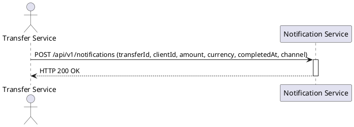
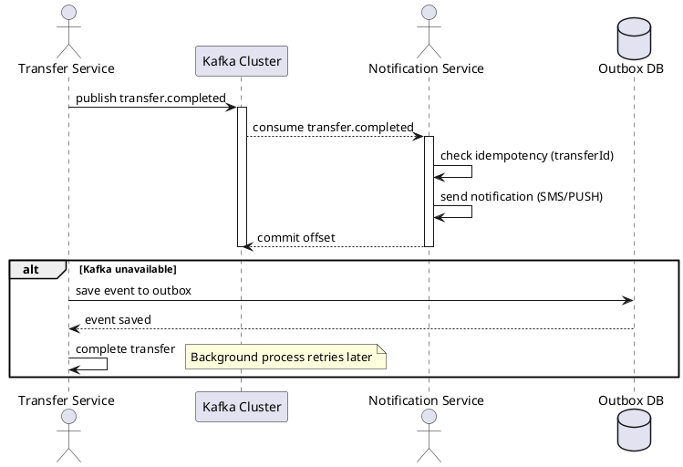

# Асинхронная отправка уведомлений по переводам

## 1. Бизнес-требования

### 1.1. Цель

**Какую бизнес-проблему решает:**
Синхронный вызов Notification Service после P2P-перевода увеличивает latency операции и создаёт каскадные отказы при недоступности Notification Service.

**Какую ценность приносит пользователю:**
Снижение времени выполнения перевода за счёт асинхронной отправки уведомлений; повышение доступности сервиса переводов при сбоях Notification Service.

**Какие метрики улучшает:**
Latency P2P-перевода (p95/p99), доступность Transfer Service. Целевые значения: GAP-REQ-001.

**Источник требования:** Product request (описание пользователя)

**Стейкхолдеры:**

| Стейкхолдер | Роль | Интерес / ожидание | Влияние / ответственность |
|-------------|------|--------------------|---------------------------|
| Команда Transfer Service | Владелец producer | Снизить latency и каскадные отказы | Реализует публикацию события в Kafka и outbox |
| Команда Notification Service | Владелец consumer | Получать события асинхронно, обеспечить идемпотентность | Реализует подписку на топик, retry, DLQ |
| Команда Kafka | Владелец инфраструктуры | Обеспечить retention 7 дней, гарантию at-least-once | Настройка кластера, мониторинг |
| Product Owner | Владелец продукта | Повысить стабильность сервиса переводов | Принимает функциональный результат |

**Задача в Jira:** GAP-REQ-002

**SMART-цель:**

| Критерий | Описание |
|----------|----------|
| Specific | Перевести отправку уведомлений о P2P-переводах с синхронного REST-вызова на асинхронную модель через Kafka |
| Measurable | GAP-REQ-001 |
| Achievable | Достижимость зависит от готовности Kafka-кластера и реализации outbox в Transfer Service |
| Relevant | Снижение latency и каскадных отказов напрямую влияет на стабильность сервиса переводов |
| Time-bound | GAP-REQ-003 |

**Бизнес-правила и ограничения:**

| ID | Правило / Ограничение | Источник | Применяется к |
|----|----------------------|----------|---------------|
| BR-01 | Гарантия доставки at-least-once | Описание пользователя | Kafka-интеграция |
| BR-02 | Идемпотентная обработка по transferId | Описание пользователя | Notification Service |
| BR-03 | DLQ для сообщений после 3 retry | Описание пользователя | Notification Service |
| BR-04 | Retention топика 7 дней | Описание пользователя | Kafka cluster |
| BR-05 | При недоступности Kafka перевод не откатывается, событие попадает в outbox | Описание пользователя | Transfer Service |
| CN-01 | Событие публикуется в топик `transfer.completed` | Описание пользователя | Transfer Service |
| CN-02 | Событие содержит: transferId, clientId, amount, currency, completedAt, channel | Описание пользователя | Transfer Service |
| CN-03 | channel — enum: SMS, PUSH, BOTH | Описание пользователя | Transfer Service |

**Gaps и допущения:**

| ID | Тип | Где обнаружено | Что не хватает / что предполагается | Как закрыть |
|----|-----|----------------|-------------------------------------|-------------|
| GAP-REQ-001 | Gap | SMART — Measurable | Не указаны целевые значения метрик (latency p95/p99, доступность) | Уточнить у Product Owner |
| GAP-REQ-002 | Gap | Задача в Jira | Отсутствует ссылка на задачу в Jira | Добавить ссылку после создания задачи |
| GAP-REQ-003 | Gap | SMART — Time-bound | Не указан срок реализации (релиз, квартал) | Уточнить у Product Owner |

## 2. Ограничения и допущения

| Ограничение/допущение | Тип | Описание | Обоснование |
|----------------------|-----|----------|-------------|
| Использование корпоративного Kafka cluster | Техническое | События публикуются в существующий корпоративный Kafka cluster | Описание пользователя |
| Гарантия at-least-once | Техническое | Kafka гарантирует доставку хотя бы один раз | Описание пользователя |
| Идемпотентность по transferId | Техническое | Notification Service обрабатывает каждое событие не более одного раза | Описание пользователя |
| 3 retry + DLQ | Техническое | После 3 неудачных попыток сообщение помещается в DLQ | Описание пользователя |
| Retention 7 дней | Техническое | Сообщения в топике хранятся 7 дней | Описание пользователя |
| Outbox при недоступности Kafka | Техническое | Событие сохраняется в outbox и переотправляется позже | Описание пользователя |
| Перевод не откатывается | Бизнес-правило | При недоступности Kafka перевод считается успешным | Описание пользователя |
| Формат события: transferId, clientId, amount, currency, completedAt, channel | Техническое | Событие содержит указанные поля | Описание пользователя |
| channel — enum: SMS, PUSH, BOTH | Техническое | Канал уведомления — один из трёх значений | Описание пользователя |

### 1.2. Процесс/Сервис AS IS

**Как работает сейчас:**

После успешного выполнения P2P-перевода между счетами клиента Transfer Service синхронно вызывает Notification Service по REST для отправки уведомления. Это увеличивает время ответа операции перевода и создаёт каскадные отказы при недоступности Notification Service.

**Use Case AS IS:**

| Элемент | Значение |
|---------|----------|
| Название | Отправить уведомление о переводе (синхронно) |
| Актор(ы) | Transfer Service |
| Триггер | Успешное завершение P2P-перевода между счетами клиента |
| Предусловия | См. таблицу предусловий ниже |
| Постусловия | См. таблицу постусловий ниже |
| Бизнес-правила | BR-01 (см. раздел 1.1) |

**Предусловия AS IS:**

| № | Предусловие | Проверяемое условие |
|---|-------------|---------------------|
| 1 | P2P-перевод между счетами клиента успешно завершён | Статус перевода = COMPLETED |
| 2 | Notification Service доступен по REST | HTTP-соединение установлено |

**Постусловия AS IS:**

| Исход | Постусловие |
|-------|-------------|
| Успех | Уведомление отправлено клиенту. Операция перевода завершена |
| Неуспех (бизнес) | — |
| Неуспех (техн.) | Уведомление не отправлено. Операция перевода завершена, но клиент не уведомлён |

**Основной сценарий AS IS:**

```
Шаг 1:  Transfer Service завершает P2P-перевод между счетами клиента со статусом COMPLETED
Шаг 2:  Transfer Service формирует запрос к Notification Service (REST)
          ЕСЛИ [BR-01] уведомление должно быть отправлено
            ТО сценарий продолжается с шага 3
          ИНАЧЕ
            ПЕРЕЙТИ К альтернативному сценарию 2a
Шаг 3:  Transfer Service отправляет синхронный HTTP-запрос к Notification Service
Шаг 4:  Notification Service обрабатывает запрос и отправляет уведомление клиенту
          ЕСЛИ запрос обработан успешно (HTTP 200)
            ТО сценарий завершается успешно
          ИНАЧЕ
            ПЕРЕЙТИ К альтернативному сценарию 4a
```

**Альтернативные сценарии AS IS:**

```
2a. Уведомление не требуется (BR-01 не выполняется):
  2a.1. Transfer Service завершает операцию перевода без отправки уведомления
  2a.2. Сценарий завершается успешно

4a. Ошибка при обработке запроса Notification Service (HTTP 4xx/5xx, timeout):
  4a.1. Transfer Service получает ошибку от Notification Service
  4a.2. Transfer Service завершает операцию перевода без отправки уведомления
  4a.3. Сценарий завершается неуспешно (техническая ошибка)
```

**Таблица проблем AS IS:**

| Проблема | Влияние на бизнес | Частота | Стоимость проблемы | Приоритет |
|----------|-------------------|---------|-------------------|-----------|
| Увеличение latency операции перевода при синхронном вызове Notification Service | Ухудшение пользовательского опыта, увеличение времени ответа | Всегда | GAP-REQ-001 | Высокий |
| Каскадный отказ при недоступности Notification Service | Операция перевода завершается, но клиент не получает уведомление | При недоступности Notification Service | GAP-REQ-001 | Высокий |

**Диаграмма AS IS (желательно):**



### 1.3. Процесс/Сервис TO BE

**Целевое состояние:**

После успешного завершения P2P-перевода между счетами клиента Transfer Service публикует событие в топик Kafka `transfer.completed`. Notification Service асинхронно потребляет событие и отправляет клиенту SMS и/или push-уведомление. При недоступности Kafka событие сохраняется в outbox и переотправляется позже. Операция перевода не зависит от доступности Kafka или Notification Service.

**Ключевые изменения:**
- Замена синхронного REST-вызова на асинхронную публикацию события в Kafka
- Введение outbox-паттерна для гарантии доставки при недоступности Kafka
- Добавление идемпотентной обработки на стороне Notification Service
- Введение DLQ для сообщений, не обработанных после 3 retry

**Use Case TO BE:**

| Элемент | Значение |
|---------|----------|
| Название | Асинхронная отправка уведомления по переводу |
| Актор(ы) | Transfer Service (producer), Notification Service (consumer) |
| Триггер | P2P-перевод между счетами клиента успешно завершён (статус COMPLETED) |
| Предусловия | См. таблицу предусловий ниже |
| Постусловия | См. таблицу постусловий ниже |
| Бизнес-правила | BR-01 (см. раздел 1.1) |

**Предусловия TO BE:**

| № | Предусловие | Проверяемое условие |
|---|-------------|---------------------|
| 1 | P2P-перевод между счетами клиента успешно завершён | Статус перевода = COMPLETED |
| 2 | Kafka cluster доступен (для публикации события) | GAP-UC-001 |
| 3 | Outbox-таблица существует и доступна для записи | GAP-UC-002 |

**Постусловия TO BE:**

| Исход | Постусловие |
|-------|-------------|
| Успех | Событие `transfer.completed` опубликовано в Kafka. Notification Service обработал событие и отправил уведомление клиенту. Операция перевода завершена |
| Неуспех (бизнес) | — |
| Неуспех (техн.) | Событие сохранено в outbox для повторной отправки. Операция перевода завершена, но клиент не уведомлён. При исчерпании retry (3 попытки) событие помещено в DLQ |

**Бизнес-правила TO BE:**

| ID | Правило | Применяется на шаге |
|----|---------|---------------------|
| BR-01 | Уведомление должно быть отправлено, если клиент дал согласие на уведомления | Шаг 2 |

**Основной сценарий TO BE:**

```
Шаг 1:  Transfer Service завершает P2P-перевод между счетами клиента со статусом COMPLETED
Шаг 2:  Transfer Service формирует событие transfer.completed (transferId, clientId, amount, currency, completedAt, channel)
          ЕСЛИ [BR-01] уведомление должно быть отправлено
            ТО сценарий продолжается с шага 3
          ИНАЧЕ
            ПЕРЕЙТИ К альтернативному сценарию 2a
Шаг 3:  Transfer Service публикует событие в топик Kafka transfer.completed
          ЕСЛИ Kafka cluster доступен
            ТО сценарий продолжается с шага 4
          ИНАЧЕ
            ПЕРЕЙТИ К альтернативному сценарию 3a
Шаг 4:  Notification Service потребляет событие из топика transfer.completed
Шаг 5:  Notification Service проверяет идемпотентность по transferId
          ЕСЛИ событие с таким transferId уже обработано
            ТО ПЕРЕЙТИ К альтернативному сценарию 5a
          ИНАЧЕ
            сценарий продолжается с шага 6
Шаг 6:  Notification Service отправляет уведомление клиенту (SMS и/или push согласно channel)
          ЕСЛИ уведомление отправлено успешно
            ТО сценарий завершается успешно
          ИНАЧЕ
            ПЕРЕЙТИ К альтернативному сценарию 6a
```

**Альтернативные сценарии TO BE:**

```
2a. Уведомление не требуется (BR-01 не выполняется):
  2a.1. Transfer Service завершает операцию перевода без публикации события
  2a.2. Сценарий завершается успешно

3a. Kafka cluster недоступен (GAP-UC-001):
  3a.1. Transfer Service сохраняет событие в outbox-таблицу
  3a.2. Transfer Service завершает операцию перевода
  3a.3. Фоновый процесс (GAP-UC-003) периодически проверяет outbox и переотправляет события в Kafka
  3a.4. Сценарий завершается успешно (операция перевода завершена, уведомление будет отправлено позже)

5a. Событие уже обработано (дубликат):
  5a.1. Notification Service игнорирует событие
  5a.2. Сценарий завершается успешно

6a. Ошибка при отправке уведомления:
  6a.1. Notification Service выполняет retry (до 3 попыток)
          ЕСЛИ retry исчерпаны
            ТО событие помещается в DLQ
          ИНАЧЕ
            сценарий продолжается с шага 6
  6a.2. Сценарий завершается неуспешно (техническая ошибка)
```

**Связи между Use Cases:**

| Связь | Связанный Use Case | Шаг / Extension Point | Условие |
|-------|--------------------|-----------------------|---------|
| <<include>> | — | — | — |
| <<extend>> | — | — | — |

**Изменения относительно AS IS:**

| Шаг | Было (AS IS) | Стало (TO BE) | Тип (NEW / CHG / DEL) |
|-----|-------------|---------------|-----|
| 2 | Transfer Service формирует запрос к Notification Service (REST) | Transfer Service формирует событие `transfer.completed` | CHG |
| 3 | Transfer Service отправляет синхронный HTTP-запрос к Notification Service | Transfer Service публикует событие в топик Kafka `transfer.completed` | CHG |
| — | — | Transfer Service сохраняет событие в outbox при недоступности Kafka | NEW |
| — | — | Notification Service проверяет идемпотентность по transferId | NEW |
| — | — | Notification Service выполняет retry (до 3 попыток) при ошибке отправки | NEW |
| — | — | Событие помещается в DLQ после исчерпания retry | NEW |
| 4 | Notification Service обрабатывает запрос и отправляет уведомление | Notification Service потребляет событие из Kafka и отправляет уведомление | CHG |
| 4a | Ошибка при обработке запроса Notification Service (HTTP 4xx/5xx, timeout) | — | DEL |

**Таблица преимуществ TO BE:**

| Преимущество | Метрика улучшения | Бизнес-эффект | Способ измерения |
|--------------|-------------------|---------------|------------------|
| Снижение latency операции перевода | Время выполнения перевода (p95) | Улучшение пользовательского опыта | Мониторинг времени выполнения перевода |
| Устранение каскадных отказов | Доступность операции перевода при недоступности Notification Service | Повышение надёжности сервиса переводов | Мониторинг успешности переводов |
| Гарантированная доставка уведомлений | Процент успешно доставленных уведомлений | Повышение качества обслуживания клиентов | Мониторинг consumer-лагера и DLQ |

**Диаграмма TO BE (желательно):**



---

## 2. Ограничения и допущения

**Gaps и допущения:**

| ID | Тип | Описание | Влияние | Статус |
|----|-----|----------|---------|--------|
| GAP-UC-001 | Gap | Не указано, как Transfer Service определяет доступность Kafka cluster (timeout, количество ретраев, механизм проверки) | Без этого невозможно реализовать корректное переключение на outbox | Открыт |
| GAP-UC-002 | Gap | Не указана структура outbox-таблицы (поля, индексы, статусы) | Без этого невозможно реализовать outbox-паттерн | Открыт |
| GAP-UC-003 | Gap | Не указан механизм фонового процесса для переотправки событий из outbox (периодичность, количество ретраев, обработка ошибок) | Без этого outbox-паттерн не будет работать | Открыт |
| GAP-UC-004 | Gap | Не указан eventType для события `transfer.completed` (формат, схема, версионирование) | Без этого невозможно реализовать сериализацию/десериализацию | Открыт |
| GAP-UC-005 | Gap | Не указаны метрики для мониторинга producer (количество опубликованных событий, ошибки публикации, размер outbox) и consumer (лаг, количество обработанных событий, ошибки обработки, количество событий в DLQ) | Без этого невозможно оценить эффективность решения | Открыт |
| GAP-UC-006 | Gap | Не указан механизм retry на стороне Notification Service (интервал между попытками, exponential backoff) | Без этого невозможно реализовать корректный retry | Открыт |
| GAP-UC-007 | Gap | Не указан retention топика `transfer.completed` (в brief указано 7 дней, но это не подтверждено) | Влияет на настройку Kafka | Открыт |

## 4. Функциональные требования

#### 4.1.1. Сервис Transfer Service (producer)

> **Выбор протокола → template/spec/gate:** см. матрицу протоколов в начале документа.

**Общая информация:**

| Параметр | Значение |
|----------|----------|
| Назначение | Публикация события о завершении P2P-перевода для асинхронной отправки уведомлений |
| Система-источник | Transfer Service |
| Система-получатель | Kafka Cluster |
| Тип интеграции | Асинхронная |
| Протокол | Kafka |
| Направление | Однонаправленная (pub/sub) |
| Версия API | GAP-INT-001 |
| Аутентификация | GAP-INT-002 |
| Формат данных | JSON |
| Rate Limit | GAP-INT-003 |
| Timeout | GAP-INT-004 |
| Retry Policy | GAP-INT-005 |

**Метод:** `publish` (Kafka Producer API)

**Kafka Headers:**

| Header Key | Обязат. | Описание | Пример |
|------------|---------|----------|--------|
| X-Message-Id | Да | UUID сообщения | 550e8400-e29b-41d4-a716-446655440000 |
| X-Correlation-Id | Да | ID для трассировки | 7c9e6679-7425-40de-944b-e07fc1f90ae7 |
| X-Event-Type | Да | Тип события | TransferCompleted |
| X-Schema-Version | Да | Версия схемы | 1.0 |
| X-Source | Да | Сервис-источник | transfer-service |
| content-type | Да | Формат сериализации | application/json |

**Параметры payload:**

| Параметр | Тип | Обязат. | Описание | Валидация | Пример | Маппинг |
|----------|-----|---------|----------|-----------|--------|---------|
| transferId | string | Да | Идентификатор перевода | format: uuid | 123e4567-e89b-12d3-a456-426614174000 | transfer.id |
| clientId | string | Да | Идентификатор клиента | format: uuid | 550e8400-e29b-41d4-a716-446655440000 | transfer.clientId |
| amount | number | Да | Сумма перевода | minimum: 0.01, maximum: 999999999.99 | 1500.50 | transfer.amount |
| currency | string | Да | Валюта перевода (ISO 4217) | pattern: ^[A-Z]{3}$ | RUB | transfer.currency |
| completedAt | string | Да | Время завершения перевода | format: date-time | 2026-02-04T10:30:00Z | transfer.completedAt |
| channel | string | Да | Канал уведомления | enum: [SMS, PUSH, BOTH] | BOTH | transfer.channel |

**Пример сообщения:**

```json
{
  "metadata": {
    "messageId": "550e8400-e29b-41d4-a716-446655440000",
    "correlationId": "7c9e6679-7425-40de-944b-e07fc1f90ae7",
    "timestamp": "2026-02-04T10:30:00Z",
    "eventType": "TransferCompleted",
    "version": "1.0",
    "source": "transfer-service"
  },
  "payload": {
    "transferId": "123e4567-e89b-12d3-a456-426614174000",
    "clientId": "550e8400-e29b-41d4-a716-446655440000",
    "amount": 1500.50,
    "currency": "RUB",
    "completedAt": "2026-02-04T10:30:00Z",
    "channel": "BOTH"
  }
}
```

#### 4.1.2. Асинхронное событие TransferCompleted

**Общая информация:**

| Параметр | Значение |
|----------|----------|
| Назначение | Уведомление о завершении P2P-перевода для отправки уведомлений клиенту |
| Topic / Queue | `transfer.completed` |
| Partition Key | clientId |
| Retention | 7 дней |
| Гарантия доставки | At-least-once |
| Формат сериализации | JSON (Schema Registry) |

**Consumer информация:**

| Consumer | Consumer Group | Retry Policy | DLQ Topic | Идемпотентность |
|----------|---------------|--------------|-----------|-----------------|
| Notification Service | notification-service-transfers | 3 retries, GAP-INT-006 | transfer.completed.dlq | По transferId |

**Kafka Headers:**

| Header Key | Обязат. | Описание | Пример |
|------------|---------|----------|--------|
| X-Message-Id | Да | UUID сообщения | 550e8400-e29b-41d4-a716-446655440000 |
| X-Correlation-Id | Да | ID для трассировки | 7c9e6679-7425-40de-944b-e07fc1f90ae7 |
| X-Event-Type | Да | Тип события | TransferCompleted |
| X-Schema-Version | Да | Версия схемы | 1.0 |
| X-Source | Да | Сервис-источник | transfer-service |
| content-type | Да | Формат сериализации | application/json |

**Параметры payload:**

| Параметр | Тип | Обязат. | Описание | Валидация | Пример | Маппинг |
|----------|-----|---------|----------|-----------|--------|---------|
| transferId | string | Да | Идентификатор перевода | format: uuid | 123e4567-e89b-12d3-a456-426614174000 | transfer.id |
| clientId | string | Да | Идентификатор клиента | format: uuid | 550e8400-e29b-41d4-a716-446655440000 | transfer.clientId |
| amount | number | Да | Сумма перевода | minimum: 0.01, maximum: 999999999.99 | 1500.50 | transfer.amount |
| currency | string | Да | Валюта перевода (ISO 4217) | pattern: ^[A-Z]{3}$ | RUB | transfer.currency |
| completedAt | string | Да | Время завершения перевода | format: date-time | 2026-02-04T10:30:00Z | transfer.completedAt |
| channel | string | Да | Канал уведомления | enum: [SMS, PUSH, BOTH] | BOTH | transfer.channel |

**Пример сообщения:**

```json
{
  "metadata": {
    "messageId": "550e8400-e29b-41d4-a716-446655440000",
    "correlationId": "7c9e6679-7425-40de-944b-e07fc1f90ae7",
    "timestamp": "2026-02-04T10:30:00Z",
    "eventType": "TransferCompleted",
    "version": "1.0",
    "source": "transfer-service"
  },
  "payload": {
    "transferId": "123e4567-e89b-12d3-a456-426614174000",
    "clientId": "550e8400-e29b-41d4-a716-446655440000",
    "amount": 1500.50,
    "currency": "RUB",
    "completedAt": "2026-02-04T10:30:00Z",
    "channel": "BOTH"
  }
}
```

### 4.2. Приложение (логика работы)

#### 4.2.1. Алгоритм работы при старте

1. Transfer Service при старте проверяет доступность Kafka cluster (GAP-INT-004).
2. Если Kafka недоступен, Transfer Service переключается на outbox-паттерн (GAP-INT-007).
3. Notification Service при старте подписывается на топик `transfer.completed` в consumer group `notification-service-transfers`.
4. Notification Service инициализирует механизм идемпотентной обработки по transferId.

**Gaps и допущения:**

| ID | Тип | Описание | Влияние | Статус |
|----|-----|----------|---------|--------|
| GAP-INT-001 | Gap | Не указана версия API для Kafka producer/consumer | Без этого невозможно обеспечить совместимость | Открыт |
| GAP-INT-002 | Gap | Не указан механизм аутентификации для подключения к Kafka cluster | Без этого невозможно настроить безопасное подключение | Открыт |
| GAP-INT-003 | Gap | Не указан rate limit для публикации сообщений в топик | Без этого возможна перегрузка Kafka cluster | Открыт |
| GAP-INT-004 | Gap | Не указан timeout для проверки доступности Kafka cluster | Без этого невозможно корректно реализовать переключение на outbox | Открыт |
| GAP-INT-005 | Gap | Не указан retry policy для публикации сообщений в Kafka | Без этого невозможно гарантировать at-least-once доставку | Открыт |
| GAP-INT-006 | Gap | Не указан механизм retry на стороне Notification Service (интервал между попытками, exponential backoff) | Без этого невозможно реализовать корректный retry | Открыт |
| GAP-INT-007 | Gap | Не указана структура outbox-таблицы (поля, индексы, статусы) | Без этого невозможно реализовать outbox-паттерн | Открыт |
| GAP-INT-008 | Gap | Не указан механизм фонового процесса для переотправки событий из outbox (периодичность, количество ретраев, обработка ошибок) | Без этого outbox-паттерн не будет работать | Открыт |
| GAP-INT-009 | Gap | Не указаны метрики для мониторинга producer (количество опубликованных событий, ошибки публикации, размер outbox) и consumer (лаг, количество обработанных событий, ошибки обработки, количество событий в DLQ) | Без этого невозможно оценить эффективность решения | Открыт |

## 5. Нефункциональные требования

#### Время отклика / Пропускная способность

### 7.1.1. ВРЕМЯ ОТКЛИКА

| Endpoint / Операция | p85 | Условия измерения | Критичность |
|---------------------|-----|-------------------|-------------|
| `POST /api/v1/transfers` (синхронная часть) | DESIGN-NFR-001: < 500 ms | 500 CCU, 100 RPS, PostgreSQL 16 | Critical |
| Публикация события в Kafka `transfer.completed` | DESIGN-NFR-002: < 200 ms | 500 CCU, 100 msg/s | High |
| Обработка события Notification Service (SMS/PUSH) | DESIGN-NFR-003: < 2 s | 500 CCU, 100 msg/s | Medium |

Классификация:
| Endpoint | Категория |
|----------|-----------|
| `POST /api/v1/transfers` (синхронная часть) | Быстрая (< 500 ms) — распределённая транзакция |
| Публикация события в Kafka | Мгновенная (< 200 ms) — асинхронная операция |
| Обработка события Notification Service | Стандартная (< 2 s) — включает отправку SMS/PUSH |

**Gaps и допущения:**

| ID | Тип | Описание | Влияние | Статус |
|----|-----|----------|---------|--------|
| DESIGN-NFR-001 | Design | p85 для синхронной части перевода установлен в < 500 ms на основе типовых требований к P2P-переводам | Без этого невозможно определить SLA для пользователя | Открыт |
| DESIGN-NFR-002 | Design | p85 для публикации события в Kafka установлен в < 200 ms на основе типовых требований к асинхронным операциям | Без этого невозможно определить SLA для producer | Открыт |
| DESIGN-NFR-003 | Design | p85 для обработки события Notification Service установлен в < 2 s на основе типовых требований к отправке уведомлений | Без этого невозможно определить SLA для consumer | Открыт |

---

### 7.1.2. ПРОПУСКНАЯ СПОСОБНОСТЬ

| Endpoint / Очередь | Штатная (RPS) | Пиковая (RPS) | Множитель | Продолжительность пика |
|---------------------|---------------|---------------|-----------|------------------------|
| `POST /api/v1/transfers` | GAP-NFR-001: [значение] | GAP-NFR-001: [значение] | GAP-NFR-001: [xN] | GAP-NFR-001: [длительность и окно] |
| Kafka: `transfer.completed` | GAP-NFR-002: [значение msg/s] | GAP-NFR-002: [значение msg/s] | GAP-NFR-002: [xN] | GAP-NFR-002: [длительность и окно] |

Профиль нагрузки:
| Параметр | Значение |
|----------|----------|
| Средний RPS (штатный режим) | GAP-NFR-003: [значение] |
| Пиковый RPS | GAP-NFR-003: [значение] |
| Время пиковой нагрузки | GAP-NFR-003: [расписание / события] |

**Gaps и допущения:**

| ID | Тип | Описание | Влияние | Статус |
|----|-----|----------|---------|--------|
| GAP-NFR-001 | Gap | Не указана штатная и пиковая пропускная способность для `POST /api/v1/transfers` | Без этого невозможно определить требования к масштабированию Transfer Service | Открыт |
| GAP-NFR-002 | Gap | Не указана штатная и пиковая пропускная способность для топика `transfer.completed` | Без этого невозможно определить требования к конфигурации Kafka | Открыт |
| GAP-NFR-003 | Gap | Не указан профиль нагрузки (средний RPS, пиковый RPS, время пиковой нагрузки) | Без этого невозможно определить требования к инфраструктуре | Открыт |

---

### 7.1.3. ВРЕМЯ ОБРАБОТКИ ТРАНЗАКЦИЙ

| Транзакция | SLA (85-й перцентиль) | Включает (ожидаемое время шага) | Таймаут клиента / HTTP |
|------------|----------------------|--------------------------------|------------------------|
| P2P-перевод между счетами клиента | DESIGN-NFR-004: 2 с | Валидация + проверка лимитов (150 ms) → Списание (200 ms) → Публикация события в Kafka (async) | DESIGN-NFR-005: 3 с |

Распределённая транзакция (P2P-перевод — Outbox):
| Шаг | Сервис | Ожидаемое время | Step Timeout (макс.) | Компенсация |
|-----|--------|----------------|---------------------|-------------|
| 1. Валидация + проверка лимитов | Account Service | 150 ms | 500 ms | — (нет побочных эффектов) |
| 2. Списание | Account Service | 200 ms | 500 ms | Возврат средств |
| 3. Публикация события в Kafka (async) | Transfer Service | 200 ms | 500 ms | — (best-effort, outbox) |
| **Global Timeout** | | **~550 ms** | **1.5 с** | **Полный rollback шагов 1–2** |

> **Примечание:** SLA (85-й перцентиль), таймаут клиента, step timeout и global timeout должны быть согласованы: HTTP-таймаут клиента > SLA транзакции ≥ global timeout.

**Gaps и допущения:**

| ID | Тип | Описание | Влияние | Статус |
|----|-----|----------|---------|--------|
| DESIGN-NFR-004 | Design | SLA для P2P-перевода установлен в 2 с на основе типовых требований к переводам | Без этого невозможно определить требования к производительности | Открыт |
| DESIGN-NFR-005 | Design | Таймаут клиента установлен в 3 с на основе SLA транзакции + запас | Без этого невозможно определить поведение клиента при превышении SLA | Открыт |

---

### 7.1.4. ВРЕМЯ ЗАГРУЗКИ СТРАНИЦ

| Экран | LCP | FID | CLS | TTI |
|-------|-----|-----|-----|-----|
| Не применимо (backend-сервис) | — | — | — | — |

Стратегия загрузки:
| Элемент | Стратегия | Обоснование |
|---------|-----------|-------------|
| Не применимо (backend-сервис) | — | — |

**Gaps и допущения:**

| ID | Тип | Описание | Влияние | Статус |
|----|-----|----------|---------|--------|
| Gaps не выявлены | | | | |

---

### 7.1.5. ОДНОВРЕМЕННЫЕ ПОЛЬЗОВАТЕЛИ

| Параметр | Значение |
|----------|----------|
| Максимум CCU | GAP-NFR-004: [значение] |
| Максимум сессий на пользователя | GAP-NFR-004: [значение] |
| Штатное количество активных | GAP-NFR-004: [значение] |
| Поведение при превышении лимита | GAP-NFR-004: [HTTP 429 / очередь / degradation] |

Управление нагрузкой:
| Механизм | Описание | Параметры | Применение |
|----------|----------|-----------|------------|
| GAP-NFR-005: [Rate Limiting / Throttling / Circuit Breaker / Bulkhead / Backpressure] | GAP-NFR-005: [описание] | GAP-NFR-005: [пороги] | GAP-NFR-005: [где применяется] |

**Gaps и допущения:**

| ID | Тип | Описание | Влияние | Статус |
|----|-----|----------|---------|--------|
| GAP-NFR-004 | Gap | Не указаны требования к одновременным пользователям (CCU, сессии, поведение при превышении лимита) | Без этого невозможно определить требования к масштабированию | Открыт |
| GAP-NFR-005 | Gap | Не указаны механизмы управления нагрузкой (rate limiting, circuit breaker, bulkhead) | Без этого невозможно обеспечить стабильность сервиса при пиковых нагрузках | Открыт |

---

### 7.1.6. ПРОИЗВОДИТЕЛЬНОСТЬ БД

| Запрос / Операция | Тип | Макс. время | Объём данных | Требуемые индексы |
|-------------------|-----|-------------|-------------|-------------------|
| Запись события в outbox-таблицу | write | DESIGN-NFR-006: < 50 ms | 1 запись | По transferId, статусу |
| Чтение событий из outbox-таблицы | read | DESIGN-NFR-006: < 100 ms | До 1000 записей | По статусу, дате создания |

Пул соединений:
| Параметр | Значение | Обоснование |
|----------|----------|-------------|
| Pool size | GAP-NFR-006: [значение] | GAP-NFR-006: [обоснование] |
| Таймаут получения соединения | GAP-NFR-006: [значение] | GAP-NFR-006: [обоснование] |
| Max idle connections | GAP-NFR-006: [значение] | GAP-NFR-006: [обоснование] |

**Gaps и допущения:**

| ID | Тип | Описание | Влияние | Статус |
|----|-----|----------|---------|--------|
| DESIGN-NFR-006 | Design | Максимальное время записи/чтения outbox-таблицы установлено на основе типовых требований к БД | Без этого невозможно определить требования к производительности БД | Открыт |
| GAP-NFR-006 | Gap | Не указаны параметры пула соединений к БД (pool size, timeout, max idle) | Без этого невозможно настроить подключение к БД | Открыт |

---

### 7.1.7. КЭШИРОВАНИЕ

| Ресурс / Ключ кэша | Уровень | TTL | Инвалидация | Макс. размер | При промахе |
|---------------------|---------|-----|-------------|-------------|-------------|
| Не применимо (асинхронная интеграция) | — | — | — | — | — |

**Gaps и допущения:**

| ID | Тип | Описание | Влияние | Статус |
|----|-----|----------|---------|--------|
| Gaps не выявлены | | | | |

## 5. Нефункциональные требования

#### 5.3.1. Требования к логированию

> Неподтверждённое помечено **DESIGN-OBS-*** / **GAP-OBS-***; см. **Gaps и допущения**.

### Общие требования к логированию

#### Уровни логирования

| Уровень | Когда использовать | Обязательные поля |
|---------|-------------------|-------------------|
| ERROR | Критические ошибки, сбои интеграции, ошибки обработки сообщений из Kafka/DLQ | timestamp, level, message, stackTrace, correlationId, service, eventType |
| WARN | Потенциальные проблемы, retry, деградация, недоступность Kafka | timestamp, level, message, correlationId, eventType, retryCount |
| INFO | Бизнес-события, интеграционные вызовы, публикация/потребление событий | timestamp, level, message, operation, transferId, clientId, eventType |
| DEBUG | Отладка (только на dev/staging) | timestamp, level, message, context |

#### Таблица событий для логирования

| Журнал | Уровень | Логируемые параметры | Правила инициализации события | Статус |
|--------|---------|---------------------|-------------------------------|--------|
| Интеграционный журнал | INFO | `eventType` = PUBLISH_TRANSFER_COMPLETED<br>`callType` = OUT<br>`exSystem` = Kafka | При публикации события `transfer.completed` в Kafka | DESIGN-OBS-001 |
| Интеграционный журнал | INFO | `eventType` = CONSUME_TRANSFER_COMPLETED<br>`callType` = IN<br>`exSystem` = Kafka | При получении события `transfer.completed` из Kafka | DESIGN-OBS-001 |
| Интеграционный журнал | WARN | `eventType` = KAFKA_RETRY<br>`callType` = OUT<br>`exSystem` = Kafka | При повторной попытке обработки сообщения (retry) | DESIGN-OBS-001 |
| Интеграционный журнал | ERROR | `eventType` = KAFKA_DLQ<br>`callType` = OUT<br>`exSystem` = Kafka | При отправке сообщения в DLQ после 3 неудачных retry | DESIGN-OBS-001 |
| Интеграционный журнал | ERROR | `eventType` = KAFKA_UNAVAILABLE<br>`callType` = OUT<br>`exSystem` = Kafka | При недоступности Kafka (событие сохраняется в outbox) | DESIGN-OBS-001 |
| Системный журнал | INFO | `eventType` = OUTBOX_SAVE<br>`callType` = OUT<br>`exSystem` = Database | При сохранении события в outbox-таблицу | DESIGN-OBS-001 |
| Системный журнал | INFO | `eventType` = OUTBOX_RESEND<br>`callType` = OUT<br>`exSystem` = Database | При повторной отправке события из outbox | DESIGN-OBS-001 |
| Бизнес-журнал | INFO | `eventType` = NOTIFICATION_SENT<br>`callType` = OUT<br>`exSystem` = Notification Service | При успешной отправке уведомления клиенту | DESIGN-OBS-001 |
| Бизнес-журнал | ERROR | `eventType` = NOTIFICATION_FAILED<br>`callType` = OUT<br>`exSystem` = Notification Service | При неудачной отправке уведомления клиенту | DESIGN-OBS-001 |

#### Структура полей лога (автоматические)

| Атрибут | Описание | Обязательность | Пример | Источник | Статус |
|---------|----------|----------------|--------|----------|--------|
| `@timestamp` | Дата-время возникновения события | Да | 2026-02-04T11:56:08.949000Z | Фреймворк | Подтверждено |
| `callid` | ID трассировки запроса | Да | B870E7E2-83E8-4BBB-B84C-5C47B2B1FCE3 | Генерируется при входящем запросе | Подтверждено |
| `requestId` | ID конкретного запроса/ответа | Да (для ответов) | c7bf5745-e9ab-4e77-8003-dc67d7ac1a84 | Из тела запроса | Подтверждено |
| `sessionId` | Клиентская сессия | Да | 91b8d75d42be78c6b0891aafc15eff10 | Из входящего запроса | Подтверждено |
| `ucpid` | ID клиента в ЕПК | Да | 1129388786934915284 | Из входящего запроса | Подтверждено |
| `service` | Имя сервиса | Да | transfer-service | Конфигурация | Подтверждено |
| `system` | Код автоматизированной системы | Да | SI | Конфигурация | Подтверждено |
| `version` | Версия дистрибутива | Нет | 01.080.00 | Конфигурация | Подтверждено |
| `environment` | Среда | Да | prom | Конфигурация | Подтверждено |
| `stand` | Стенд | Нет | prom | Конфигурация | Подтверждено |
| `datacenter` | ЦОД | Нет | a-tsod | Конфигурация | Подтверждено |
| `cluster` | Кластер | Нет | dropApp | Конфигурация | Подтверждено |
| `namespace` | K8s namespace | Нет | ci02128305-prom-retail2-b1-atsod | K8s metadata | Подтверждено |
| `host` | Hostname | Нет | pvsss-kub002738.sigma.sbrf.ru | K8s metadata | Подтверждено |
| `pod` | Имя pod'а | Нет | transfer-svc-bb8455cc4-vjmq5 | K8s metadata | Подтверждено |
| `ip` | IP-адрес | Нет | 29.64.18.169 | K8s metadata | Подтверждено |
| `block` | Блок | Нет | block-1 | Конфигурация | Подтверждено |
| `distrib` | Дистрибутив | Нет | d-01.080.00_5 | Конфигурация | Подтверждено |
| `client_name` | Имя клиентского приложения | Нет | sisupp-transfer-svc-k2 | Конфигурация | Подтверждено |

#### Структура полей лога (прикладные)

| Атрибут | Описание | Обязательность | Пример | Источник | Статус |
|---------|----------|----------------|--------|----------|--------|
| `eventType` | Код события | Да | PUBLISH_TRANSFER_COMPLETED | Код сервиса | DESIGN-OBS-001 |
| `callType` | IN / OUT | Да | OUT | Код сервиса | Подтверждено |
| `exSystem` | Внешняя система | Да | Kafka | Код сервиса | Подтверждено |
| `rqStr` / `rsStr` | Тело запроса/ответа AS IS | Нет | `{"transferId":"uuid","clientId":"uuid","amount":100.00,"currency":"RUB","completedAt":"2026-02-04T11:56:08.949Z","channel":"BOTH"}` | Запрос/ответ | DESIGN-OBS-001 |
| `transferId` | ID перевода | Да | 550e8400-e29b-41d4-a716-446655440000 | Из события | Подтверждено |
| `clientId` | ID клиента | Да | 550e8400-e29b-41d4-a716-446655440001 | Из события | Подтверждено |
| `retryCount` | Номер попытки обработки | Нет | 2 | Код сервиса | DESIGN-OBS-001 |
| `errorReason` | Причина ошибки | Нет | Notification Service unavailable | Код сервиса | DESIGN-OBS-001 |

---

**Gaps и допущения**

| ID | Тип | Где в документе | Что предположено / не уточнялось | Подтверждено? | Как закрыть |
|----|-----|-----------------|----------------------------------|---------------|-------------|
| DESIGN-OBS-001 | Design | Таблица событий для логирования, Структура полей лога | Набор eventType, callType, exSystem, rqStr/rsStr, retryCount, errorReason спроектирован на основе brief. Не указаны точные значения eventType и структура rqStr/rsStr. | Нет | Согласовать с командами Transfer Service и Notification Service |

#### 5.3.2. Требования к мониторингу

> Неподтверждённое помечено **DESIGN-OBS-*** / **GAP-OBS-***; см. **Gaps и допущения**.

### Технические метрики

| Название метрики (Prometheus) | Тип | Описание | Labels | Статус |
|-------------------------------|-----|----------|--------|--------|
| `transfer_requests_total` | Counter | Общее количество запросов на перевод | method, endpoint, status | Подтверждено |
| `transfer_request_duration_seconds` | Histogram | Время обработки запроса на перевод | method, endpoint | Подтверждено |
| `transfer_active_requests` | Gauge | Текущие активные запросы на перевод | method | Подтверждено |
| `transfer_kafka_publish_total` | Counter | Количество публикаций событий в Kafka | topic, status | DESIGN-OBS-002 |
| `transfer_kafka_publish_duration_seconds` | Histogram | Время публикации события в Kafka | topic | DESIGN-OBS-002 |
| `transfer_kafka_consume_total` | Counter | Количество потреблённых событий из Kafka | topic, status | DESIGN-OBS-002 |
| `transfer_kafka_consume_duration_seconds` | Histogram | Время обработки события из Kafka | topic | DESIGN-OBS-002 |
| `transfer_outbox_size` | Gauge | Количество событий в outbox-таблице, ожидающих отправки | status | DESIGN-OBS-002 |
| `transfer_db_connections` | Gauge | Число активных соединений с БД для операций перевода | db_name, pool, stand | Подтверждено |

### Метрики ошибок

| Название метрики (Prometheus) | Тип | Описание | Статус |
|-------------------------------|-----|----------|--------|
| `transfer_failures_total` | Counter | Общее количество неуспешных переводов | Подтверждено |
| `transfer_kafka_publish_failures_total` | Counter | Количество неудачных публикаций событий в Kafka | DESIGN-OBS-002 |
| `transfer_kafka_consume_failures_total` | Counter | Количество неудачных обработок событий из Kafka | DESIGN-OBS-002 |
| `transfer_kafka_dlq_total` | Counter | Количество сообщений, отправленных в DLQ | DESIGN-OBS-002 |
| `transfer_kafka_retry_total` | Counter | Количество повторных попыток обработки сообщений | DESIGN-OBS-002 |
| `transfer_outbox_save_failures_total` | Counter | Количество ошибок сохранения события в outbox | DESIGN-OBS-002 |
| `transfer_notification_failures_total` | Counter | Количество неудачных отправок уведомлений | DESIGN-OBS-002 |

### Бизнес-метрики

| Название метрики (Prometheus) | Тип | Описание | Формула расчёта | Статус |
|-------------------------------|-----|----------|-----------------|--------|
| `transfer_success_rate` | Gauge | Конверсия переводов | `successful_transfers / total_transfers * 100%` | Подтверждено |
| `transfer_amount_total` | Counter | Суммарный объём переводов (₽) | `sum(transfer.amount)` | Подтверждено |
| `transfer_avg_amount` | Gauge | Средний чек перевода | `transfer_amount_total / successful_transfers` | Подтверждено |
| `transfer_notification_success_rate` | Gauge | Доля успешно отправленных уведомлений | `successful_notifications / total_notifications * 100%` | DESIGN-OBS-002 |
| `transfer_notification_latency_seconds` | Histogram | Время от публикации события до отправки уведомления | — | DESIGN-OBS-002 |

### Фронтовые метрики

| № | Название события | Параметры | Описание события | Статус |
|---|-----------------|-----------|-----------------|--------|
| 1 | Transfer CreateScreen Click | TypeOperation · Тип перевода · Из поля `transfer.type` | Клик на кнопку «Перевести» на экране создания перевода | Подтверждено |
| 2 | Transfer ConfirmScreen Complete | TypeOperation · Тип перевода · Из поля `transfer.type` | Экран подтверждения: перевод отправлен | Подтверждено |
|   |   | Event_duration · Время от нажатия «Подтвердить» до результата. Интервалы: `"0-100"`, ..., `">5000"` (мс) · Таймер UI | | |
| 3 | Transfer ResultScreen Error Show | TypeOperation · Тип перевода · Из поля `transfer.type` | Показ ошибки на экране результата | Подтверждено |
|   |   | ErrorType · Код ошибки: `1` — 400, `2` — 401, `3` — 403, `6` — 500, `7` — 503, `100` — timeout, `101` — нет сети, `Other` — прочее · HTTP status / системная ошибка | | |

---

**Gaps и допущения**

| ID | Тип | Где в документе | Что предположено / не уточнялось | Подтверждено? | Как закрыть |
|----|-----|-----------------|----------------------------------|---------------|-------------|
| DESIGN-OBS-002 | Design | Технические метрики, Метрики ошибок, Бизнес-метрики | Набор метрик Kafka, outbox, уведомлений спроектирован на основе brief. Не указаны точные названия метрик, labels, пороги алёртов. | Нет | Согласовать с командами Transfer Service, Notification Service и SRE |
