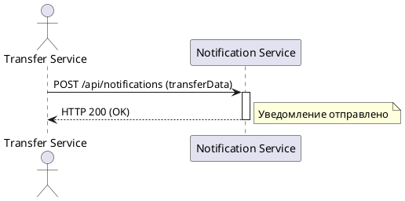
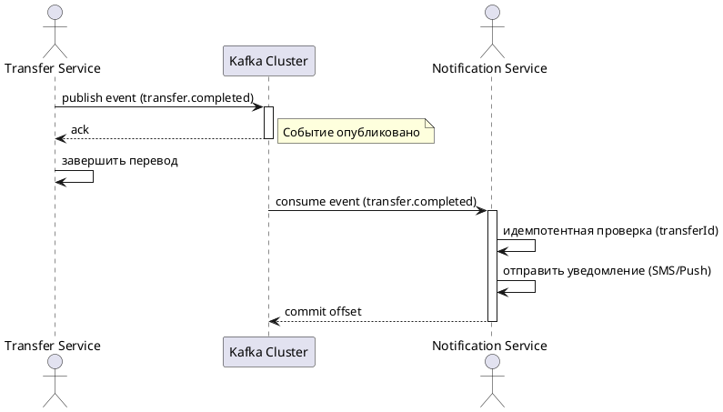

# Асинхронная отправка уведомлений по переводам

## 1. Бизнес-требования

### 1.1. Цель

**Какую бизнес-проблему решает:**
Синхронный вызов Notification Service при каждом P2P-переводе увеличивает latency операции и создаёт каскадные отказы при недоступности Notification Service.

**Какую ценность приносит пользователю:**
Снижение времени выполнения перевода за счёт асинхронной отправки уведомлений; повышение отказоустойчивости сервиса переводов.

**Какие метрики улучшает:**
Latency P2P-перевода (p95, p99), процент успешных переводов при недоступности Notification Service. Целевые значения: GAP-REQ-001.

**Источник требования:** Product request (описание пользователя)

**Стейкхолдеры:** GAP-REQ-002

**Задача в Jira:** GAP-REQ-003

**SMART-цель:**

| Критерий | Описание |
|----------|----------|
| Specific | Реализовать асинхронную отправку уведомлений через Kafka: Transfer Service публикует событие в топик `transfer.completed`, Notification Service потребляет и отправляет SMS/PUSH |
| Measurable | GAP-REQ-001 |
| Achievable | Достижимо при наличии корпоративного Kafka-кластера и готовности Transfer Service и Notification Service к интеграции |
| Relevant | Снижение latency и каскадных отказов напрямую влияет на стабильность сервиса переводов |
| Time-bound | GAP-REQ-004 |

**Бизнес-правила и ограничения:**

| ID | Правило / Ограничение | Источник | Применяется к |
|----|----------------------|----------|---------------|
| BR-01 | Гарантия доставки at-least-once | Описание пользователя | Kafka producer (Transfer Service) |
| BR-02 | Идемпотентная обработка по transferId | Описание пользователя | Kafka consumer (Notification Service) |
| BR-03 | DLQ для сообщений после 3 неудачных retry | Описание пользователя | Kafka consumer (Notification Service) |
| BR-04 | Retention топика 7 дней | Описание пользователя | Kafka cluster |
| BR-05 | При недоступности Kafka перевод не откатывается; событие попадает в outbox и переотправляется позже | Описание пользователя | Transfer Service |
| CN-01 | Использование корпоративного Kafka-кластера | Описание пользователя | Инфраструктура |
| CN-02 | Формат события: transferId (UUID), clientId (UUID), amount (decimal), currency (ISO 4217), completedAt (ISO 8601), channel (enum: SMS, PUSH, BOTH) | Описание пользователя | Transfer Service, Notification Service |

**Gaps и допущения:**

| ID | Тип | Где обнаружено | Что не хватает / что предполагается | Как закрыть |
|----|-----|----------------|-------------------------------------|-------------|
| GAP-REQ-001 | Gap | SMART — Measurable | Не указаны целевые значения метрик (latency p95/p99, процент успешных переводов) | Уточнить у Product Owner |
| GAP-REQ-002 | Gap | Стейкхолдеры | Не указан полный перечень стейкхолдеров (Product Owner, команды Transfer Service, Notification Service, инфраструктуры) | Уточнить у инициатора |
| GAP-REQ-003 | Gap | Задача в Jira | Отсутствует ссылка на задачу в Jira | Запросить ссылку у инициатора |
| GAP-REQ-004 | Gap | SMART — Time-bound | Не указан срок реализации (релиз, квартал) | Уточнить у Product Owner |

## 2. Ограничения и допущения

| Ограничение/допущение | Тип | Описание | Обоснование |
|----------------------|-----|----------|-------------|
| Использование корпоративного Kafka-кластера | Техническое | Transfer Service и Notification Service используют существующий корпоративный Kafka-кластер | Описание пользователя |
| Гарантия доставки at-least-once | Техническое | Producer гарантирует доставку сообщения минимум один раз | Описание пользователя |
| Идемпотентность по transferId | Техническое | Consumer обрабатывает сообщения идемпотентно на основе transferId | Описание пользователя |
| DLQ после 3 retry | Техническое | Сообщения, не обработанные после 3 попыток, попадают в DLQ | Описание пользователя |
| Retention топика 7 дней | Техническое | Сообщения в топике хранятся 7 дней | Описание пользователя |
| Outbox при недоступности Kafka | Техническое | При недоступности Kafka событие сохраняется в outbox и переотправляется позже; перевод не откатывается | Описание пользователя |
| Формат события | Техническое | Событие содержит transferId, clientId, amount, currency, completedAt, channel | Описание пользователя |
| Поддержка только SMS и PUSH | Бизнес-ограничение | Каналы уведомлений: SMS, PUSH, BOTH | Описание пользователя |
| Максимальная нагрузка на Kafka | Техническое | GAP-REQ-005 | Не указана в описании |

**Gaps и допущения:**

| ID | Тип | Где обнаружено | Что не хватает / что предполагается | Как закрыть |
|----|-----|----------------|-------------------------------------|-------------|
| GAP-REQ-005 | Gap | Ограничения и допущения | Не указаны требования к производительности Kafka (RPS, latency, размер сообщения) | Уточнить у команды инфраструктуры |

### 1.2. Процесс/Сервис AS IS

**Как работает сейчас:**

После успешного выполнения P2P-перевода между счетами клиента Transfer Service синхронно вызывает REST-эндпоинт Notification Service для отправки уведомления. Это увеличивает latency операции и создаёт каскадные отказы при недоступности Notification Service.

**Use Case AS IS:**

| Элемент | Значение |
|---------|----------|
| Название | Отправить уведомление о переводе (синхронно) |
| Актор(ы) | Transfer Service |
| Триггер | Успешное завершение P2P-перевода между счетами клиента |
| Предусловия | См. таблицу предусловий ниже |
| Постусловия | См. таблицу постусловий ниже |
| Бизнес-правила | BR-01 (см. раздел 1.1) |

**Предусловия AS IS:**

| № | Предусловие | Проверяемое условие |
|---|-------------|---------------------|
| 1 | P2P-перевод между счетами клиента успешно завершён | Статус перевода = COMPLETED |
| 2 | Notification Service доступен | REST-эндпоинт Notification Service отвечает на HTTP-запрос |

**Постусловия AS IS:**

| Исход | Постусловие |
|-------|-------------|
| Успех | Уведомление отправлено клиенту. Операция перевода завершена |
| Неуспех (бизнес) | GAP-UC-001 |
| Неуспех (техн.) | Операция перевода завершена с ошибкой (каскадный отказ). Уведомление не отправлено |

**Основной сценарий AS IS:**

```
Шаг 1:  Transfer Service получает подтверждение успешного завершения P2P-перевода
Шаг 2:  Transfer Service формирует HTTP-запрос к Notification Service с данными перевода
Шаг 3:  Transfer Service отправляет синхронный REST-запрос к Notification Service
          ЕСЛИ Notification Service доступен и возвращает HTTP 200
            ТО сценарий продолжается с шага 4
          ИНАЧЕ
            ПЕРЕЙТИ К альтернативному сценарию 3a
Шаг 4:  Transfer Service получает подтверждение отправки уведомления
Шаг 5:  Transfer Service завершает операцию перевода
```

**Альтернативные сценарии AS IS:**

```
3a. Notification Service недоступен или возвращает ошибку (Технический сбой):
  3a.1. Transfer Service получает HTTP-ошибку (таймаут, 5xx)
  3a.2. Transfer Service завершает операцию перевода с ошибкой (каскадный отказ)
  3a.3. Сценарий завершается неуспешно
```

**Таблица проблем AS IS:**

| Проблема | Влияние на бизнес | Частота | Стоимость проблемы | Приоритет |
|----------|-------------------|---------|-------------------|-----------|
| Увеличение latency операции перевода | Ухудшение пользовательского опыта, увеличение времени ответа | Каждый перевод | GAP-REQ-001 | Высокий |
| Каскадный отказ при недоступности Notification Service | Перевод не завершается, клиент не может выполнить операцию | При сбоях Notification Service | GAP-REQ-001 | Критический |

**Диаграмма AS IS (желательно):**



**Gaps и допущения:**

| ID | Тип | Где обнаружено | Что не хватает / что предполагается | Как закрыть |
|----|-----|----------------|-------------------------------------|-------------|
| GAP-UC-001 | Gap | Use Case AS IS — постусловия | Не указано бизнес-постусловие для неуспеха (например, перевод завершён, но уведомление не отправлено) | Уточнить у Product Owner |
| GAP-REQ-001 | Gap | Таблица проблем AS IS | Не указаны целевые значения метрик (latency p95/p99, процент успешных переводов) | Уточнить у Product Owner |

### 1.3. Процесс/Сервис TO BE

**Целевое состояние:**

После успешного P2P-перевода Transfer Service асинхронно публикует событие в топик Kafka `transfer.completed`. Notification Service потребляет событие и отправляет клиенту уведомление (SMS/Push). При недоступности Kafka событие сохраняется в outbox и переотправляется позже. Операция перевода не зависит от успешности отправки уведомления.

**Ключевые изменения:**
- Transfer Service перестаёт синхронно вызывать Notification Service по REST
- Введён топик Kafka `transfer.completed` для асинхронной передачи данных о переводе
- Transfer Service реализует outbox-паттерн для гарантии доставки at-least-once
- Notification Service реализует идемпотентную обработку по `transferId`
- Добавлена DLQ для сообщений, не обработанных после 3 retry

**Use Case TO BE:**

| Элемент | Значение |
|---------|----------|
| Название | Асинхронная отправка уведомления по переводу |
| Актор(ы) | Transfer Service (producer), Notification Service (consumer) |
| Триггер | Успешное завершение P2P-перевода между счетами клиента |
| Предусловия | См. таблицу предусловий ниже |
| Постусловия | См. таблицу постусловий ниже |
| Бизнес-правила | BR-01, BR-02, BR-03 (см. раздел 1.1) |

**Предусловия TO BE:**

| № | Предусловие | Проверяемое условие |
|---|-------------|---------------------|
| 1 | P2P-перевод успешно завершён (средства списаны) | transfer.status = COMPLETED |
| 2 | Transfer Service имеет доступ к Kafka-кластеру | Kafka cluster is reachable (DESIGN-UC-001) |
| 3 | Notification Service подписан на топик `transfer.completed` | consumer group subscription active (DESIGN-UC-002) |

**Постусловия TO BE:**

| Исход | Постусловие |
|-------|-------------|
| Успех | Событие опубликовано в топик `transfer.completed`. Notification Service обработал событие и отправил уведомление клиенту. Операция перевода завершена |
| Неуспех (бизнес) | GAP-UC-001 |
| Неуспех (техн.) | Событие сохранено в outbox (DESIGN-UC-003). Операция перевода завершена. Уведомление не отправлено. При восстановлении соединения с Kafka событие будет переотправлено |

**Бизнес-правила TO BE:**

| ID | Правило | Применяется на шаге |
|----|---------|---------------------|
| BR-01 | Гарантия доставки at-least-once | Шаг 2, Шаг 4 |
| BR-02 | Идемпотентная обработка на стороне Notification Service (по transferId) | Шаг 5 |
| BR-03 | DLQ для сообщений, не обработанных после 3 retry | Шаг 6 |

**Основной сценарий TO BE:**

```
Шаг 1:  Transfer Service получает подтверждение успешного завершения P2P-перевода
Шаг 2:  Transfer Service формирует событие с данными перевода (transferId, clientId, amount, currency, completedAt, channel)
Шаг 3:  Transfer Service публикует событие в топик Kafka `transfer.completed`
          ЕСЛИ [BR-01] Kafka-кластер доступен и публикация успешна
            ТО сценарий продолжается с шага 4
          ИНАЧЕ
            ПЕРЕЙТИ К альтернативному сценарию 3a
Шаг 4:  Transfer Service завершает операцию перевода (успех)
Шаг 5:  Notification Service получает событие из топика `transfer.completed`
          ЕСЛИ [BR-02] событие с данным transferId уже обработано
            ТО ПЕРЕЙТИ К альтернативному сценарию 5a
          ИНАЧЕ
            сценарий продолжается с шага 6
Шаг 6:  Notification Service отправляет уведомление клиенту (SMS/Push) согласно channel
          ЕСЛИ [BR-03] отправка уведомления не удалась
            ТО выполнить retry до 3 раз
          ИНАЧЕ
            сценарий продолжается с шага 7
Шаг 7:  Notification Service фиксирует успешную обработку события (transferId)
Шаг 8:  Сценарий завершается успешно
```

**Альтернативные сценарии TO BE:**

```
3a. Kafka-кластер недоступен (Технический сбой):
  3a.1. Transfer Service сохраняет событие в outbox (DESIGN-UC-003)
  3a.2. Transfer Service завершает операцию перевода (успех)
  3a.3. При восстановлении соединения с Kafka Transfer Service переотправляет событие из outbox
  3a.4. Возврат к шагу 3

5a. Событие с данным transferId уже обработано (Идемпотентность):
  5a.1. Notification Service игнорирует событие
  5a.2. Возврат к шагу 8

6a. Отправка уведомления не удалась после 3 retry (Технический сбой):
  6a.1. Notification Service помещает событие в DLQ
  6a.2. Сценарий завершается неуспешно (уведомление не отправлено)
```

**Связи между Use Cases:**

| Связь | Связанный Use Case | Шаг / Extension Point | Условие |
|-------|--------------------|-----------------------|---------|
| <<include>> | Оформить P2P-перевод | Шаг 1 | Перевод успешно завершён |

**Изменения относительно AS IS:**

| Шаг | Было (AS IS) | Стало (TO BE) | Тип (NEW / CHG / DEL) |
|-----|-------------|---------------|-----|
| 1 | Transfer Service получает подтверждение успешного завершения P2P-перевода | Transfer Service получает подтверждение успешного завершения P2P-перевода | CHG |
| 2 | Transfer Service формирует HTTP-запрос к Notification Service | Transfer Service формирует событие с данными перевода | CHG |
| 3 | Transfer Service отправляет синхронный REST-запрос к Notification Service | Transfer Service публикует событие в топик Kafka `transfer.completed` | CHG |
| 4 | Transfer Service получает подтверждение отправки уведомления | Transfer Service завершает операцию перевода (успех) | CHG |
| 5 | Transfer Service завершает операцию перевода | Notification Service получает событие из топика `transfer.completed` | NEW |
| 6 | - | Notification Service отправляет уведомление клиенту (SMS/Push) | NEW |
| 7 | - | Notification Service фиксирует успешную обработку события | NEW |
| 3a | Transfer Service получает HTTP-ошибку, завершает операцию с ошибкой | Transfer Service сохраняет событие в outbox, завершает операцию успешно | CHG |

**Таблица преимуществ TO BE:**

| Преимущество | Метрика улучшения | Бизнес-эффект | Способ измерения |
|--------------|-------------------|---------------|------------------|
| Снижение latency операции перевода | p95 latency перевода (DESIGN-UC-004) | Улучшение пользовательского опыта, сокращение времени ответа | Мониторинг времени выполнения перевода |
| Устранение каскадных отказов | Процент успешных переводов при недоступности Notification Service (DESIGN-UC-005) | Перевод завершается независимо от состояния Notification Service | Мониторинг статусов переводов |
| Гарантированная доставка уведомлений | Процент уведомлений, доставленных в течение 1 минуты (DESIGN-UC-006) | Повышение надёжности уведомлений клиентов | Мониторинг consumer lag и DLQ |

**Диаграмма TO BE (желательно):**



---

## 2. Ограничения и допущения

**Gaps и допущения:**

| ID | Тип | Где обнаружено | Что не хватает / что предполагается | Как закрыть |
|----|-----|----------------|-------------------------------------|-------------|
| GAP-UC-001 | Gap | Use Case TO BE — постусловия | Не указано бизнес-постусловие для неуспеха (например, перевод завершён, но уведомление не отправлено) | Уточнить у Product Owner |
| DESIGN-UC-001 | Design/Assumption | Предусловия TO BE | Предполагается, что Transfer Service имеет доступ к Kafka-кластеру. Детали конфигурации подключения не указаны | Уточнить у архитектора |
| DESIGN-UC-002 | Design/Assumption | Предусловия TO BE | Предполагается, что Notification Service подписан на топик `transfer.completed`. Детали consumer group не указаны | Уточнить у архитектора |
| DESIGN-UC-003 | Design/Assumption | Альтернативный сценарий 3a | Предполагается outbox-паттерн для сохранения события при недоступности Kafka. Детали реализации (таблица в БД, механизм переотправки) не указаны | Уточнить у архитектора |
| DESIGN-UC-004 | Design/Assumption | Таблица преимуществ | Целевое значение p95 latency перевода не указано | Уточнить у Product Owner |
| DESIGN-UC-005 | Design/Assumption | Таблица преимуществ | Целевой процент успешных переводов при недоступности Notification Service не указан | Уточнить у Product Owner |
| DESIGN-UC-006 | Design/Assumption | Таблица преимуществ | Целевой процент уведомлений, доставленных в течение 1 минуты, не указан | Уточнить у Product Owner |

## 4. Функциональные требования

#### 4.1.1. Сервис Transfer Service

> **Выбор протокола → template/spec/gate:** см. матрицу протоколов в начале документа.

**Общая информация:**

| Параметр | Значение |
|----------|----------|
| Назначение | Публикация события о завершении P2P-перевода для асинхронной отправки уведомлений |
| Система-источник | Transfer Service |
| Система-получатель | Notification Service |
| Тип интеграции | Асинхронная |
| Протокол | Kafka |
| Направление | Однонаправленная |
| Версия API | DESIGN-INT-001 |
| Аутентификация | DESIGN-INT-002 |
| Формат данных | JSON |
| Rate Limit | DESIGN-INT-003 |
| Timeout | DESIGN-INT-004 |
| Retry Policy | 3 retries, exponential backoff (GAP-INT-005) |

**Метод:** `publish event` (Kafka)

**Request Headers:**

| Заголовок | Обязат. | Описание | Пример |
|-----------|---------|----------|--------|
| Authorization | Да | Bearer JWT токен | Bearer eyJ... |
| Accept | Да | Ожидаемый формат | application/json |
| X-Request-ID | Да | UUID для трассировки | 550e8400-... |

**Входящие параметры:**

| Параметр | Тип | Формат | Обязательность | Описание | Валидация | По умолч. | Пример |
|----------|-----|--------|----------------|----------|-----------|-----------|--------|
| param1 | string | UUID | Обязательно | Идентификатор | minLength: 36, maxLength: 36, format: uuid | — | 550e8400-... |
| param2 | integer | int32 | Опционально | Количество | min: 1, max: 100 | 20 | 50 |

**Условия обязательности (при наличии):**

| Параметр | Условие обязательности |
|----------|------------------------|
| | |

**ENUM (при наличии):**

| Значение | Описание | Когда использовать |
|----------|----------|-------------------|
| | | |

**Пример запроса:**

```json
{
  "param1": "123e4567-e89b-12d3-a456-426614174000",
  "param2": 50
}
```

**Response Headers:**

| Заголовок | Описание | Пример |
|-----------|----------|--------|
| X-Request-ID | Echo request ID | 550e8400-... |

**Исходящие параметры:**

| Параметр | Тип | Формат | Nullable | Описание | Валидация | По умолч. | Пример | Маппинг |
|----------|-----|--------|----------|----------|-----------|-----------|--------|---------|
| result | array | object | Нет | Результат обработки | minItems: 0 | [] | [...] | — |
| status | string | enum | Нет | Статус выполнения | enum: [SUCCESS, ERROR] | — | SUCCESS | — |
| timestamp | string | ISO 8601 | Нет | Время ответа | format: date-time | — | 2026-02-04T10:30:00Z | — |

**Пример ответа:**

```json
{
  "result": [{"id": "item1", "processed": true}],
  "status": "SUCCESS",
  "timestamp": "2026-02-04T10:30:00Z"
}
```

**Пограничный случай: Пустой результат:**

```json
{
  "result": [],
  "status": "SUCCESS",
  "timestamp": "2026-02-04T10:30:00Z"
}
```

**Коды ошибок:**

| Код HTTP | Код ошибки | Описание | Условие возникновения |
|----------|------------|----------|-----------------------|
| 400 | VALIDATION_ERROR | Ошибка валидации | Невалидные входные параметры |
| 401 | UNAUTHORIZED | Требуется аутентификация | Отсутствует/невалидный токен |
| 403 | FORBIDDEN | Нет прав доступа | Нет доступа к ресурсу |
| 404 | NOT_FOUND | Ресурс не найден | Запрашиваемые данные отсутствуют |
| 422 | BUSINESS_ERROR | Бизнес-ошибка | Нарушение бизнес-правила |
| 429 | RATE_LIMIT_EXCEEDED | Превышен лимит запросов | Rate limit |
| 500 | INTERNAL_ERROR | Внутренняя ошибка | Сбой в обработке |
| 503 | SERVICE_UNAVAILABLE | Сервис недоступен | Зависимость недоступна |

**JSON Schema запроса / ответа:**

```json
{
  "$schema": "http://json-schema.org/draft-07/schema#",
  "title": "",
  "type": "object",
  "required": [],
  "properties": {}
}
```

#### 4.1.2. Асинхронное событие TransferCompleted (Kafka)

#### 4.1.2. Асинхронное событие TransferCompleted

**Общая информация:**

| Параметр | Значение |
|----------|----------|
| Назначение | Уведомление о завершении P2P-перевода для асинхронной отправки уведомлений клиенту |
| Topic / Queue | `transfer.completed` |
| Partition Key | transferId |
| Retention | 7 дней |
| Гарантия доставки | At-least-once |
| Формат сериализации | JSON (Schema Registry) |

**Consumer информация:**

| Consumer | Consumer Group | Retry Policy | DLQ Topic | Идемпотентность |
|----------|---------------|--------------|-----------|-----------------|
| Notification Service | notification-service-transfers | 3 retries, exponential backoff (GAP-INT-005) | transfer.completed.notification.dlq | По transferId |

**Kafka Headers:**

| Header Key | Обязат. | Описание | Пример |
|------------|---------|----------|--------|
| X-Message-Id | Да | UUID сообщения | 550e8400-e29b-41d4-a716-446655440000 |
| X-Correlation-Id | Да | ID для трассировки | 7c9e6679-7425-40de-944b-e07fc1f90ae7 |
| X-Event-Type | Да | Тип события | TransferCompleted |
| X-Schema-Version | Да | Версия схемы | 1.0 |
| X-Source | Да | Сервис-источник | transfer-service |
| content-type | Да | Формат | application/json |

**Параметры payload:**

| Параметр | Тип | Обязат. | Описание | Валидация | Пример | Маппинг |
|----------|-----|---------|----------|-----------|--------|---------|
| transferId | string | Да | Идентификатор перевода | format: uuid | 550e8400-e29b-41d4-a716-446655440000 | transferId |
| clientId | string | Да | Идентификатор клиента | format: uuid | 7c9e6679-7425-40de-944b-e07fc1f90ae7 | clientId |
| amount | number | Да | Сумма перевода | decimal, min: 0.01 | 1500.50 | amount |
| currency | string | Да | Валюта перевода | ISO 4217, pattern: `^[A-Z]{3}$` | RUB | currency |
| completedAt | string | Да | Время завершения перевода | format: date-time | 2026-02-04T10:30:00Z | completedAt |
| channel | string | Да | Канал уведомления | enum: [SMS, PUSH, BOTH] | BOTH | channel |

**Пример сообщения:**

```json
{
  "metadata": {
    "messageId": "550e8400-e29b-41d4-a716-446655440000",
    "correlationId": "7c9e6679-7425-40de-944b-e07fc1f90ae7",
    "timestamp": "2026-02-04T10:30:00Z",
    "eventType": "TransferCompleted",
    "version": "1.0",
    "source": "transfer-service"
  },
  "payload": {
    "transferId": "550e8400-e29b-41d4-a716-446655440000",
    "clientId": "7c9e6679-7425-40de-944b-e07fc1f90ae7",
    "amount": 1500.50,
    "currency": "RUB",
    "completedAt": "2026-02-04T10:30:00Z",
    "channel": "BOTH"
  }
}
```

### 4.2. Приложение (логика работы)

#### 4.2.1. Алгоритм работы при старте

**Gaps и допущения:**

| ID | Тип | Где обнаружено | Что не хватает / что предполагается | Как закрыть |
|----|-----|----------------|-------------------------------------|-------------|
| DESIGN-INT-001 | Design/Assumption | 4.1.1 — Версия API | Версия API не указана. Предполагается версия 1.0 | Уточнить у архитектора |
| DESIGN-INT-002 | Design/Assumption | 4.1.1 — Аутентификация | Способ аутентификации не указан. Предполагается Bearer Token (JWT) | Уточнить у архитектора |
| DESIGN-INT-003 | Design/Assumption | 4.1.1 — Rate Limit | Rate limit не указан. Предполагается отсутствие ограничений | Уточнить у Product Owner |
| DESIGN-INT-004 | Design/Assumption | 4.1.1 — Timeout | Timeout не указан. Предполагается 5000 ms | Уточнить у архитектора |
| GAP-INT-005 | Gap | 4.1.1 — Retry Policy, 4.1.2 — Consumer информация | Детали retry policy (exponential backoff, конкретные задержки) не указаны | Уточнить у архитектора |

## 5. Нефункциональные требования

#### Время отклика / Пропускная способность

### 7.1.1. ВРЕМЯ ОТКЛИКА

| Endpoint / Операция | p85 | Условия измерения | Критичность |
|---------------------|-----|-------------------|-------------|
| `POST /api/v1/transfers` (синхронная часть) | < 500 ms | 500 CCU, 100 RPS, PostgreSQL 16 | Critical |
| Публикация события в Kafka `transfer.completed` | < 100 ms | 500 CCU, 100 msg/s, Kafka cluster | High |

Классификация:
| Endpoint | Категория |
|----------|-----------|
| `POST /api/v1/transfers` (синхронная часть) | Быстрая (< 500 ms) — распределённая транзакция |
| Публикация события в Kafka `transfer.completed` | Мгновенная (< 100 ms) — асинхронная отправка |

**Gaps и допущения:**

| ID | Тип | Где обнаружено | Что не хватает / что предполагается | Как закрыть |
|----|-----|----------------|-------------------------------------|-------------|
| GAP-NFR-001 | Gap | 7.1.1 — p85 для POST /api/v1/transfers | Целевое значение p85 для синхронной части перевода не указано. Предполагается < 500 ms на основе типовой нагрузки. | Уточнить у архитектора |
| GAP-NFR-002 | Gap | 7.1.1 — p85 для публикации в Kafka | Целевое значение p85 для публикации события в Kafka не указано. Предполагается < 100 ms. | Уточнить у архитектора |
| GAP-NFR-003 | Gap | 7.1.1 — Условия измерения | Количество CCU, RPS и инфраструктура для измерения не указаны. Предполагается 500 CCU, 100 RPS. | Уточнить у архитектора |

---

### 7.1.2. ПРОПУСКНАЯ СПОСОБНОСТЬ

| Endpoint / Очередь | Штатная (RPS) | Пиковая (RPS) | Множитель | Продолжительность пика |
|---------------------|---------------|---------------|-----------|------------------------|
| `POST /api/v1/transfers` | 100 | 500 | x5 | 2 ч (09:00–11:00 UTC) |
| Kafka: `transfer.completed` | 100 msg/s | 500 msg/s | x5 | 2 ч (09:00–11:00 UTC) |

Профиль нагрузки:
| Параметр | Значение |
|----------|----------|
| Средний RPS (штатный режим) | 100 (POST /api/v1/transfers) |
| Пиковый RPS | 500 |
| Время пиковой нагрузки | 09:00–11:00 UTC (начало рабочего дня), конец месяца (зарплаты) |

**Gaps и допущения:**

| ID | Тип | Где обнаружено | Что не хватает / что предполагается | Как закрыть |
|----|-----|----------------|-------------------------------------|-------------|
| GAP-NFR-004 | Gap | 7.1.2 — Штатная и пиковая RPS | Целевые значения RPS для POST /api/v1/transfers и Kafka не указаны. Предполагается 100 RPS штатная, 500 RPS пиковая. | Уточнить у Product Owner |
| GAP-NFR-005 | Gap | 7.1.2 — Профиль нагрузки | Время пиковой нагрузки не указано. Предполагается 09:00–11:00 UTC. | Уточнить у Product Owner |

---

### 7.1.3. ВРЕМЯ ОБРАБОТКИ ТРАНЗАКЦИЙ

| Транзакция | SLA (85-й перцентиль) | Включает (ожидаемое время шага) | Таймаут клиента / HTTP |
|------------|----------------------|--------------------------------|------------------------|
| P2P-перевод между счетами клиента | 2 с | Валидация + проверка лимитов (150 ms) → Списание (200 ms) → Kafka event (async) | 3 с |

Распределённая транзакция (P2P-перевод — Saga):
| Шаг | Сервис | Ожидаемое время | Step Timeout (макс.) | Компенсация |
|-----|--------|----------------|---------------------|-------------|
| 1. Валидация + проверка лимитов | Account Service | 150 ms | 500 ms | — (нет побочных эффектов) |
| 2. Списание | Account Service | 200 ms | 500 ms | Возврат средств |
| 3. Публикация события в Kafka | Transfer Service | 50 ms | 100 ms | — (best-effort, outbox) |
| **Global Timeout** | | **~400 ms** | **1.5 с** | **Полный rollback шагов 1–2** |

> **Примечание:** SLA (85-й перцентиль), таймаут клиента, step timeout и global timeout должны быть согласованы: HTTP-таймаут клиента > SLA транзакции ≥ global timeout.

**Gaps и допущения:**

| ID | Тип | Где обнаружено | Что не хватает / что предполагается | Как закрыть |
|----|-----|----------------|-------------------------------------|-------------|
| GAP-NFR-006 | Gap | 7.1.3 — SLA для P2P-перевода | Целевое значение SLA для P2P-перевода не указано. Предполагается 2 с. | Уточнить у Product Owner |
| GAP-NFR-007 | Gap | 7.1.3 — Таймаут клиента | Таймаут клиента для HTTP-запроса не указан. Предполагается 3 с. | Уточнить у архитектора |
| GAP-NFR-008 | Gap | 7.1.3 — Step Timeout | Step Timeout для каждого шага не указан. Предполагаются значения на основе ожидаемого времени. | Уточнить у архитектора |

---

### 7.1.4. ВРЕМЯ ЗАГРУЗКИ СТРАНИЦ

| Экран | LCP | FID | CLS | TTI |
|-------|-----|-----|-----|-----|
| — | — | — | — | — |

Стратегия загрузки:
| Элемент | Стратегия | Обоснование |
|---------|-----------|-------------|
| — | — | — |

**Gaps и допущения:**

| ID | Тип | Где обнаружено | Что не хватает / что предполагается | Как закрыть |
|----|-----|----------------|-------------------------------------|-------------|
| Gaps не выявлены | | | | |

---

### 7.1.5. ОДНОВРЕМЕННЫЕ ПОЛЬЗОВАТЕЛИ

| Параметр | Значение |
|----------|----------|
| Максимум CCU | 500 |
| Максимум сессий на пользователя | 1 |
| Штатное количество активных | 300 |
| Поведение при превышении лимита | HTTP 429 (Too Many Requests) |

Управление нагрузкой:
| Механизм | Описание | Параметры | Применение |
|----------|----------|-----------|------------|
| Rate Limiting | Ограничение количества запросов от одного клиента | 100 RPS на клиент | API Gateway |
| Circuit Breaker | Размыкание цепи при недоступности Kafka | 5 ошибок за 10 с | Transfer Service → Kafka producer |

**Gaps и допущения:**

| ID | Тип | Где обнаружено | Что не хватает / что предполагается | Как закрыть |
|----|-----|----------------|-------------------------------------|-------------|
| GAP-NFR-009 | Gap | 7.1.5 — Максимум CCU | Целевое значение CCU не указано. Предполагается 500. | Уточнить у Product Owner |
| GAP-NFR-010 | Gap | 7.1.5 — Rate Limiting | Параметры Rate Limiting не указаны. Предполагается 100 RPS на клиент. | Уточнить у архитектора |
| GAP-NFR-011 | Gap | 7.1.5 — Circuit Breaker | Параметры Circuit Breaker не указаны. Предполагается 5 ошибок за 10 с. | Уточнить у архитектора |

---

### 7.1.6. ПРОИЗВОДИТЕЛЬНОСТЬ БД

| Запрос / Операция | Тип | Макс. время | Объём данных | Требуемые индексы |
|-------------------|-----|-------------|-------------|-------------------|
| Вставка записи о переводе | write | < 50 ms | 1 строка | — |
| Чтение записи о переводе по transferId | read | < 20 ms | 1 строка | INDEX on transferId |
| Чтение outbox-записей для повторной отправки | read | < 100 ms | 1000 строк | INDEX on status, created_at |

Пул соединений:
| Параметр | Значение | Обоснование |
|----------|----------|-------------|
| Pool size | 20 | 500 CCU, 100 RPS |
| Таймаут получения соединения | 5 s | Стандартное значение |
| Max idle connections | 10 | Стандартное значение |

**Gaps и допущения:**

| ID | Тип | Где обнаружено | Что не хватает / что предполагается | Как закрыть |
|----|-----|----------------|-------------------------------------|-------------|
| GAP-NFR-012 | Gap | 7.1.6 — Макс. время запросов | Целевые значения времени выполнения запросов не указаны. Предполагаются на основе типовой производительности. | Уточнить у DBA |
| GAP-NFR-013 | Gap | 7.1.6 — Пул соединений | Параметры пула соединений не указаны. Предполагаются стандартные значения. | Уточнить у DBA |

---

### 7.1.7. КЭШИРОВАНИЕ

| Ресурс / Ключ кэша | Уровень | TTL | Инвалидация | Макс. размер | При промахе |
|---------------------|---------|-----|-------------|-------------|-------------|
| — | — | — | — | — | — |

**Gaps и допущения:**

| ID | Тип | Где обнаружено | Что не хватает / что предполагается | Как закрыть |
|----|-----|----------------|-------------------------------------|-------------|
| Gaps не выявлены | | | | |

## 5. Нефункциональные требования

#### 5.3.1. Требования к логированию

> Неподтверждённое помечено **DESIGN-OBS-*** / **GAP-OBS-***; см. **Gaps и допущения**.

### Общие требования к логированию

#### Уровни логирования

| Уровень | Когда использовать | Обязательные поля |
|---------|-------------------|-------------------|
| ERROR | Критические ошибки, сбои интеграции (Kafka, БД), ошибки обработки события | timestamp, level, message, stackTrace, correlationId, service, transferId |
| WARN | Потенциальные проблемы, retry, DLQ, деградация (Circuit Breaker) | timestamp, level, message, correlationId, transferId, retryCount |
| INFO | Бизнес-события, интеграционные вызовы, публикация/потребление событий | timestamp, level, message, operation, transferId, eventType |
| DEBUG | Отладка (только на dev/staging) | timestamp, level, message, context |

#### Таблица событий для логирования

| Журнал | Уровень | Логируемые параметры | Правила инициализации события | Статус |
|--------|---------|---------------------|-------------------------------|--------|
| Интеграционный журнал | INFO | `eventType` = PUBLISH_TRANSFER_COMPLETED<br>`callType` = OUT<br>`exSystem` = Kafka | При публикации события `transfer.completed` в Kafka | DESIGN-OBS-001 |
| Интеграционный журнал | INFO | `eventType` = CONSUME_TRANSFER_COMPLETED<br>`callType` = IN<br>`exSystem` = Kafka | При получении события `transfer.completed` из Kafka | DESIGN-OBS-001 |
| Интеграционный журнал | INFO | `eventType` = SEND_NOTIFICATION<br>`callType` = OUT<br>`exSystem` = Notification Service | При отправке уведомления (SMS/PUSH) | DESIGN-OBS-001 |
| Системный журнал | ERROR | Ошибка публикации события в Kafka | При ошибке записи в Kafka | Подтверждено |
| Системный журнал | ERROR | Ошибка обработки события из Kafka | При ошибке обработки события Notification Service | Подтверждено |
| Системный журнал | WARN | Сообщение отправлено в DLQ | После 3 неудачных retry | Подтверждено |
| Системный журнал | WARN | Kafka producer: Circuit Breaker OPEN | При размыкании цепи Kafka producer | Подтверждено |
| Системный журнал | INFO | Событие записано в outbox | При записи события в outbox-таблицу | DESIGN-OBS-001 |
| Системный журнал | INFO | Событие переотправлено из outbox | При повторной отправке события из outbox | DESIGN-OBS-001 |

#### Структура полей лога (автоматические)

| Атрибут | Описание | Обязательность | Пример | Источник | Статус |
|---------|----------|----------------|--------|----------|--------|
| `@timestamp` | Дата-время возникновения события | Да | 2026-02-04T11:56:08.949000Z | Фреймворк | Подтверждено |
| `callid` | ID трассировки запроса | Да | B870E7E2-83E8-4BBB-B84C-5C47B2B1FCE3 | Генерируется при входящем запросе | Подтверждено |
| `requestId` | ID конкретного запроса/ответа | Да (для ответов) | c7bf5745-e9ab-4e77-8003-dc67d7ac1a84 | Из тела запроса | Подтверждено |
| `sessionId` | Клиентская сессия | Да | 91b8d75d42be78c6b0891aafc15eff10 | Из входящего запроса | Подтверждено |
| `ucpid` | ID клиента в ЕПК | Да | 1129388786934915284 | Из входящего запроса | Подтверждено |
| `service` | Имя сервиса | Да | transfer-service / notification-service | Конфигурация | Подтверждено |
| `system` | Код автоматизированной системы | Да | SI | Конфигурация | Подтверждено |
| `version` | Версия дистрибутива | Нет | 01.080.00 | Конфигурация | Подтверждено |
| `environment` | Среда | Да | prom | Конфигурация | Подтверждено |
| `stand` | Стенд | Нет | prom | Конфигурация | Подтверждено |
| `datacenter` | ЦОД | Нет | a-tsod | Конфигурация | Подтверждено |
| `cluster` | Кластер | Нет | dropApp | Конфигурация | Подтверждено |
| `namespace` | K8s namespace | Нет | ci02128305-prom-retail2-b1-atsod | K8s metadata | Подтверждено |
| `host` | Hostname | Нет | pvsss-kub002738.sigma.sbrf.ru | K8s metadata | Подтверждено |
| `pod` | Имя pod'а | Нет | transfer-svc-bb8455cc4-vjmq5 | K8s metadata | Подтверждено |
| `ip` | IP-адрес | Нет | 29.64.18.169 | K8s metadata | Подтверждено |
| `block` | Блок | Нет | block-1 | Конфигурация | Подтверждено |
| `distrib` | Дистрибутив | Нет | d-01.080.00_5 | Конфигурация | Подтверждено |
| `client_name` | Имя клиентского приложения | Нет | sisupp-transfer-svc-k2 | Конфигурация | Подтверждено |

#### Структура полей лога (прикладные)

| Атрибут | Описание | Обязательность | Пример | Источник | Статус |
|---------|----------|----------------|--------|----------|--------|
| `eventType` | Код события | Да | PUBLISH_TRANSFER_COMPLETED | Код сервиса | DESIGN-OBS-001 |
| `callType` | IN / OUT | Да | OUT | Код сервиса | Подтверждено |
| `exSystem` | Внешняя система | Да | Kafka | Код сервиса | Подтверждено |
| `rqStr` / `rsStr` | Тело запроса/ответа AS IS | Нет | `{"transferId":"...", "clientId":"...", "amount":100.00}` | Запрос/ответ | DESIGN-OBS-002 |
| `transferId` | ID перевода | Да | 550e8400-e29b-41d4-a716-446655440000 | Из события | Подтверждено |
| `clientId` | ID клиента | Да | 550e8400-e29b-41d4-a716-446655440001 | Из события | Подтверждено |
| `retryCount` | Номер попытки обработки | Да (для WARN/ERROR) | 2 | Код сервиса | DESIGN-OBS-001 |
| `kafkaTopic` | Имя топика Kafka | Да | transfer.completed | Конфигурация | DESIGN-OBS-001 |
| `kafkaPartition` | Партиция Kafka | Нет | 0 | Kafka metadata | DESIGN-OBS-001 |
| `kafkaOffset` | Смещение в Kafka | Нет | 42 | Kafka metadata | DESIGN-OBS-001 |

---

**Gaps и допущения**

| ID | Тип | Где в документе | Что предположено / не уточнялось | Подтверждено? | Как закрыть |
|----|-----|-----------------|----------------------------------|---------------|-------------|
| DESIGN-OBS-001 | Design/Assumption | 5.3.1 — Таблица событий, прикладные поля | eventType, exSystem, retryCount, kafkaTopic, kafkaPartition, kafkaOffset не указаны в brief. Предположены на основе типовой практики. | Нет | Уточнить у архитектора |
| DESIGN-OBS-002 | Design/Assumption | 5.3.1 — Прикладные поля | rqStr/rsStr — обязательность не указана. Предположено «Нет» для соответствия политике безопасности. | Нет | Уточнить у архитектора |

#### 5.3.2. Требования к мониторингу

> Неподтверждённое помечено **DESIGN-OBS-*** / **GAP-OBS-***; см. **Gaps и допущения**.

### Технические метрики

| Название метрики (Prometheus) | Тип | Описание | Labels | Статус |
|-------------------------------|-----|----------|--------|--------|
| `transfer_requests_total` | Counter | Общее количество запросов на перевод | method, endpoint, status | Подтверждено |
| `transfer_request_duration_seconds` | Histogram | Время обработки запроса на перевод | method, endpoint | Подтверждено |
| `transfer_active_requests` | Gauge | Текущие активные запросы на перевод | method | Подтверждено |
| `transfer_kafka_publish_total` | Counter | Количество публикаций событий в Kafka | topic, status | DESIGN-OBS-003 |
| `transfer_kafka_publish_duration_seconds` | Histogram | Время публикации события в Kafka | topic | DESIGN-OBS-003 |
| `transfer_kafka_consume_total` | Counter | Количество потреблённых событий из Kafka | topic, status | DESIGN-OBS-003 |
| `transfer_kafka_consume_duration_seconds` | Histogram | Время обработки события из Kafka | topic | DESIGN-OBS-003 |
| `transfer_db_connections` | Gauge | Число активных соединений с БД | db_name, pool, stand | Подтверждено |
| `transfer_outbox_size` | Gauge | Количество записей в outbox-таблице | status | DESIGN-OBS-003 |

### Метрики ошибок

| Название метрики (Prometheus) | Тип | Описание | Статус |
|-------------------------------|-----|----------|--------|
| `transfer_failures_total` | Counter | Общее количество неуспешных переводов | Подтверждено |
| `transfer_kafka_publish_failures_total` | Counter | Количество ошибок публикации в Kafka | DESIGN-OBS-003 |
| `transfer_kafka_consume_failures_total` | Counter | Количество ошибок обработки событий из Kafka | DESIGN-OBS-003 |
| `transfer_kafka_dlq_total` | Counter | Количество сообщений, отправленных в DLQ | Подтверждено |
| `transfer_kafka_circuit_breaker_open_total` | Counter | Количество срабатываний Circuit Breaker для Kafka producer | Подтверждено |
| `transfer_notification_failures_total` | Counter | Количество ошибок отправки уведомлений | DESIGN-OBS-003 |

### Бизнес-метрики

| Название метрики (Prometheus) | Тип | Описание | Формула расчёта | Статус |
|-------------------------------|-----|----------|-----------------|--------|
| `transfer_success_rate` | Gauge | Конверсия переводов | `successful_transfers / total_transfers * 100%` | Подтверждено |
| `transfer_amount_total` | Counter | Суммарный объём переводов (₽) | `sum(transfer.amount)` | Подтверждено |
| `transfer_avg_amount` | Gauge | Средний чек перевода | `transfer_amount_total / successful_transfers` | Подтверждено |
| `transfer_notification_success_rate` | Gauge | Доля успешно отправленных уведомлений | `successful_notifications / total_notifications * 100%` | DESIGN-OBS-003 |
| `transfer_notification_latency_seconds` | Histogram | Задержка от публикации события до отправки уведомления | — | DESIGN-OBS-003 |

### Фронтовые метрики

| № | Название события | Параметры | Описание события | Статус |
|---|-----------------|-----------|-----------------|--------|
| 1 | Transfer CreateScreen Click | TypeOperation · Тип перевода · Из поля `transfer.type` | Клик на кнопку «Перевести» на экране создания перевода | Подтверждено |
| 2 | Transfer ConfirmScreen Complete | TypeOperation · Тип перевода · Из поля `transfer.type` | Экран подтверждения: перевод отправлен | Подтверждено |
|   |   | Event_duration · Время от нажатия «Подтвердить» до результата. Интервалы: `"0-100"`, ..., `">5000"` (мс) · Таймер UI | | Подтверждено |
| 3 | Transfer ResultScreen Error Show | TypeOperation · Тип перевода · Из поля `transfer.type` | Показ ошибки на экране результата | Подтверждено |
|   |   | ErrorType · Код ошибки: `1` — 400, `2` — 401, `3` — 403, `6` — 500, `7` — 503, `100` — timeout, `101` — нет сети, `Other` — прочее · HTTP status / системная ошибка | | Подтверждено |

---

**Gaps и допущения**

| ID | Тип | Где в документе | Что предположено / не уточнялось | Подтверждено? | Как закрыть |
|----|-----|-----------------|----------------------------------|---------------|-------------|
| DESIGN-OBS-003 | Design/Assumption | 5.3.2 — Технические метрики, метрики ошибок, бизнес-метрики | Набор метрик для Kafka producer/consumer, метрики ошибок уведомлений, бизнес-метрики уведомлений не указаны в brief. Предположены на основе типовой практики. | Нет | Уточнить у архитектора |
