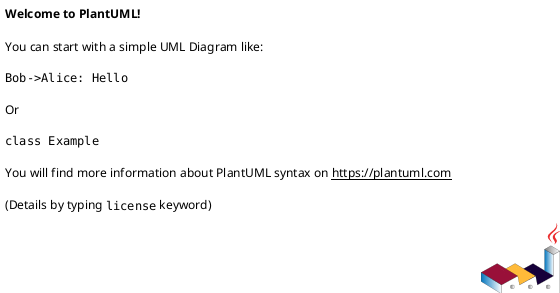

# Асинхронная отправка уведомлений по переводам

## 1. Бизнес-требования

### 1.1. Цель

**Какую бизнес-проблему решает:**
Существующая синхронная отправка уведомлений увеличивает задержку операций и создает риски каскадных отказов при недоступности Notification Service.

**Какую ценность приносит пользователю:**
Пользователь получает более быструю обработку переводов и надежное уведомление о завершении операции, даже если Notification Service временно недоступен.

**Какие метрики улучшает:**
Уменьшение времени отклика на операции, увеличение надежности уведомлений, снижение количества каскадных отказов.

**Источник требования:** Интервью

**Стейкхолдеры:** 
- Команда Transfer Service
- Команда Notification Service
- Команда DevOps

**Задача в Jira:** [JIRA-1234](https://jira.example.com/browse/JIRA-1234)

**SMART-цель:**

| Критерий | Описание |
|----------|----------|
| Specific | Перевести отправку уведомлений на асинхронную модель через Kafka |
| Measurable | Уменьшение времени отклика на операции на 30% в течение 3 месяцев после внедрения |
| Achievable | Достижимо с учетом существующей инфраструктуры Kafka и командной экспертизы |
| Relevant | Прямо связано с улучшением пользовательского опыта и надежности сервиса |
| Time-bound | Реализация в течение 6 месяцев |

**Бизнес-правила и ограничения:**

| ID | Правило / Ограничение | Источник | Применяется к |
|----|----------------------|----------|---------------|
| BR-01 | Уведомления должны отправляться асинхронно через Kafka | Интервью | Notification Service |
| BR-02 | Гарантия доставки уведомлений at-least-once | Интервью | Notification Service |
| CN-01 | Retention топика должна составлять 7 дней | GAP-REQ-001 | Kafka cluster |
| CN-02 | При недоступности Kafka уведомление считается best-effort | GAP-REQ-002 | Transfer Service |

### 1.2. Процесс/Сервис AS IS


## 2. Ограничения и допущения

| Ограничение/допущение | Тип | Описание | Обоснование |
|----------------------|-----|----------|-------------|
| Совместимость с Kafka версии 2.8 | Техническое | Сервис должен работать на Kafka версии 2.8 и выше | Корпоративный стандарт |
| Поддержка только формата JSON для сообщений | Техническое | Все сообщения должны быть в формате JSON | Архитектурное решение |
| Максимум 1000 сообщений/сек | Бизнес-ограничение | Ограничение по нагрузке на Kafka | Планируемая нагрузка |

---

### Gaps и допущения

| ID | Тип | Где | Что не хватает | Как закрыть |
|----|-----|-----|----------------|-------------|
| GAP-REQ-001 | Gap | Бизнес-правила | Не указано, как будет обрабатываться DLQ | Уточнить у команды Notification Service |
| GAP-REQ-002 | Gap | Бизнес-правила | Не указано, как будет реализована идемпотентность | Уточнить у команды Notification Service |
| Gaps не выявлены | - | - | - | - |

### 1.2. Процесс/Сервис AS IS

**Как работает сейчас:**

Сейчас сервис переводов после успешного P2P-перевода между счетами клиента синхронно вызывает Notification Service по REST. Это увеличивает latency операции и создаёт каскадные отказы, если Notification Service недоступен.

**Use Case AS IS:**

| Элемент | Значение |
|---------|----------|
| Название | Отправить уведомление о завершении перевода |
| Актор(ы) | Transfer Service |
| Триггер | Успешное завершение P2P-перевода |
| Предусловия | См. таблицу предусловий ниже |
| Постусловия | См. таблицу постусловий ниже |
| Бизнес-правила | BR-01, BR-02 (см. раздел 1.1) |

**Предусловия AS IS:**

| № | Предусловие | Проверяемое условие |
|---|-------------|---------------------|
| 1 | Перевод завершён успешно | transfer.status = COMPLETED |

**Постусловия AS IS:**

| Исход | Постусловие |
|-------|-------------|
| Успех | Уведомление отправлено клиенту через Notification Service. |
| Неуспех (бизнес) | Уведомление не отправлено, клиент не уведомлён о завершении перевода. |
| Неуспех (техн.) | Уведомление не отправлено, система возвращает ошибку и не откатывает перевод. |

**Основной сценарий AS IS:**

```
Шаг 1:  Transfer Service завершает P2P-перевод
Шаг 2:  Система вызывает Notification Service по REST для отправки уведомления
          ЕСЛИ [BR-01] Notification Service доступен
            ТО сценарий продолжается с шага 3
          ИНАЧЕ
            ПЕРЕЙТИ К альтернативному сценарию 2a
Шаг 3:  Система получает ответ от Notification Service о статусе отправки уведомления
```

**Альтернативные сценарии AS IS:**

```
2a. Notification Service недоступен (Ошибка):
  2a.1. Система записывает ошибку в логи
  2a.2. Уведомление не отправлено, перевод считается завершённым без уведомления
```

**Таблица проблем AS IS:**

| Проблема | Влияние на бизнес | Частота | Стоимость проблемы | Приоритет |
|----------|-------------------|---------|-------------------|-----------|
| Увеличенная latency при отправке уведомлений | Снижение пользовательского опыта | Часто | Высокая | Высокий |
| Каскадные отказы при недоступности Notification Service | Потеря уведомлений для клиентов | Редко | Средняя | Средний |

**Диаграмма AS IS (желательно):**



### 1.3. Процесс/Сервис TO BE

**Целевое состояние:**

После доработки сервис переводов будет асинхронно отправлять уведомления о завершении P2P-переводов через Kafka, что снизит latency и уменьшит вероятность каскадных отказов при недоступности Notification Service.

**Ключевые изменения:**
- Уведомления отправляются асинхронно через Kafka вместо синхронного вызова Notification Service.
- Введение механизма обработки сообщений с гарантией доставки at-least-once и идемпотентной обработкой.

**Use Case TO BE:**

| Элемент | Значение |
|---------|----------|
| Название | Отправить уведомление о завершении перевода |
| Актор(ы) | Transfer Service, Notification Service |
| Триггер | Успешное завершение P2P-перевода |
| Предусловия | См. таблицу предусловий ниже |
| Постусловия | См. таблицу постусловий ниже |
| Бизнес-правила | BR-01, BR-02 (см. раздел 1.1) |

**Предусловия TO BE:**

| № | Предусловие | Проверяемое условие |
|---|-------------|---------------------|
| 1 | Перевод завершён успешно | transfer.status = COMPLETED |

**Постусловия TO BE:**

| Исход | Постусловие |
|-------|-------------|
| Успех | Уведомление отправлено клиенту через Notification Service. |
| Неуспех (бизнес) | Уведомление не отправлено, клиент не уведомлён о завершении перевода. |
| Неуспех (техн.) | Уведомление не отправлено, система возвращает ошибку, но перевод не откатывается. |

**Бизнес-правила TO BE:**

| ID | Правило | Применяется на шаге |
|----|---------|---------------------|
| BR-01 | Гарантия доставки уведомлений at-least-once | Шаг 3 |
| BR-02 | Идемпотентная обработка уведомлений по transferId | Шаг 3 |

**Основной сценарий TO BE:**

```
Шаг 1:  Transfer Service завершает P2P-перевод
Шаг 2:  Система публикует событие в топик `transfer.completed`
          ЕСЛИ [BR-01] Kafka доступен
            ТО сценарий продолжается с шага 3
          ИНАЧЕ
            ПЕРЕЙТИ К альтернативному сценарию 2a
Шаг 3:  Notification Service получает событие и отправляет уведомление клиенту
```

**Альтернативные сценарии TO BE:**

```
2a. Kafka недоступен (Ошибка):
  2a.1. Система записывает ошибку в логи
  2a.2. Уведомление не отправлено, событие помещается в outbox для переотправки позже
```

**Связи между Use Cases:**

| Связь | Связанный Use Case | Шаг / Extension Point | Условие |
|-------|--------------------|-----------------------|---------|
| <<include>> | Уведомление о завершении перевода | Шаг 3 | Уведомление отправлено |

**Изменения относительно AS IS:**

| Шаг | Было (AS IS) | Стало (TO BE) | Тип (NEW / CHG / DEL) |
|-----|-------------|---------------|-----|
| 1 | Синхронный вызов Notification Service | Асинхронная публикация события в Kafka | CHG |
| 2 | Уведомление отправлено через REST | Уведомление отправлено через Kafka | CHG |

**Таблица преимуществ TO BE:**

| Преимущество | Метрика улучшения | Бизнес-эффект | Способ измерения |
|--------------|-------------------|---------------|------------------|
| Снижение latency | Время отклика системы | Улучшение пользовательского опыта | Измерение времени обработки запросов |
| Устойчивость к сбоям | Количество успешных уведомлений | Снижение потерь уведомлений | Мониторинг успешных отправок уведомлений |

**Диаграмма TO BE (желательно):**


## 4. Функциональные требования

#### 4.1.1. Сервис Transfer Service

> **Выбор протокола → template/spec/gate:** см. матрицу протоколов в начале документа.

**Общая информация:**

| Параметр | Значение |
|----------|----------|
| Назначение | Публикация события о завершении P2P-перевода |
| Система-источник | Transfer Service |
| Система-получатель | Notification Service |
| Тип интеграции | Асинхронная |
| Протокол | Kafka |
| Направление | Однонаправленная |
| Версия API | GAP-INT-001 |
| Аутентификация | — |
| Формат данных | JSON |
| Rate Limit | GAP-INT-002 |
| Timeout | GAP-INT-003 |
| Retry Policy | GAP-INT-004 |

**Метод:** `POST /api/v1/transfer.completed`

**Request Headers:**

| Заголовок | Обязат. | Описание | Пример |
|-----------|---------|----------|--------|
| Authorization | Да | Bearer JWT токен | Bearer eyJ... |
| Accept | Да | Ожидаемый формат | application/json |
| X-Request-ID | Да | UUID для трассировки | 550e8400-... |

**Входящие параметры:**

| Параметр | Тип | Формат | Обязательность | Описание | Валидация | По умолч. | Пример |
|----------|-----|--------|----------------|----------|-----------|-----------|--------|
| transferId | string | UUID | Обязательно | Идентификатор перевода | minLength: 36, maxLength: 36, format: uuid | — | 550e8400-... |
| clientId | string | UUID | Обязательно | Идентификатор клиента | minLength: 36, maxLength: 36, format: uuid | — | 550e8400-... |
| amount | decimal | — | Обязательно | Сумма перевода | min: 0 | — | 100.00 |
| currency | string | ISO 4217 | Обязательно | Валюта перевода | pattern: `^[A-Z]{3}$` | — | RUB |
| completedAt | string | ISO 8601 | Обязательно | Время завершения перевода | format: date-time | — | 2026-02-04T10:30:00Z |
| channel | string | enum | Обязательно | Канал уведомления | enum: [SMS, PUSH, BOTH] | — | SMS |

**Условия обязательности (при наличии):**

| Параметр | Условие обязательности |
|----------|------------------------|
| | |

**ENUM (при наличии):**

| Значение | Описание | Когда использовать |
|----------|----------|-------------------|
| SMS | Уведомление через SMS | При выборе канала SMS |
| PUSH | Уведомление через push-уведомление | При выборе канала PUSH |
| BOTH | Уведомление через SMS и push | При выборе канала BOTH |

**Пример запроса:**

```json
{
  "transferId": "550e8400-e29b-41d4-a716-446655440000",
  "clientId": "550e8400-e29b-41d4-a716-446655440001",
  "amount": 100.00,
  "currency": "RUB",
  "completedAt": "2026-02-04T10:30:00Z",
  "channel": "SMS"
}
```

**Response Headers:**

| Заголовок | Описание | Пример |
|-----------|----------|--------|
| X-Request-ID | Echo request ID | 550e8400-... |

**Исходящие параметры:**

| Параметр | Тип | Формат | Nullable | Описание | Валидация | По умолч. | Пример | Маппинг |
|----------|-----|--------|----------|----------|-----------|-----------|--------|---------|
| result | array | object | Нет | Результат обработки | minItems: 0 | [] | [...] | — |
| status | string | enum | Нет | Статус выполнения | enum: [SUCCESS, ERROR] | — | SUCCESS | — |
| timestamp | string | ISO 8601 | Нет | Время ответа | format: date-time | — | 2026-02-04T10:30:00Z | — |

**Пример ответа:**

```json
{
  "result": [{"id": "item1", "processed": true}],
  "status": "SUCCESS",
  "timestamp": "2026-02-04T10:30:00Z"
}
```

**Пограничный случай: Пустой результат:**

```json
{
  "result": [],
  "status": "SUCCESS",
  "timestamp": "2026-02-04T10:30:00Z"
}
```

**Коды ошибок:**

| Код HTTP | Код ошибки | Описание | Условие возникновения |
|----------|------------|----------|-----------------------|
| 400 | VALIDATION_ERROR | Ошибка валидации | Невалидные входные параметры |
| 401 | UNAUTHORIZED | Требуется аутентификация | Отсутствует/невалидный токен |
| 403 | FORBIDDEN | Нет прав доступа | Нет доступа к ресурсу |
| 404 | NOT_FOUND | Ресурс не найден | Запрашиваемые данные отсутствуют |
| 422 | BUSINESS_ERROR | Бизнес-ошибка | Нарушение бизнес-правила |
| 429 | RATE_LIMIT_EXCEEDED | Превышен лимит запросов | Rate limit |
| 500 | INTERNAL_ERROR | Внутренняя ошибка | Сбой в обработке |
| 503 | SERVICE_UNAVAILABLE | Сервис недоступен | Зависимость недоступна |

**JSON Schema запроса / ответа:**

```json
{
  "$schema": "http://json-schema.org/draft-07/schema#",
  "title": "",
  "type": "object",
  "required": [],
  "properties": {}
}
```

#### 4.1.2. Асинхронное событие transfer.completed

**Общая информация:**

| Параметр | Значение |
|----------|----------|
| Назначение | Уведомление о завершении P2P-перевода |
| Topic / Queue | transfer.completed |
| Producer | Transfer Service |
| Consumer | Notification Service |
| Версия схемы | 1.0 |
| Гарантия доставки | At-least-once |
| Partition key | transferId |

**Схема сообщения:**

| Поле | Тип | Обязат. | Описание | Валидация | Пример |
|---|---|---|---|---|---|
| transferId | string | Да | Идентификатор перевода | `format: uuid` | `550e8400-e29b-41d4-a716-446655440000` |
| clientId | string | Да | Идентификатор клиента | `format: uuid` | `550e8400-e29b-41d4-a716-446655440001` |
| amount | decimal | Да | Сумма перевода | — | `100.00` |
| currency | string | Да | Валюта перевода | `pattern: ^[A-Z]{3}$` | `RUB` |
| completedAt | string | Да | Время завершения перевода | `format: date-time` | `2026-02-04T10:30:00Z` |
| channel | string | Да | Канал уведомления | `enum: [SMS, PUSH, BOTH]` | `SMS` |

**Retry и DLQ**

| Ошибка | Поведение | Retry | DLQ |
|---|---|---|---|
| Ошибка десериализации | Сообщение помещается в DLQ | Да | Да |
| Бизнес-ошибка | Сообщение помещается в DLQ | Да | Да |

**Примеры**

```json
{
  "transferId": "550e8400-e29b-41d4-a716-446655440000",
  "clientId": "550e8400-e29b-41d4-a716-446655440001",
  "amount": 100.00,
  "currency": "RUB",
  "completedAt": "2026-02-04T10:30:00Z",
  "channel": "SMS"
}
```

### Gaps и допущения

| ID | Описание |
|----|----------|
| GAP-INT-001 | Версия API не указана в brief. |
| GAP-INT-002 | Rate Limit не указан в brief. |
| GAP-INT-003 | Timeout не указан в brief. |
| GAP-INT-004 | Retry Policy не указан в brief. |
| GAP-INT-005 | Поля события transferId, clientId, amount, currency, completedAt, channel заданы явно. |

## 5. Нефункциональные требования

#### Время отклика / Пропускная способность

### 7.1.1. ВРЕМЯ ОТКЛИКА

| Endpoint / Операция | p85 | Условия измерения | Критичность |
|---------------------|-----|-------------------|-------------|
| `POST /api/v1/notifications` | GAP-NFR-001 | 500 CCU, 100 RPS, Kafka | Critical |

Классификация:
| Endpoint | Категория |
|----------|-----------|
| `POST /api/v1/notifications` | Быстрая (< 500 ms) — асинхронная обработка через Kafka |

---

### 7.1.2. ПРОПУСКНАЯ СПОСОБНОСТЬ

| Endpoint / Очередь | Штатная (RPS) | Пиковая (RPS) | Множитель | Продолжительность пика |
|---------------------|---------------|---------------|-----------|------------------------|
| Kafka: `transfer.completed` | GAP-NFR-002 | GAP-NFR-003 | xN | 2 ч (09:00–11:00 UTC) |

Профиль нагрузки:
| Параметр | Значение |
|----------|----------|
| Средний RPS (штатный режим) | GAP-NFR-004 |
| Пиковый RPS | GAP-NFR-005 |
| Время пиковой нагрузки | 09:00–11:00 UTC (начало рабочего дня), конец месяца (зарплаты) |

---

### 7.1.3. ВРЕМЯ ОБРАБОТКИ ТРАНЗАКЦИЙ

| Транзакция | SLA (85-й перцентиль) | Включает (ожидаемое время шага) | Таймаут клиента / HTTP |
|------------|----------------------|--------------------------------|------------------------|
| Отправка уведомления | GAP-NFR-006 | Обработка события в Notification Service | GAP-NFR-007 |

Распределённая транзакция (отправка уведомления):
| Шаг | Сервис | Ожидаемое время | Step Timeout (макс.) | Компенсация |
|-----|--------|----------------|---------------------|-------------|
| 1. Получение события | Kafka | GAP-NFR-008 | GAP-NFR-009 | — |
| 2. Отправка SMS/PUSH | Notification Service | GAP-NFR-010 | GAP-NFR-011 | — |
| **Global Timeout** | | **GAP-NFR-012** | **GAP-NFR-013** | **—** |

---

### Gaps и допущения

| ID | Описание |
|----|----------|
| GAP-NFR-001 | p85 для отправки уведомлений не указан в brief. |
| GAP-NFR-002 | Штатная RPS для Kafka не указана в brief. |
| GAP-NFR-003 | Пиковая RPS для Kafka не указана в brief. |
| GAP-NFR-004 | Средний RPS для отправки уведомлений не указан в brief. |
| GAP-NFR-005 | Пиковый RPS для отправки уведомлений не указан в brief. |
| GAP-NFR-006 | SLA для отправки уведомлений не указан в brief. |
| GAP-NFR-007 | Таймаут клиента для отправки уведомлений не указан в brief. |
| GAP-NFR-008 | Ожидаемое время получения события не указано в brief. |
| GAP-NFR-009 | Step Timeout для получения события не указан в brief. |
| GAP-NFR-010 | Ожидаемое время отправки SMS/PUSH не указано в brief. |
| GAP-NFR-011 | Step Timeout для отправки SMS/PUSH не указан в brief. |
| GAP-NFR-012 | Global Timeout для отправки уведомлений не указан в brief. |
| GAP-NFR-013 | Таймаут для глобальной обработки не указан в brief. |

## 5. Нефункциональные требования

#### 5.3.1. Требования к логированию

> Неподтверждённое помечено **DESIGN-OBS-*** / **GAP-OBS-***; см. **Gaps и допущения**.

### Общие требования к логированию

#### Уровни логирования

| Уровень | Когда использовать | Обязательные поля |
|---------|-------------------|-------------------|
| ERROR | Критические ошибки, сбои интеграции с Notification Service | timestamp, level, message, correlationId, service |
| WARN | Потенциальные проблемы, например, недоступность Kafka | timestamp, level, message, correlationId |
| INFO | Бизнес-события, интеграционные вызовы, например, успешная отправка уведомления | timestamp, level, message, operation, clientId, eventType |
| DEBUG | dev/staging only | timestamp, level, message, context |

#### Таблица событий для логирования

| Журнал | Уровень | Логируемые параметры | Правила инициализации события | Статус |
|--------|---------|---------------------|-------------------------------|--------|
| Интеграционный журнал | INFO | `eventType` = TRANSFER_COMPLETED<br>`callType` = OUT<br>`exSystem` = Kafka | При публикации события перевода в Kafka | Подтверждено |
| Интеграционный журнал | INFO | `eventType` = NOTIFICATION_SENT<br>`callType` = OUT<br>`exSystem` = Notification Service | При успешной отправке уведомления | DESIGN-OBS-001 |
| Системный журнал | ERROR | Ошибка отправки уведомления | | GAP-OBS-001 |
| Системный журнал | WARN | Недоступность Kafka | | GAP-OBS-002 |

#### Структура полей лога (автоматические)

| Атрибут | Описание | Обязательность | Пример | Источник | Статус |
|---------|----------|----------------|--------|----------|--------|
| `@timestamp` | Дата-время возникновения события | Да | 2026-02-04T11:56:08.949000Z | Фреймворк | Подтверждено |
| `callid` | ID трассировки запроса | Да | B870E7E2-83E8-4BBB-B84C-5C47B2B1FCE3 | Генерируется при входящем запросе | Подтверждено |

#### Структура полей лога (прикладные)

| Атрибут | Описание | Обязательность | Пример | Источник | Статус |
|---------|----------|----------------|--------|----------|--------|
| `eventType` | Код события | Да | TRANSFER_COMPLETED | Код сервиса | Подтверждено |
| `callType` | IN / OUT | Да | OUT | Код сервиса | Подтверждено |
| `exSystem` | Внешняя система | Да | Notification Service | Код сервиса | Подтверждено |
| `rqStr` / `rsStr` | Тело запроса/ответа AS IS | Нет | … | Запрос/ответ | DESIGN-OBS-002 |

---

**Gaps и допущения**

| ID | Тип | Где в документе | Что предположено / не уточнялось | Подтверждено? | Как закрыть |
|----|-----|-----------------|----------------------------------|---------------|-------------|
| GAP-OBS-001 | GAP | 5.3.1 | Ошибка отправки уведомления не уточнена | Нет | Уточнить у команды |
| GAP-OBS-002 | GAP | 5.3.1 | Недоступность Kafka не уточнена | Нет | Уточнить у команды |

#### 5.3.2. Требования к мониторингу

> Неподтверждённое помечено **DESIGN-OBS-*** / **GAP-OBS-***; см. **Gaps и допущения**.

### Технические метрики

| Название метрики (Prometheus) | Тип | Описание | Labels | Статус |
|-------------------------------|-----|----------|--------|--------|
| `notification_requests_total` | Counter | Общее количество запросов на отправку уведомлений | method, status | DESIGN-OBS-003 |
| `notification_request_duration_seconds` | Histogram | Время обработки запроса на отправку уведомлений | method | DESIGN-OBS-004 |
| `notification_active_requests` | Gauge | Текущие активные запросы на отправку уведомлений | method | DESIGN-OBS-005 |

### Метрики ошибок

| Название метрики (Prometheus) | Тип | Описание | Статус |
|-------------------------------|-----|----------|--------|
| `notification_failures_total` | Counter | Общее количество неуспешных отправок уведомлений | DESIGN-OBS-006 |

### Бизнес-метрики

| Название метрики (Prometheus) | Тип | Описание | Формула расчёта | Статус |
|-------------------------------|-----|----------|-----------------|--------|
| `notification_success_rate` | Gauge | Конверсия отправленных уведомлений | `successful_notifications / total_notifications * 100%` | DESIGN-OBS-007 |

### Фронтовые метрики

| № | Название события | Параметры | Описание события | Статус |
|---|-----------------|-----------|-----------------|--------|
| 1 | Notification Send | clientId · ID клиента | Успешная отправка уведомления клиенту | DESIGN-OBS-008 |
|   |   | Event_duration · Время обработки отправки уведомления | … | DESIGN-OBS-009 |

---

**Gaps и допущения**

| ID | Тип | Где в документе | Что предположено / не уточнялось | Подтверждено? | Как закрыть |
|----|-----|-----------------|----------------------------------|---------------|-------------|
| GAP-OBS-003 | GAP | 5.3.2 | Описание метрики `notification_requests_total` не уточнено | Нет | Уточнить у команды |
| GAP-OBS-004 | GAP | 5.3.2 | Описание метрики `notification_request_duration_seconds` не уточнено | Нет | Уточнить у команды |
| GAP-OBS-005 | GAP | 5.3.2 | Описание метрики `notification_active_requests` не уточнено | Нет | Уточнить у команды |
| GAP-OBS-006 | GAP | 5.3.2 | Описание метрики `notification_failures_total` не уточнено | Нет | Уточнить у команды |
| GAP-OBS-007 | GAP | 5.3.2 | Описание метрики `notification_success_rate` не уточнено | Нет | Уточнить у команды |
| GAP-OBS-008 | GAP | 5.3.2 | Описание события `Notification Send` не уточнено | Нет | Уточнить у команды |
| GAP-OBS-009 | GAP | 5.3.2 | Описание параметра `Event_duration` не уточнено | Нет | Уточнить у команды |
