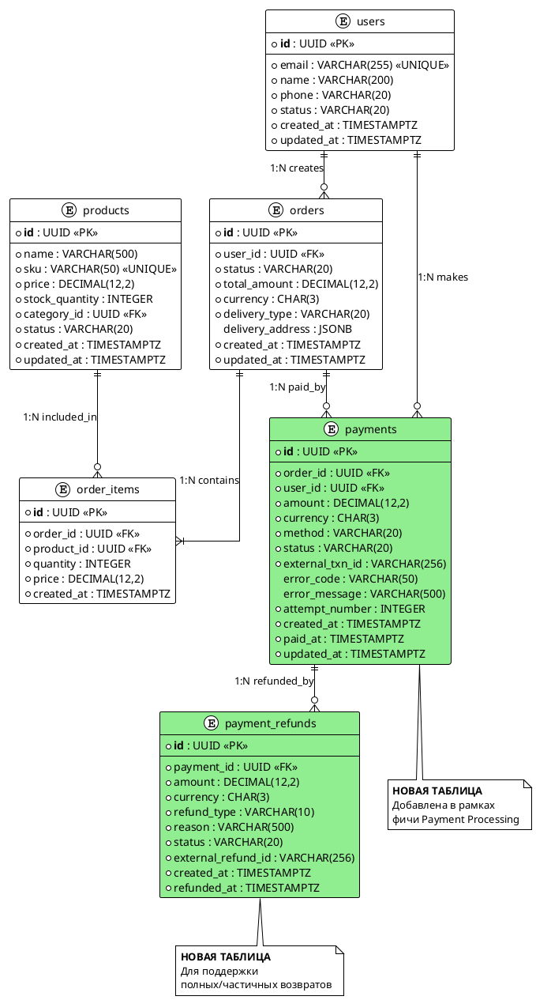

#### Пример: Изменения модели данных — добавление системы платежей (СТД-ДАНН-01-03, СТД-МИГР-01-03)

**Контекст изменения:**

| Элемент | Значение |
|---------|----------|
| Фича / изменение | Payment Processing — добавление платежей и возвратов к существующей модели заказов |
| Тип хранилища | Реляционное |
| СУБД / движок | PostgreSQL |
| Тип изменения | Новые сущности и связи с существующими users, orders, order_items, products |
| Связанные артефакты | Use Case оплаты заказа, интеграция с платёжным шлюзом |

**ER-диаграмма (СТД-ДАНН-01):**


**Новые сущности (СТД-ДАНН-02):**

Таблица: **payments**
| Атрибут | Тип | Nullable | Описание | Ограничения |
|---------|-----|----------|----------|-------------|
| id | UUID | NOT NULL | Уникальный идентификатор платежа | PK, DEFAULT gen_random_uuid() |
| order_id | UUID | NOT NULL | ID заказа | FK → orders.id, INDEX |
| user_id | UUID | NOT NULL | ID пользователя | FK → users.id, INDEX |
| amount | DECIMAL(12,2) | NOT NULL | Сумма платежа | CHECK (amount > 0) |
| currency | CHAR(3) | NOT NULL | Валюта ISO 4217 | CHECK (currency ~ '^[A-Z]{3}$') |
| method | VARCHAR(20) | NOT NULL | Способ оплаты | CHECK (method IN ('CARD','SBP','BANK_TRANSFER','WALLET')) |
| status | VARCHAR(20) | NOT NULL | Статус платежа | CHECK (status IN ('PENDING','AUTHORIZED','CAPTURED','FAILED','VOIDED')), INDEX |
| external_txn_id | VARCHAR(256) | NULL | ID транзакции платёжного шлюза | UNIQUE (если не NULL) |
| error_code | VARCHAR(50) | NULL | Код ошибки | — |
| error_message | VARCHAR(500) | NULL | Описание ошибки | — |
| attempt_number | INTEGER | NOT NULL | Номер попытки оплаты | DEFAULT 1, CHECK (BETWEEN 1 AND 10) |
| created_at | TIMESTAMPTZ | NOT NULL | Дата создания | DEFAULT now() |
| paid_at | TIMESTAMPTZ | NULL | Дата успешной оплаты | — |
| updated_at | TIMESTAMPTZ | NOT NULL | Дата обновления | DEFAULT now(), обновляется триггером |

Таблица: **payment_refunds**
| Атрибут | Тип | Nullable | Описание | Ограничения |
|---------|-----|----------|----------|-------------|
| id | UUID | NOT NULL | Уникальный идентификатор возврата | PK, DEFAULT gen_random_uuid() |
| payment_id | UUID | NOT NULL | ID платежа | FK → payments.id, INDEX |
| amount | DECIMAL(12,2) | NOT NULL | Сумма возврата | CHECK (amount > 0) |
| currency | CHAR(3) | NOT NULL | Валюта ISO 4217 | CHECK (currency ~ '^[A-Z]{3}$') |
| refund_type | VARCHAR(10) | NOT NULL | Тип возврата | CHECK (refund_type IN ('FULL','PARTIAL')) |
| reason | VARCHAR(500) | NOT NULL | Причина возврата | — |
| status | VARCHAR(20) | NOT NULL | Статус возврата | CHECK (status IN ('PENDING','COMPLETED','FAILED')) |
| external_refund_id | VARCHAR(256) | NULL | ID возврата от шлюза | UNIQUE (если не NULL) |
| created_at | TIMESTAMPTZ | NOT NULL | Дата создания | DEFAULT now() |
| refunded_at | TIMESTAMPTZ | NULL | Дата возврата | — |

**Связи между сущностями (СТД-ДАНН-03):**
| Сущность 1 | Сущность 2 | Тип связи | FK | Описание |
|------------|------------|-----------|-----|----------|
| users | orders | 1:N | orders.user_id → users.id | Пользователь создаёт заказы |
| orders | order_items | 1:N | order_items.order_id → orders.id | Заказ содержит позиции |
| products | order_items | 1:N | order_items.product_id → products.id | Товар входит в позиции |
| orders | payments | 1:N | payments.order_id → orders.id | Заказ оплачивается (может быть несколько попыток) |
| users | payments | 1:N | payments.user_id → users.id | Пользователь совершает платежи |
| payments | payment_refunds | 1:N | payment_refunds.payment_id → payments.id | Платёж может иметь возвраты |

**Сводные таблицы (junction):**

Не требуются: в данной фиче связи «многие ко многим» отсутствуют.

**Область изменения:**

| Категория | Элементы |
|-----------|----------|
| Новые сущности | payments, payment_refunds |
| Изменённые сущности | — |
| Удалённые / deprecated сущности | — |
| Затронутые связи | users → payments, orders → payments, payments → payment_refunds |
| Индексы и ограничения | idx_payments_order_id, idx_payments_user_id, idx_payments_status, idx_payments_external_txn (partial UNIQUE), idx_refunds_payment_id, idx_refunds_external (partial UNIQUE), CHECK на amount/currency/method/status/refund_type |

**Gaps и допущения:**

Gaps не выявлены

**Миграция V20260204_01 — Создание таблицы payments (СТД-МИГР-01):**
```sql
-- DDL: Создание таблицы
CREATE TABLE payments (
    id              UUID PRIMARY KEY DEFAULT gen_random_uuid(),
    order_id        UUID NOT NULL REFERENCES orders(id),
    user_id         UUID NOT NULL REFERENCES users(id),
    amount          DECIMAL(12,2) NOT NULL CHECK (amount > 0),
    currency        CHAR(3) NOT NULL CHECK (currency ~ '^[A-Z]{3}$'),
    method          VARCHAR(20) NOT NULL CHECK (method IN ('CARD','SBP','BANK_TRANSFER','WALLET')),
    status          VARCHAR(20) NOT NULL CHECK (status IN ('PENDING','AUTHORIZED','CAPTURED','FAILED','VOIDED')),
    external_txn_id VARCHAR(256),
    error_code      VARCHAR(50),
    error_message   VARCHAR(500),
    attempt_number  INTEGER NOT NULL DEFAULT 1 CHECK (attempt_number BETWEEN 1 AND 10),
    created_at      TIMESTAMPTZ NOT NULL DEFAULT now(),
    paid_at         TIMESTAMPTZ,
    updated_at      TIMESTAMPTZ NOT NULL DEFAULT now()
);

-- Индексы
CREATE INDEX idx_payments_order_id ON payments(order_id);
CREATE INDEX idx_payments_user_id ON payments(user_id);
CREATE INDEX idx_payments_status ON payments(status);
CREATE UNIQUE INDEX idx_payments_external_txn ON payments(external_txn_id) WHERE external_txn_id IS NOT NULL;

-- Триггер обновления updated_at
CREATE TRIGGER trg_payments_updated_at BEFORE UPDATE ON payments
    FOR EACH ROW EXECUTE FUNCTION update_updated_at();
```

**Миграция V20260204_02 — Создание таблицы payment_refunds:**
```sql
-- DDL: Создание таблицы
CREATE TABLE payment_refunds (
    id                UUID PRIMARY KEY DEFAULT gen_random_uuid(),
    payment_id        UUID NOT NULL REFERENCES payments(id),
    amount            DECIMAL(12,2) NOT NULL CHECK (amount > 0),
    currency          CHAR(3) NOT NULL CHECK (currency ~ '^[A-Z]{3}$'),
    refund_type       VARCHAR(10) NOT NULL CHECK (refund_type IN ('FULL','PARTIAL')),
    reason            VARCHAR(500) NOT NULL,
    status            VARCHAR(20) NOT NULL CHECK (status IN ('PENDING','COMPLETED','FAILED')),
    external_refund_id VARCHAR(256),
    created_at        TIMESTAMPTZ NOT NULL DEFAULT now(),
    refunded_at       TIMESTAMPTZ
);

-- Индексы
CREATE INDEX idx_refunds_payment_id ON payment_refunds(payment_id);
CREATE UNIQUE INDEX idx_refunds_external ON payment_refunds(external_refund_id) WHERE external_refund_id IS NOT NULL;
```

**Rollback скрипт (СТД-МИГР-03):**
```sql
-- Rollback V20260204_02
DROP TABLE IF EXISTS payment_refunds CASCADE;

-- Rollback V20260204_01
DROP TABLE IF EXISTS payments CASCADE;
```

**Порядок выполнения (СТД-МИГР-02):**
| № | Миграция | Описание | Зависимости |
|---|----------|----------|-------------|
| 1 | V20260204_01 | CREATE TABLE payments | orders, users уже существуют |
| 2 | V20260204_02 | CREATE TABLE payment_refunds | payments (V20260204_01) |
