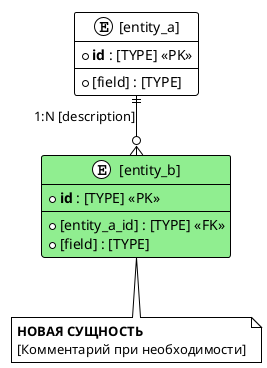

#### Модель данных — [Название фичи или изменения]

**Контекст изменения:**

| Элемент | Значение |
|---------|----------|
| Фича / изменение | [Краткое название изменения] |
| Тип хранилища | [Реляционное / документное / графовое / другое] |
| СУБД / движок | [PostgreSQL / Oracle / MongoDB / GAP-DATA-001] |
| Тип изменения | [Новые сущности / изменение сущностей / связи / ограничения] |
| Связанные артефакты | [Requirements / Use Case / Integration — ссылки или названия] |

**ER-диаграмма:**

**Новые и изменённые сущности:**

**Таблица: [entity_name]**

| Атрибут | Тип | Nullable | Описание | Ограничения |
|---------|-----|----------|----------|-------------|
| id | [TYPE] | NOT NULL | Уникальный идентификатор | PK, DEFAULT [value] |
| [field] | [TYPE] | [NULL / NOT NULL] | [Описание] | [FK / CHECK / INDEX / UNIQUE] |

**Связи между сущностями:**

| Сущность 1 | Сущность 2 | Тип связи | FK / Reference | Описание |
|------------|------------|-----------|----------------|----------|
| [Entity A] | [Entity B] | 1:N | [entity_b.a_id → entity_a.id] | [Смысл связи] |

**Сводные таблицы (junction):**

_Заполняется, если в фиче есть бизнес-связь «многие ко многим»._

**Таблица: [junction_table]**

| Атрибут | Тип | Nullable | Описание | Ограничения |
|---------|-----|----------|----------|-------------|
| id | [TYPE] | NOT NULL | Идентификатор связи | PK |
| [entity_a_id] | [TYPE] | NOT NULL | Ссылка на [Entity A] | FK → [entity_a.id] |
| [entity_b_id] | [TYPE] | NOT NULL | Ссылка на [Entity B] | FK → [entity_b.id] |
| [role_or_status] | [TYPE] | [NULL / NOT NULL] | Атрибут связи | [CHECK / INDEX] |

**Область изменения:**

| Категория | Элементы |
|-----------|----------|
| Новые сущности | [entity_b, junction_table] |
| Изменённые сущности | [entity_a — добавлено поле X] |
| Удалённые / deprecated сущности | [— или список] |
| Затронутые связи | [Entity A → Entity B] |
| Индексы и ограничения | [idx_entity_b_a_id, chk_status] |

**Gaps и допущения:**

| ID | Где найдено | Что неизвестно / что предположено | Как закрыть / подтвердить |
|----|-------------|-----------------------------------|---------------------------|
| GAP-DATA-001 | [Секция / поле] | [Точная формулировка пробела] | [Действие для закрытия] |
| ASM-DATA-001 | [Секция / поле] | [Предположение без явного подтверждения] | [Как подтвердить] |
| DESIGN-DATA-001 | [Секция / поле] | [Спроектировано по выбору «B) Спроектируй сам с нуля»] | [Review с DBA / PO] |
