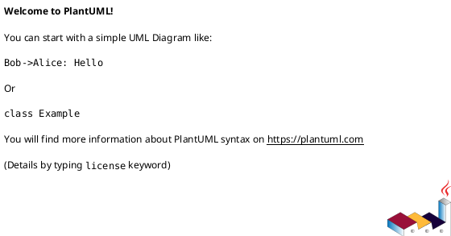
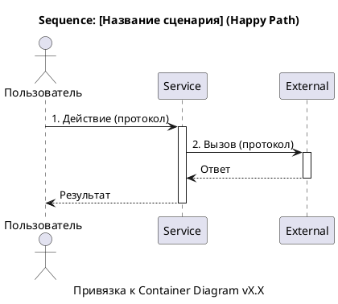
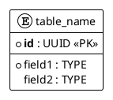

# Шаблон требований к разработке сервиса/приложения

> Версия 2.0 — маршрутизация по **standard kits** вместо прямых ссылок на `СТД-*`.
> Исходный канон: `standarts_features (3).md`. Заполнение разделов — через kits ниже.

## Маршрутизация разделов → kits

| Раздел шаблона | Kit | Entrypoint skill | Выходной артефакт |
|----------------|-----|------------------|-------------------|
| 1.1 Цель, BR, SMART | `requirements-standard-kit` | `requirements-standard-kit/skills/requirements-analysis/SKILL.md` | `01-Requirements/<feature>.md` |
| 1.2 / 1.3 Use Case AS IS / TO BE | `use-case-standard-kit` | `use-case-standard-kit/skills/use-case-analysis/SKILL.md` | `02-Use-Cases/<use-case>.md` |
| 1.2 / 1.3 / 3.2 Диаграммы процесса | `uml-diagram-standard-kit` | `uml-diagram-standard-kit/skills/uml-diagram-analysis/SKILL.md` | `03-Diagrams/<diagram>.md` |
| 2. Ограничения и допущения | `requirements-standard-kit` | `requirements-standard-kit/skills/requirements-analysis/SKILL.md` | внутри `01-Requirements/<feature>.md` |
| 3.1 C4 Container | — *(kit отсутствует)* | заполнить по `standarts_features (3).md` §3 | `03-Architecture/container.md` |
| 4.1 Синхронные интеграции | `integration-standard-kit` | `.cursor/skills/describe-integration/SKILL.md` | `04-Interfaces/<integration>.md` |
| 4.1.2 Асинхронные события | `integration-standard-kit` | `.cursor/skills/describe-integration/SKILL.md` | `04-Interfaces/<event>.md` |
| 4.2.2 Алгоритм / Use Case | `use-case-standard-kit` | `use-case-standard-kit/skills/use-case-analysis/SKILL.md` | `02-Use-Cases/<operation>.md` |
| 4.2.3 Модель данных | `data-standard-kit` | `.cursor/skills/describe-data-model/SKILL.md` | `05-Data/<feature>-data-model.md` |
| 5.1 Безопасность | `nfr-standard-kit` | `.cursor/skills/describe-nfr/SKILL.md` | `07-NFR/<feature>-security.md` |
| 5.2 Производительность | `nfr-standard-kit` | `.cursor/skills/describe-nfr/SKILL.md` | `07-NFR/<feature>-performance.md` |
| 5.2 Надёжность | `nfr-standard-kit` | `.cursor/skills/describe-nfr/SKILL.md` | `07-NFR/<feature>-reliability.md` |
| 5.3.1 Логирование | `observability-standard-kit` | `.cursor/skills/describe-observability/SKILL.md` | `08-Observability/<feature>-logging.md` |
| 5.3.2 Метрики | `observability-standard-kit` | `.cursor/skills/describe-observability/SKILL.md` | `08-Observability/<feature>-metrics.md` |
| 5.4 Конфигурация | `nfr-standard-kit` | `.cursor/skills/describe-nfr/SKILL.md` | `07-NFR/<feature>-configuration.md` |
| 5.5 Feature Toggles | `nfr-standard-kit` | `.cursor/skills/describe-nfr/SKILL.md` | `07-NFR/<feature>-feature-toggles.md` |

### Матрица протоколов интеграции (раздел 4.1)

| Протокол | Template | Spec | Example | Gate |
|----------|----------|------|---------|------|
| REST | `integration-standard-kit/templates/rest-endpoint.template.md` | `spec-kit/rest-api.schema.yaml` | `examples/rest-integration-example.md` | `quality-gates/rest-review.yaml` |
| gRPC | `templates/grpc-service.template.md` | `spec-kit/grpc-service.schema.yaml` | `examples/grpc-service-example.md` | `quality-gates/grpc-review.yaml` |
| GraphQL | `templates/graphql-operation.template.md` | `spec-kit/graphql-operation.schema.yaml` | `examples/graphql-operation-example.md` | `quality-gates/graphql-review.yaml` |
| SOAP | `templates/soap-operation.template.md` | `spec-kit/soap-operation.schema.yaml` | `examples/soap-operation-example.md` | `quality-gates/soap-review.yaml` |
| Async / Kafka | `templates/async-message.template.md` | `spec-kit/async-message.schema.yaml` | `examples/async-message-example.md` | `quality-gates/async-review.yaml` |
| Страница интеграции | `templates/integration-page.template.md` | `spec-kit/integration-page.schema.yaml` | — | `quality-gates/integration-review.yaml` |

### Матрица диаграмм UML (разделы 1.2, 1.3, 3.2)

| Тип диаграммы | Template | Spec | Example | Gate |
|---------------|----------|------|---------|------|
| Sequence | `uml-diagram-standard-kit/templates/sequence-diagram.template.md` | `spec-kit/sequence-diagram.schema.yaml` | `examples/sequence-diagram-example.md` | `quality-gates/sequence-diagram-review.yaml` |
| Activity | `templates/activity-diagram.template.md` | `spec-kit/activity-diagram.schema.yaml` | `examples/activity-diagram-example.md` | `quality-gates/activity-diagram-review.yaml` |
| State | `templates/state-diagram.template.md` | `spec-kit/state-diagram.schema.yaml` | `examples/state-diagram-example.md` | `quality-gates/state-diagram-review.yaml` |

---

## Контракт выходного документа (для `write_feature_doc`)

> **Важно для ассистента:** при `section_id=full` верни **один** Markdown-файл фичи.
> **Запрещено:** заголовки «Пакет методологии», «Раздел X | kit», служебные строки kits (`> **Kit`, `> **Skill`, `> **Покрывает стандарты`), пересказ tool, обёртка в ` ```markdown `.

### Обязательная структура (`section_id=full`)

Документ **обязан** содержать заголовки shablon **в этом порядке** (пропускай только разделы, явно не применимые к фиче):

```text
# [Название фичи]

## 1. Бизнес-требования
### 1.1. Цель
### 1.2. Процесс/Сервис AS IS      ← обязательно, если в brief есть «сейчас», миграция, текущая схема
### 1.3. Процесс/Сервис TO BE      ← обязательно

## 2. Ограничения и допущения

## 4. Функциональные требования
#### 4.1.2. Асинхронное событие [EventName]   ← при Kafka / async

## 5. Нефункциональные требования
#### 5.3.1. Требования к логированию
#### 5.3.2. Требования к мониторингу
```

### Обязательные блоки Use Case в `### 1.3. TO BE` (нельзя заменять одним абзацем)

| Блок | Обязательность |
|------|----------------|
| **Use Case TO BE** (таблица: Название, Акторы, Триггер, …) | **Да** |
| **Предусловия TO BE** | **Да** |
| **Постусловия TO BE** | **Да** |
| **Основной сценарий TO BE** (нумерованные шаги) | **Да** |
| **Альтернативные сценарии TO BE** (минимум 1) | **Да** |
| Изменения относительно AS IS | Желательно |
| Диаграмма TO BE (plantuml) | **Нет** — по желанию |

То же для `### 1.2. AS IS`: таблица Use Case + сценарии, диаграмма — по желанию.

---

## Основные определения

<!-- kit-section id="glossary" kit="none" source="standarts_features (3).md" std="СТД-ГЛОСС-01, СТД-ГЛОСС-02" -->

> **Kit:** отсутствует — заполнить вручную или вынести в `01-Requirements/<feature>.md` (глоссарий).
> **Источник стандарта:** `standarts_features (3).md` — СТД-ГЛОСС-01, СТД-ГЛОСС-02.

| Термин | Определение | Синонимы | Контекст использования |
|--------|-------------|----------|------------------------|
| Сервис | Контракт/метод взаимодействия, имеющий четкие входные и выходные параметры, правила валидации и описание поведения | | |
| Приложение | Конкретный деплоймент в OS, содержащий логику работы при старте и штатной работе, алгоритмы обработки данных | | |
| Многоблочка | Архитектура с распределенной обработкой данных между несколькими блоками/инстансами | | |

## Аббревиатуры и сокращения

<!-- kit-section id="abbreviations" kit="none" source="standarts_features (3).md" std="СТД-ГЛОСС-04" -->

> **Источник стандарта:** `standarts_features (3).md` — СТД-ГЛОСС-04.

| Сокращение | Определение |
|------------|-------------|
| БТ | Бизнес-требования |
| API | Application Programming Interface |
| OS | Operating System |
| REST | Representational State Transfer |
| gRPC | Google Remote Procedure Call |
| HTTP | Hypertext Transfer Protocol |

---

## 1. Бизнес-требования

### 1.1. Цель

<!-- kit-section id="1.1" kit="requirements-standard-kit"
     skill="requirements-standard-kit/skills/requirements-analysis/SKILL.md"
     template="requirements-standard-kit/templates/requirements-analysis.template.md"
     spec="requirements-standard-kit/spec-kit/requirements-analysis.schema.yaml"
     example="requirements-standard-kit/examples/operation-history-requirements-example.md"
     gate="requirements-standard-kit/quality-gates/requirements-review.yaml" -->

> **Kit:** `requirements-standard-kit`
> **Skill:** `requirements-standard-kit/skills/requirements-analysis/SKILL.md`
> **Template:** `templates/requirements-analysis.template.md`
> **Spec:** `spec-kit/requirements-analysis.schema.yaml`
> **Example:** `examples/operation-history-requirements-example.md`
> **Gate:** `quality-gates/requirements-review.yaml`
> **Покрывает стандарты:** СТД-ЦЕЛЬ-01/02, СТД-ВЫЯВ-01/02/03, СТД-ТРАСС-01.

**Какую бизнес-проблему решает:**
*[Описание]*

**Какую ценность приносит пользователю:**
*[Описание]*

**Какие метрики улучшает:**
*[Описание]*

**Источник требования:** *Интервью / Документ / Система*

**Стейкхолдеры:** *[Перечень]*

**Задача в Jira:** *[Ссылка]*

**SMART-цель:**

| Критерий | Описание |
|----------|----------|
| Specific | *[Конкретная цель]* |
| Measurable | *[Как измерить]* |
| Achievable | *[Достижимость]* |
| Relevant | *[Релевантность]* |
| Time-bound | *[Срок]* |

**Бизнес-правила и ограничения:**

| ID | Правило / Ограничение | Источник | Применяется к |
|----|----------------------|----------|---------------|
| BR-01 | | | |
| BR-02 | | | |

### 1.2. Процесс/Сервис AS IS

<!-- kit-section id="1.2-usecase" kit="use-case-standard-kit"
     skill="use-case-standard-kit/skills/use-case-analysis/SKILL.md"
     template="use-case-standard-kit/templates/use-case.template.md"
     spec="use-case-standard-kit/spec-kit/use-case.schema.yaml"
     example="use-case-standard-kit/examples/transfer-between-accounts-use-case-example.md"
     gate="use-case-standard-kit/quality-gates/use-case-review.yaml"
     variant="AS-IS"
     diagram_kit="uml-diagram-standard-kit" -->

> **Kit (Use Case):** `use-case-standard-kit` — вариант **AS IS**
> **Kit (диаграмма, опционально):** `uml-diagram-standard-kit`
> **Покрывает стандарты:** СТД-ASIS-00…06, СТД-UC-01/02, СТД-УСЛОВ-01/02, СТД-АЛГ-01–06, СТД-АЛЬТ-01–03.

**Как работает сейчас:**

> [1–3 предложения о текущем поведении системы / процесса]

**Use Case AS IS:**

| Элемент | Значение |
|---------|----------|
| Название | *[Глагол + существительное — цель актора]* |
| Актор(ы) | |
| Триггер | |
| Предусловия | См. таблицу предусловий ниже |
| Постусловия | См. таблицу постусловий ниже |
| Бизнес-правила | BR-01, BR-02 (см. раздел 1.1) |

**Предусловия AS IS:**

| № | Предусловие | Проверяемое условие |
|---|-------------|---------------------|
| 1 | | |

**Постусловия AS IS:**

| Исход | Постусловие |
|-------|-------------|
| Успех | |
| Неуспех (бизнес) | |
| Неуспех (техн.) | |

**Основной сценарий AS IS:**

```
Шаг 1:  [Актор/Система] [действие]
Шаг 2:  ...
```

**Альтернативные сценарии AS IS:**

```
1a. [Условие] (Тип: Бизнес-ошибки / Технические ошибки / Ошибки валидации):
  1a.1. ...
  1a.2. Возврат к шагу N / Сценарий завершается неуспешно
```

**Таблица проблем AS IS:**

| Проблема | Влияние на бизнес | Частота | Стоимость проблемы | Приоритет |
|----------|-------------------|---------|-------------------|-----------|
| | | | | |

**Диаграмма AS IS (желательно):**



### 1.3. Процесс/Сервис TO BE

<!-- kit-section id="1.3-usecase" kit="use-case-standard-kit"
     skill="use-case-standard-kit/skills/use-case-analysis/SKILL.md"
     template="use-case-standard-kit/templates/use-case.template.md"
     spec="use-case-standard-kit/spec-kit/use-case.schema.yaml"
     example="use-case-standard-kit/examples/transfer-between-accounts-use-case-example.md"
     gate="use-case-standard-kit/quality-gates/use-case-review.yaml"
     variant="TO-BE"
     diagram_kit="uml-diagram-standard-kit" -->

> **Kit (Use Case):** `use-case-standard-kit` — вариант **TO BE** — **обязательны таблица Use Case и сценарии**
> **Kit (диаграмма, опционально):** `uml-diagram-standard-kit`
> **Покрывает стандарты:** СТД-TOBE-00…06, СТД-UC-01/02, СТД-СВЯЗЬ-01–03.

**Целевое состояние:**

> [1–3 предложения — как процесс будет работать после доработки]

**Ключевые изменения:**
- *[Изменение 1]*
- *[Изменение 2]*

**Use Case TO BE:**

| Элемент | Значение |
|---------|----------|
| Название | *[Глагол + существительное — цель актора]* |
| Актор(ы) | |
| Триггер | |
| Предусловия | См. таблицу предусловий ниже |
| Постусловия | См. таблицу постусловий ниже |
| Бизнес-правила | BR-01, BR-02, ... (см. раздел 1.1) |

**Предусловия TO BE:**

| № | Предусловие | Проверяемое условие |
|---|-------------|---------------------|
| 1 | | |

**Постусловия TO BE:**

| Исход | Постусловие |
|-------|-------------|
| Успех | |
| Неуспех (бизнес) | |
| Неуспех (техн.) | |

**Бизнес-правила TO BE:**

| ID | Правило | Применяется на шаге |
|----|---------|---------------------|
| BR-01 | | |

**Основной сценарий TO BE:**

```
Шаг 1:  [Актор/Система] [действие]
          [BR-XX] Условие → иначе → Na
Шаг 2:  ...
```

**Альтернативные сценарии TO BE:**

```
1a. [Условие] [BR-XX] (Тип: Бизнес-ошибки / Технические ошибки / ...):
  1a.1. ...
  1a.2. Возврат к шагу N / Сценарий завершается неуспешно
```

**Связи между Use Cases:**

| Связь | Связанный Use Case | Шаг / Extension Point | Условие |
|-------|--------------------|-----------------------|---------|
| <<include>> | | | |
| <<extend>> | | | |

**Изменения относительно AS IS:**

| Шаг | Было (AS IS) | Стало (TO BE) | Тип (NEW / CHG / DEL) |
|-----|-------------|---------------|-----|
| | | | |

**Таблица преимуществ TO BE:**

| Преимущество | Метрика улучшения | Бизнес-эффект | Способ измерения |
|--------------|-------------------|---------------|------------------|
| | | | |

**Диаграмма TO BE (желательно):**

*[NEW] — зелёным, [CHG] — синим, [DEL] — серым/перечёркнутым. Можно оставить заглушку plantuml.*


---

## 2. Ограничения и допущения

<!-- kit-section id="2" kit="requirements-standard-kit"
     skill="requirements-standard-kit/skills/requirements-analysis/SKILL.md"
     note="constraints-and-assumptions subsection" -->

> **Kit:** `requirements-standard-kit` (подраздел ограничений и допущений)
> **Skill:** `requirements-standard-kit/skills/requirements-analysis/SKILL.md`

| Ограничение/допущение | Тип | Описание | Обоснование |
|----------------------|-----|----------|-------------|
| Совместимость с Java 11 | Техническое | Сервис должен работать на Java 11 | Корпоративный стандарт |
| Поддержка только REST | Техническое | Только REST API | Архитектурное решение |
| Максимум 1000 запросов/сек | Бизнес-ограничение | Ограничение по нагрузке | Планируемая нагрузка |

---

## 3. Архитектура

### 3.1. Архитектура сервиса

<!-- kit-section id="3.1" kit="none" source="standarts_features (3).md" std="СТД-КОМП-01–03, СТД-C4-01–08" gap="architecture-standard-kit" -->

> **Kit:** отсутствует *(GAP: `architecture-standard-kit` — планируется)*
> **Источник стандарта:** `standarts_features (3).md` — СТД-КОМП-01–03, СТД-C4-01–08.
> **Заполнение:** вручную или через tool с `doc_type=custom` + этот раздел шаблона.

**Затрагиваемые компоненты:**

| Компонент | Тип | Изменения | Владелец | Зависимости |
|-----------|-----|-----------|----------|-------------|
| | | | | |

**Архитектура:** *Монолит / Микросервисы / SOA*

**Принцип выделения сервиса (для микросервисов):** *[Bounded Context / ...]*

**Container-диаграмма C4:**

```plantuml
@startuml
!include https://raw.githubusercontent.com/plantuml-stdlib/C4-PlantUML/master/C4_Container.puml

title Container Diagram — [Название фичи]
caption Версия X.X | ГГГГ-ММ-ДД | [Команда]

Person(user, "Название", "Описание")

System_Boundary(boundary, "Название системы") {
    Container(svc, "Service Name", "Технология", "Описание")
    ContainerDb(db, "Database", "Технология", "Описание")
    ContainerQueue(queue, "Queue", "Технология", "Описание")
}

System_Ext(ext, "External System", "Описание")

Rel(user, svc, "Описание", "Протокол")
Rel(svc, db, "SQL", "JDBC")

SHOW_LEGEND()
@enduml
```

> Легенда обязательна. Технология указана для каждого контейнера. Стрелки подписаны протоколом.

### 3.2. Архитектура приложения

<!-- kit-section id="3.2" kit="uml-diagram-standard-kit"
     skill="uml-diagram-standard-kit/skills/uml-diagram-analysis/SKILL.md"
     template="uml-diagram-standard-kit/templates/sequence-diagram.template.md"
     spec="uml-diagram-standard-kit/spec-kit/sequence-diagram.schema.yaml"
     gate="uml-diagram-standard-kit/quality-gates/sequence-diagram-review.yaml"
     link="СТД-C4-06, СТД-SEQ-01–07" -->

> **Kit:** `uml-diagram-standard-kit` — Sequence Diagram, привязанная к Container-диаграмме
> **Template:** `templates/sequence-diagram.template.md`
> **Покрывает стандарты:** СТД-C4-06, СТД-SEQ-01–07.



### 3.3. Архитектура многоблочной обработки (при необходимости)

<!-- kit-section id="3.3" kit="none" source="standarts_features (3).md" optional="true" -->

> **Kit:** отсутствует — описать вручную при многоблочной архитектуре.

*Описание распределения обработки между несколькими блоками/инстансами.*

**Пример для многоблочной архитектуры:**
1. **Блок A**: Прием и валидация запросов
2. **Блок B**: Обработка бизнес-логики
3. **Блок C**: Взаимодействие с внешними системами
4. **Блок D**: Формирование ответа и кэширование

---

## 4. Функциональные требования

### 4.1. Сервисы (контракты взаимодействия)

#### 4.1.1. Сервис [Название сервиса]

<!-- kit-section id="4.1.1" kit="integration-standard-kit"
     skill=".cursor/skills/describe-integration/SKILL.md"
     kit_skill="integration-standard-kit/skills/integration-analysis/SKILL.md"
     page_template="integration-standard-kit/templates/integration-page.template.md"
     page_spec="integration-standard-kit/spec-kit/integration-page.schema.yaml"
     page_gate="integration-standard-kit/quality-gates/integration-review.yaml"
     protocol_select="REST|gRPC|GraphQL|SOAP" -->

> **Kit:** `integration-standard-kit`
> **Entrypoint:** `.cursor/skills/describe-integration/SKILL.md`
> **Kit skill:** `integration-standard-kit/skills/integration-analysis/SKILL.md`
> **Выбор протокола → template/spec/gate:** см. матрицу протоколов в начале документа.
> **Покрывает стандарты:** СТД-ИНТ-01, СТД-СИНХ-ПАР-*, СТД-ЗАГОЛ-*, СТД-ПРИМ-*, СТД-REST-03, СТД-API-DOC-04.

**Общая информация:**

| Параметр | Значение |
|----------|----------|
| Назначение | |
| Система-источник | |
| Система-получатель | |
| Тип интеграции | Синхронная / Асинхронная |
| Протокол | REST (HTTPS) / gRPC (HTTP/2) / GraphQL / SOAP / Kafka |
| Направление | Однонаправленная / Двунаправленная |
| Версия API | |
| Аутентификация | Bearer Token (JWT) / WS-Security / ... |
| Формат данных | JSON / Protobuf / XML |
| Rate Limit | |
| Timeout | |
| Retry Policy | |

**Метод:** `[HTTP метод] /api/v1/[путь]`

**Request Headers:**

| Заголовок | Обязат. | Описание | Пример |
|-----------|---------|----------|--------|
| Authorization | Да | Bearer JWT токен | Bearer eyJ... |
| Accept | Да | Ожидаемый формат | application/json |
| X-Request-ID | Да | UUID для трассировки | 550e8400-... |

**Входящие параметры:**

| Параметр | Тип | Формат | Обязательность | Описание | Валидация | По умолч. | Пример |
|----------|-----|--------|----------------|----------|-----------|-----------|--------|
| param1 | string | UUID | Обязательно | Идентификатор | minLength: 36, maxLength: 36, format: uuid | — | 550e8400-... |
| param2 | integer | int32 | Опционально | Количество | min: 1, max: 100 | 20 | 50 |

**Условия обязательности (при наличии):**

| Параметр | Условие обязательности |
|----------|------------------------|
| | |

**ENUM (при наличии):**

| Значение | Описание | Когда использовать |
|----------|----------|-------------------|
| | | |

**Пример запроса:**

```json
{
  "param1": "123e4567-e89b-12d3-a456-426614174000",
  "param2": 50
}
```

**Response Headers:**

| Заголовок | Описание | Пример |
|-----------|----------|--------|
| X-Request-ID | Echo request ID | 550e8400-... |

**Исходящие параметры:**

| Параметр | Тип | Формат | Nullable | Описание | Валидация | По умолч. | Пример | Маппинг |
|----------|-----|--------|----------|----------|-----------|-----------|--------|---------|
| result | array | object | Нет | Результат обработки | minItems: 0 | [] | [...] | — |
| status | string | enum | Нет | Статус выполнения | enum: [SUCCESS, ERROR] | — | SUCCESS | — |
| timestamp | string | ISO 8601 | Нет | Время ответа | format: date-time | — | 2026-02-04T10:30:00Z | — |

**Пример ответа:**

```json
{
  "result": [{"id": "item1", "processed": true}],
  "status": "SUCCESS",
  "timestamp": "2026-02-04T10:30:00Z"
}
```

**Пограничный случай: Пустой результат:**

```json
{
  "result": [],
  "status": "SUCCESS",
  "timestamp": "2026-02-04T10:30:00Z"
}
```

**Коды ошибок:**

| Код HTTP | Код ошибки | Описание | Условие возникновения |
|----------|------------|----------|-----------------------|
| 400 | VALIDATION_ERROR | Ошибка валидации | Невалидные входные параметры |
| 401 | UNAUTHORIZED | Требуется аутентификация | Отсутствует/невалидный токен |
| 403 | FORBIDDEN | Нет прав доступа | Нет доступа к ресурсу |
| 404 | NOT_FOUND | Ресурс не найден | Запрашиваемые данные отсутствуют |
| 422 | BUSINESS_ERROR | Бизнес-ошибка | Нарушение бизнес-правила |
| 429 | RATE_LIMIT_EXCEEDED | Превышен лимит запросов | Rate limit |
| 500 | INTERNAL_ERROR | Внутренняя ошибка | Сбой в обработке |
| 503 | SERVICE_UNAVAILABLE | Сервис недоступен | Зависимость недоступна |

**JSON Schema запроса / ответа:**

```json
{
  "$schema": "http://json-schema.org/draft-07/schema#",
  "title": "",
  "type": "object",
  "required": [],
  "properties": {}
}
```

#### 4.1.2. Асинхронное событие [EventName] (при наличии Kafka / RabbitMQ)

<!-- kit-section id="4.1.2" kit="integration-standard-kit"
     skill=".cursor/skills/describe-integration/SKILL.md"
     template="integration-standard-kit/templates/async-message.template.md"
     spec="integration-standard-kit/spec-kit/async-message.schema.yaml"
     example="integration-standard-kit/examples/async-message-example.md"
     gate="integration-standard-kit/quality-gates/async-review.yaml" -->

> **Kit:** `integration-standard-kit` — домен **Async / event**
> **Template:** `templates/async-message.template.md`
> **Покрывает стандарты:** СТД-ИНТ-01, СТД-АСИНХ-01…10, СТД-АСИНХ-ЗАГОЛ-01.

**Общая информация:**

| Параметр | Значение |
|----------|----------|
| Назначение | |
| Topic / Queue | |
| Partition Key | |
| Retention | |
| Гарантия доставки | At-least-once / At-most-once / Exactly-once |
| Формат сериализации | JSON (Schema Registry) / Avro |

**Consumer информация:**

| Consumer | Consumer Group | Retry Policy | DLQ Topic | Идемпотентность |
|----------|---------------|--------------|-----------|-----------------|
| | | | | |

**Kafka Headers:**

| Header Key | Обязат. | Описание | Пример |
|------------|---------|----------|--------|
| X-Message-Id | Да | UUID сообщения | |
| X-Correlation-Id | Да | ID для трассировки | |
| X-Event-Type | Да | Тип события | |
| X-Schema-Version | Да | Версия схемы | |
| X-Source | Да | Сервис-источник | |
| content-type | Да | Формат | application/json |

**Параметры payload:**

| Параметр | Тип | Обязат. | Описание | Валидация | Пример | Маппинг |
|----------|-----|---------|----------|-----------|--------|---------|
| | | | | | | |

**Пример сообщения:**

```json
{
  "metadata": {
    "messageId": "",
    "correlationId": "",
    "timestamp": "",
    "eventType": "",
    "version": "1.0",
    "source": ""
  },
  "payload": {}
}
```

### 4.2. Приложение (логика работы)

#### 4.2.1. Алгоритм работы при старте

<!-- kit-section id="4.2.1" kit="none" source="standarts_features (3).md" optional="true" -->

> **Kit:** отсутствует — описать последовательность старта приложения вручную.

*Описание последовательности действий при запуске приложения*

1. **Инициализация конфигурации** — загрузка ConfigMap, валидация, логгер
2. **Подключение к зависимостям** — БД, кэш, внешние сервисы
3. **Запуск обработчиков** — HTTP, планировщик, health-check

#### 4.2.2. Алгоритм обработки запроса [Название операции]

<!-- kit-section id="4.2.2" kit="use-case-standard-kit"
     skill="use-case-standard-kit/skills/use-case-analysis/SKILL.md"
     template="use-case-standard-kit/templates/use-case.template.md"
     note="если Use Case не описан в 1.2/1.3" -->

> **Kit:** `use-case-standard-kit`
> **Применять:** если Use Case не описан в разделах 1.2 / 1.3.

| Элемент | Значение |
|---------|----------|
| Название | *[Глагол + существительное — цель актора]* |
| Актор(ы) | |
| Триггер | |
| Предусловия | |
| Постусловия | |
| Бизнес-правила | |

**Основной сценарий — Happy Path:**

```
Шаг 1:  [Актор/Система] [действие]
          [BR-XX] Условие → иначе → Na
Шаг 2:  ...
```

**Альтернативные сценарии:**

```
1a. [Условие] [BR-XX] (Тип: Ошибки валидации / Бизнес-ошибки / Технические ошибки / Пограничные случаи):
  1a.1. [Действие]
  1a.2. Возврат к шагу N / Сценарий завершается неуспешно
```

#### 4.2.3. Модель данных (при изменении БД)

<!-- kit-section id="4.2.3" kit="data-standard-kit"
     skill=".cursor/skills/describe-data-model/SKILL.md"
     kit_skill="data-standard-kit/skills/data-model-analysis/SKILL.md"
     template="data-standard-kit/templates/data-model.template.md"
     spec="data-standard-kit/spec-kit/data-model.schema.yaml"
     example="data-standard-kit/examples/payment-processing-data-model-example.md"
     gate="data-standard-kit/quality-gates/data-model-review.yaml" -->

> **Kit:** `data-standard-kit`
> **Entrypoint:** `.cursor/skills/describe-data-model/SKILL.md`
> **Покрывает стандарты:** СТД-ДАНН-01–04, СТД-МИГР-01–03, СТД-МАП-01–03.

**ER-диаграмма:**



**Описание сущностей:**

| Атрибут | Тип | Nullable | Описание | Ограничения |
|---------|-----|----------|----------|-------------|
| id | UUID | NOT NULL | Уникальный идентификатор | PK, DEFAULT gen_random_uuid() |

**Связи:**

| Сущность 1 | Сущность 2 | Тип связи | FK | Описание |
|------------|------------|-----------|-----|----------|
| | | 1:N | | |

**Миграции:**

```sql
-- DDL
CREATE TABLE table_name (...);

-- Rollback
DROP TABLE IF EXISTS table_name CASCADE;
```

**Data Mapping:**

| Источник | Поле источника | Тип | Назначение | Поле назначения | Тип | Правило преобразования |
|----------|----------------|-----|------------|-----------------|-----|------------------------|
| | | | | | | |

#### 4.2.4. Изменения в алгоритме (для доработок)

<!-- kit-section id="4.2.4" kit="none" optional="true" -->

> **Kit:** отсутствует — таблица изменений при доработке существующей логики.

| Изменение | Область | Описание | Ссылка на предыдущую версию |
|-----------|---------|----------|-----------------------------|
| | | | |

---

## 5. Нефункциональные требования

<!-- kit-section id="5" kit="nfr-standard-kit"
     skill=".cursor/skills/describe-nfr/SKILL.md"
     kit_skill="nfr-standard-kit/skills/nfr-analysis/SKILL.md"
     clarification_template="nfr-standard-kit/templates/nfr-clarification-questionnaire.template.md"
     clarification_spec="nfr-standard-kit/spec-kit/nfr-clarification.schema.yaml"
     umbrella_gate="nfr-standard-kit/quality-gates/nfr-review.yaml"
     clarification_gate="NFR-GATE-000" -->

> **Kit (umbrella):** `nfr-standard-kit`
> **Entrypoint:** `.cursor/skills/describe-nfr/SKILL.md`
> **Clarification-first:** перед финальными таблицами — `templates/nfr-clarification-questionnaire.template.md`
> **Общий gate:** `quality-gates/nfr-review.yaml`

### 5.1. Требования безопасности

<!-- kit-section id="5.1" kit="nfr-standard-kit" domain="security"
     template="nfr-standard-kit/templates/security.template.md"
     spec="nfr-standard-kit/spec-kit/security.schema.yaml"
     gate="nfr-standard-kit/quality-gates/security-review.yaml"
     example="none" -->

> **Kit:** `nfr-standard-kit` — домен **security**
> **Template:** `templates/security.template.md` *(эталонного example нет)*

| Требование | Описание | Метод реализации |
|------------|----------|------------------|
| Аутентификация | OAuth 2.0 | API Gateway |
| Авторизация | RBAC | Внутренние проверки |
| Шифрование данных | TLS 1.2+ | На уровне инфраструктуры |
| Чувствительные данные | *[Какие данные, способ защиты]* | Шифрование / Маскирование |

### 5.2. Требования надежности и производительности

#### Время отклика

<!-- kit-section id="5.2-performance" kit="nfr-standard-kit" domain="performance"
     template="nfr-standard-kit/templates/performance.template.md"
     spec="nfr-standard-kit/spec-kit/performance.schema.yaml"
     example="nfr-standard-kit/examples/account-transfer-performance-example.md"
     gate="nfr-standard-kit/quality-gates/performance-review.yaml" -->

> **Kit:** `nfr-standard-kit` — домен **performance**

| Endpoint / Операция | p85 | Условия измерения | Критичность |
|---------------------|-----|-------------------|-------------|
| | | | |

#### Пропускная способность

| Endpoint / Очередь | Штатная (RPS) | Пиковая (RPS) | Множитель | Продолжительность пика |
|---------------------|---------------|---------------|-----------|------------------------|
| | | | | |

#### Время обработки транзакций

| Транзакция | SLA (85-й перцентиль) | Включает | Таймаут клиента / HTTP |
|------------|----------------------|----------|------------------------|
| | | | |

*Для распределённых транзакций (Saga):*

| Шаг | Сервис | Ожидаемое время | Step Timeout (макс.) | Компенсация |
|-----|--------|----------------|---------------------|-------------|
| | | | | |
| **Global Timeout** | | | | **Полный rollback** |

#### Время загрузки страниц (при наличии UI)

| Экран | LCP | FID | CLS | TTI |
|-------|-----|-----|-----|-----|
| | | | | |

#### Одновременные пользователи и управление нагрузкой

| Параметр | Значение |
|----------|----------|
| Максимум CCU | |
| Максимум сессий на пользователя | |
| Поведение при превышении лимита | |

| Механизм | Параметры | Применение |
|----------|-----------|------------|
| Rate Limiting | | |
| Throttling | | |
| Circuit Breaker | | |
| Bulkhead | | |

#### Производительность БД

| Запрос / Операция | Тип | Макс. время | Объём данных | Требуемые индексы |
|-------------------|-----|-------------|-------------|-------------------|
| | | | | |

| Параметр пула | Значение | Обоснование |
|---------------|----------|-------------|
| Pool size | | |
| Таймаут получения соединения | | |

#### Кэширование

| Ресурс / Ключ кэша | Уровень кэша | TTL | Стратегия инвалидации | Макс. размер | Поведение при промахе |
|---------------------|-------------|-----|----------------------|-------------|----------------------|
| | L1/L2/L3/L4 | | TTL / Event-driven / Write-through / Cache-aside | | |

#### Надёжность

<!-- kit-section id="5.2-reliability" kit="nfr-standard-kit" domain="reliability"
     template="nfr-standard-kit/templates/reliability.template.md"
     spec="nfr-standard-kit/spec-kit/reliability.schema.yaml"
     example="nfr-standard-kit/examples/account-transfer-reliability-example.md"
     gate="nfr-standard-kit/quality-gates/reliability-review.yaml" -->

> **Kit:** `nfr-standard-kit` — домен **reliability**

**SLA/SLO:**

| Метрика | SLO | Описание |
|---------|-----|----------|
| Availability | | |
| Error rate | | |
| Latency p85 | | |

**Graceful Degradation:**

| Зависимость | Поведение при отказе | Fallback |
|-------------|---------------------|----------|
| | | |

### 5.3. Требования к логированию и мониторингу

<!-- kit-section id="5.3" kit="observability-standard-kit"
     skill=".cursor/skills/describe-observability/SKILL.md"
     kit_skill="observability-standard-kit/skills/observability-analysis/SKILL.md"
     clarification_template="observability-standard-kit/templates/observability-clarification-questionnaire.template.md"
     clarification_gate="OBS-GATE-000" -->

> **Kit:** `observability-standard-kit`
> **Entrypoint:** `.cursor/skills/describe-observability/SKILL.md`
> **Clarification-first:** `templates/observability-clarification-questionnaire.template.md`
> **Выход:** `08-Observability/<feature>-logging.md` + `<feature>-metrics.md`

#### 5.3.1. Требования к логированию

<!-- kit-section id="5.3.1" kit="observability-standard-kit" domain="logging"
     template="observability-standard-kit/templates/logging.template.md"
     spec="observability-standard-kit/spec-kit/logging.schema.yaml"
     example="observability-standard-kit/examples/account-transfer-logging-example.md"
     gate="observability-standard-kit/quality-gates/logging-review.yaml" -->

> **Kit:** `observability-standard-kit` — домен **logging**

**Таблица событий:**

| Журнал | Уровень | Логируемые параметры | Правила инициализации события |
|--------|---------|---------------------|-------------------------------|
| Интеграционный | INFO | `eventType`, `callType` = IN/OUT, `exSystem` | При запросе / ответе |
| Системный | ERROR | | |
| Бизнес | INFO | | |

**Структура лога:**

```json
{
  "@timestamp": "<ISO 8601>",
  "eventType": "<EVENT_TYPE>",
  "callType": "<IN | OUT>",
  "callid": "<trace-id (UUID)>",
  "exSystem": "<external-system>",
  "rqStr": "<request-body-as-string>",
  "rsStr": "<response-body-as-string>",
  "level": "<INFO | WARN | ERROR | DEBUG>",
  "message": "<message>"
}
```

**Структура полей — автоматические / прикладные:**

| Атрибут | Описание | Обязательность | Источник |
|---------|----------|----------------|----------|
| `@timestamp` | Дата-время | Да | Фреймворк |
| `callid` | ID трассировки | Да | Генерируется при входящем запросе |
| `eventType` | Код события | Да | Код сервиса |
| `rqStr` / `rsStr` | Тело запроса / ответа AS IS | Да (для вызовов) | Из тела запроса/ответа |

#### 5.3.2. Требования к мониторингу

<!-- kit-section id="5.3.2" kit="observability-standard-kit" domain="metrics"
     template="observability-standard-kit/templates/metrics.template.md"
     spec="observability-standard-kit/spec-kit/metrics.schema.yaml"
     example="observability-standard-kit/examples/account-transfer-metrics-example.md"
     gate="observability-standard-kit/quality-gates/metrics-review.yaml" -->

> **Kit:** `observability-standard-kit` — домен **metrics**

**Технические метрики:**

| Название метрики (Prometheus) | Тип | Описание | Labels |
|-------------------------------|-----|----------|--------|
| `<service>_requests_total` | Counter | Общее количество запросов | method, endpoint, status |
| `<service>_request_duration_seconds` | Histogram | Время обработки запроса | method, endpoint |

**Метрики ошибок / бизнес-метрики / фронтенд:**

| Название метрики | Тип | Описание |
|-----------------|-----|----------|
| | | |

### 5.4. Требования к настройкам

<!-- kit-section id="5.4" kit="nfr-standard-kit" domain="configuration"
     template="nfr-standard-kit/templates/configuration.template.md"
     spec="nfr-standard-kit/spec-kit/configuration.schema.yaml"
     example="nfr-standard-kit/examples/account-transfer-configuration-example.md"
     gate="nfr-standard-kit/quality-gates/configuration-review.yaml" -->

> **Kit:** `nfr-standard-kit` — домен **configuration**

#### Конфигурационные параметры

| Параметр | Тип | Уровень | Частота | Область | Хранение | По умолчанию | Описание | Валидация | Влияние при изменении | Процедура отката |
|----------|-----|---------|---------|---------|----------|-------------|----------|-----------|----------------------|------------------|
| `db.pool.size` | integer | internal | static | env | ConfigMap | 10 | Размер пула соединений | min: 5, max: 50 | Увеличение → больше соединений к БД | rollout restart |
| `api.timeout.ms` | integer | public | dynamic | global | ConfigMap | 5000 | Таймаут API в мс | min: 100, max: 60000 | Влияет на время ожидания клиентов | Предыдущее значение |
| `feature.xxx.enabled` | boolean | public | runtime | env | БД | false | Флаг функциональности | true / false | ON/OFF функционала | false в БД |

### 5.5. Требования к сопровождению

#### Feature Toggles (при наличии)

<!-- kit-section id="5.5" kit="nfr-standard-kit" domain="feature-toggles"
     template="nfr-standard-kit/templates/feature-toggles.template.md"
     spec="nfr-standard-kit/spec-kit/feature-toggles.schema.yaml"
     example="nfr-standard-kit/examples/account-transfer-feature-toggles-example.md"
     gate="nfr-standard-kit/quality-gates/feature-toggles-review.yaml" -->

> **Kit:** `nfr-standard-kit` — домен **feature-toggles**

**Toggle: [Название]**

| Параметр | Значение |
|----------|----------|
| Название (ключ) | `feature.<domain>.<name>.enabled` |
| Описание | |
| Тип | Release / Experiment / Ops / Permission |
| Значение по умолчанию | true / false |
| Стратегия раскатки | Boolean / Percentage rollout / User segment / Canary |

**Поведение:**

| Состояние | Поведение | UI | API |
|-----------|----------|-----|-----|
| ON | | | |
| OFF | | | |

**Зависимости:**

| Тогл | Зависит от | Тип | Описание |
|------|-----------|-----|----------|
| | | requires / conflicts / includes | |

**План удаления / чек-лист верификации:**

| Метрика | Порог (OK) | Порог (Rollback) | Источник | Период наблюдения |
|---------|------------|------------------|----------|-------------------|
| Error rate | | | | |
| Latency p85 | | | | |

| Требование | Описание | Ответственный |
|------------|----------|---------------|
| Документация API | OpenAPI 3.0 спецификация | Разработчик |
| Health-check эндпоинты | `/health`, `/ready`, `/live` | Разработчик |
| Метрики для алертинга | Ключевые метрики в Prometheus | Разработчик |
| Процедура деплоя / отката | Описание процесса обновления | DevOps |

---

## 6. Ссылки

<!-- kit-section id="6" kit="none" -->

1. [Стандарты REST для МП](ссылка)
2. [Стандарты gRPC](ссылка)
3. [Реестр микросервисов](ссылка)
4. [Требования по надежности (Backend)](ссылка)
5. [Концепции сквозного логирования](ссылка)
6. [OpenAPI спецификация](ссылка)
7. [Схема базы данных](ссылка)

---

## Приложения

### Приложение A: Схемы данных

*JSON Schema, диаграммы БД — артефакты из `data-standard-kit` и `integration-standard-kit`.*

### Приложение B: Версионирование

<!-- kit-section id="appendix-b" kit="none" source="standarts_features (3).md" std="СТД-ВЕРС-01" -->

| Версия | Дата | Автор | Изменения |
|--------|------|-------|-----------|
| 2.0 | ГГГГ-ММ-ДД | [ФИО] | Маршрутизация по standard kits |
| 1.0 | ГГГГ-ММ-ДД | [ФИО] | Первоначальная версия (СТД-*) |

### Приложение C: Реестр метрик

*Полный список — артефакт из `observability-standard-kit` (metrics).*

| Название метрики | Тип | Описание | Tags | Ответственный |
|------------------|-----|----------|------|---------------|
| `business_operation_success` | Counter | Успешные бизнес-операции | `operation_type` | Команда X |

---

*Документ утвержден:*
- Аналитик: ____________________
- Разработчик: _________________
- Архитектор: __________________
- Тестировщик: _________________
