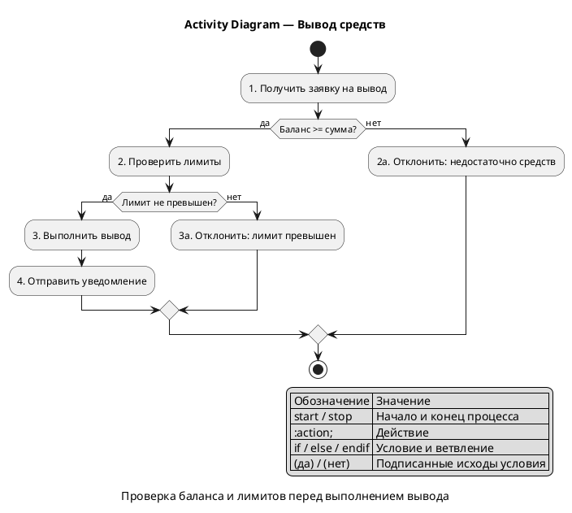
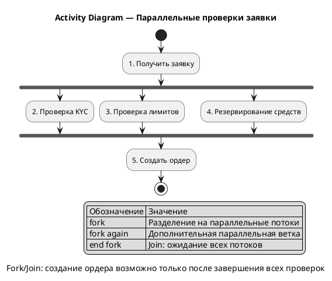
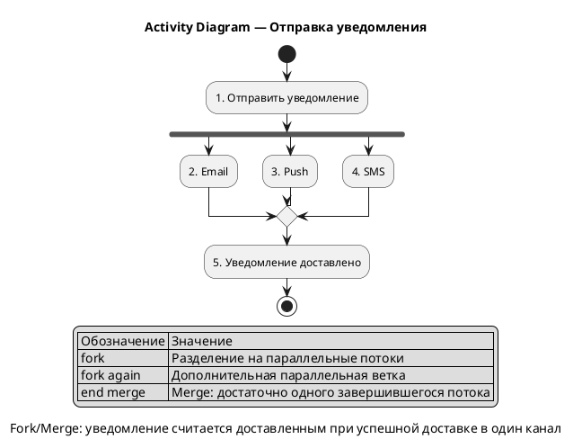

#### Activity Diagram — Вывод средств

Канонические примеры Activity Diagram из `standarts_features (3).md`: базовый процесс, процесс с условиями и варианты параллельного выполнения.

**Назначение:**

Диаграммы показывают алгоритм обработки заявки на вывод средств: проверку баланса, проверку лимитов, успешный вывод и отклонения.

**Действия и условия:**

| № | Действие / условие | Ответственный | Описание в тексте |
|---|---|---|---|
| 1 | Получить заявку на вывод | Система | Старт обработки заявки |
| 2 | Баланс >= сумма? | Система | Проверка достаточности средств |
| 3 | Проверить лимиты | Система | Проверка лимитов операции |
| 4 | Лимит не превышен? | Система | Ветвление по лимиту |
| 5 | Выполнить вывод | Система | Успешное выполнение |
| 6 | Отправить уведомление | Система | Уведомление клиента |

**PlantUML: Activity Diagram с условиями**

**PlantUML: Fork/Join — все потоки должны завершиться**

**PlantUML: Fork/Merge — достаточно одного потока**

**Легенда:**

| Обозначение | Значение |
|---|---|
| `start` | Начало процесса |
| `stop` | Конец процесса |
| `:Действие;` | Шаг процесса |
| `if / else / endif` | Условие и ветвление |
| `fork / end fork` | Параллельные потоки с ожиданием всех веток |
| `end merge` | Объединение без ожидания всех потоков |

**Соответствие тексту:**

| Элемент на диаграмме | Номер | Описание в тексте |
|---|---|---|
| `Получить заявку на вывод` | 1 | Старт обработки заявки |
| `Баланс >= сумма?` | 2 | Проверка достаточности средств |
| `Проверить лимиты` | 3 | Проверка лимитов |
| `Выполнить вывод` | 5 | Успешный исход |

**Gaps и допущения:**

| ID | Тип | Где найдено | Описание | Как закрыть |
|---|---|---|---|---|
| - | - | - | Gaps не выявлены | - |
