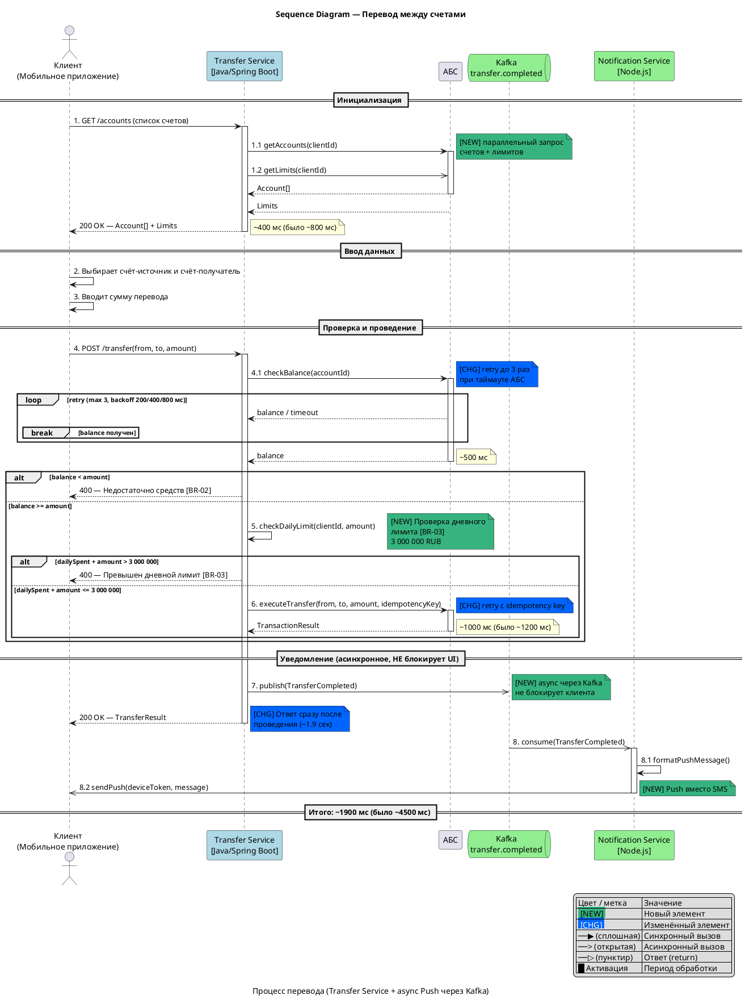

#### Sequence Diagram — Перевод между счетами

Канонический пример Sequence Diagram из `standarts_features (3).md`: процесс перевода между счетами с синхронными вызовами, асинхронной публикацией события, retry-фрагментом, ветвлениями и легендой.

**Назначение:**

Диаграмма показывает целевой процесс перевода: клиент вызывает Transfer Service, сервис проверяет данные через АБС, публикует событие в Kafka и не блокирует UI на отправке уведомления.

**Участники:**

| Участник | Тип | Роль |
|---|---|---|
| `Client` | actor | Клиент в мобильном приложении |
| `Transfer` | participant | Transfer Service |
| `ABS` | participant | Автоматизированная банковская система |
| `Kafka` | queue | Topic `transfer.completed` |
| `Notify` | participant | Notification Service |

**PlantUML:**

**Легенда:**

| Обозначение | Значение |
|---|---|
| `->` | Синхронный вызов |
| `->>` | Асинхронный вызов |
| `-->` | Ответ / return |
| `++` / `--` | Activation start / end |
| `[NEW]` | Новый элемент |
| `[CHG]` | Измененный элемент |

**Соответствие тексту:**

| Элемент на диаграмме | Номер | Описание в тексте |
|---|---|---|
| `GET /accounts` | 1 | Получение счетов клиента |
| `POST /transfer` | 4 | Инициация перевода |
| `checkDailyLimit` | 5 | Проверка дневного лимита |
| `executeTransfer` | 6 | Проведение перевода |
| `publish(TransferCompleted)` | 7 | Публикация события об успешном переводе |
| `consume(TransferCompleted)` | 8 | Асинхронная обработка уведомления |

**Gaps и допущения:**

| ID | Тип | Где найдено | Описание | Как закрыть |
|---|---|---|---|---|
| - | - | - | Gaps не выявлены | - |
