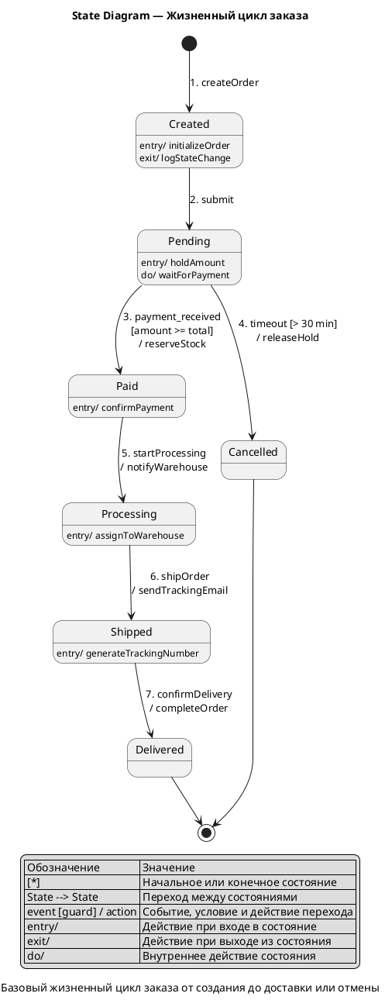
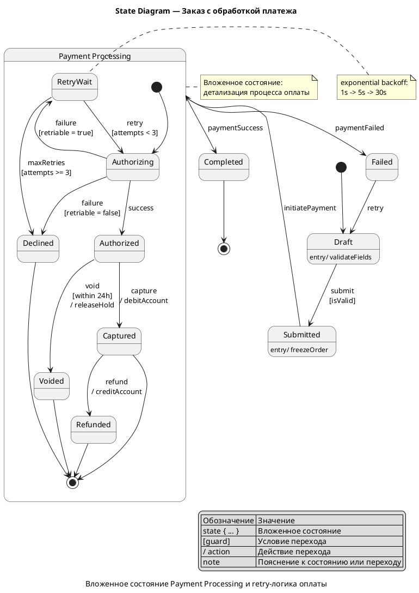
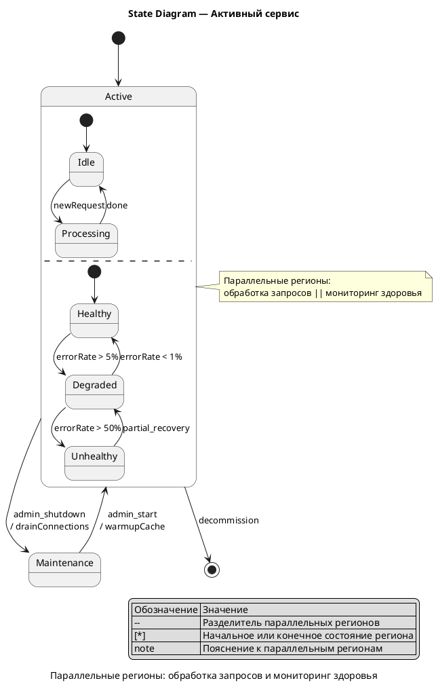

#### State Diagram — Жизненный цикл заказа

Канонические примеры State Diagram из `standarts_features (3).md`: базовый жизненный цикл заказа, вложенные состояния платежа и параллельные регионы.

**Назначение:**

Диаграммы показывают состояния заказа, события переходов, guards, transition actions, entry/exit/do actions, вложенные состояния и параллельные регионы.

**Состояния и переходы:**

| № | Состояние / переход | Событие | Guard | Действие |
|---|---|---|---|---|
| 1 | `[*] -> Created` | `createOrder` | - | - |
| 2 | `Created -> Pending` | `submit` | - | - |
| 3 | `Pending -> Paid` | `payment_received` | `[amount >= total]` | `reserveStock` |
| 4 | `Pending -> Cancelled` | `timeout` | `[> 30 min]` | `releaseHold` |
| 5 | `Paid -> Processing` | `startProcessing` | - | `notifyWarehouse` |

**PlantUML: Базовая State Diagram**

**PlantUML: State Diagram с вложенными состояниями и guard**

**PlantUML: State Diagram с параллельными состояниями**

**Легенда:**

| Обозначение | Значение |
|---|---|
| `[*]` | Начальное или конечное состояние |
| `State --> State` | Переход |
| `event [guard] / action` | Событие, условие и действие перехода |
| `entry/`, `exit/`, `do/` | Действия состояния |
| `state { ... }` | Вложенное состояние |
| `--` | Разделитель параллельных регионов |

**Соответствие тексту:**

| Элемент на диаграмме | Номер | Описание в тексте |
|---|---|---|
| `Created -> Pending` | 2 | Заказ отправлен в обработку |
| `Pending -> Paid` | 3 | Платеж получен и сумма достаточна |
| `Pending -> Cancelled` | 4 | Истекло время ожидания платежа |
| `Paid -> Processing` | 5 | Старт обработки заказа |

**Gaps и допущения:**

| ID | Тип | Где найдено | Описание | Как закрыть |
|---|---|---|---|---|
| - | - | - | Gaps не выявлены | - |
