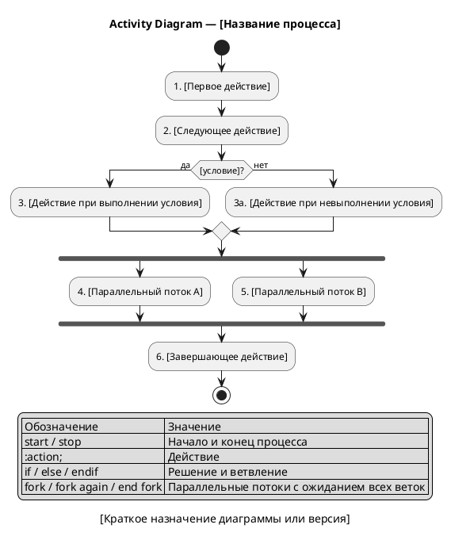

#### Activity Diagram — [Название процесса]

**Назначение:**

[Кратко описать процесс или алгоритм, который показывает диаграмма.]

**Действия и условия:**

| № | Действие / условие | Ответственный | Описание в тексте |
|---|---|---|---|
| 1 | [Действие] | [Актор/система] | [Ссылка на шаг] |
| 2 | [Условие] | [Актор/система] | [Ссылка на ветвление] |

**PlantUML:**

**Легенда:**

| Обозначение | Значение |
|---|---|
| `start` | Начало процесса |
| `stop` | Конец процесса |
| `:Действие;` | Шаг процесса |
| `if / else / endif` | Условие и ветвление |
| `fork / end fork` | Параллельные потоки с синхронизацией |
| `end merge` | Объединение, когда достаточно одного потока |

**Соответствие тексту:**

| Элемент на диаграмме | Номер | Описание в тексте |
|---|---|---|
| `[Первое действие]` | 1 | [Ссылка на шаг текстового описания] |

**Gaps и допущения:**

| ID | Тип | Где найдено | Описание | Как закрыть |
|---|---|---|---|---|
| GAP-UML-001 | Gap | [Действия / Условия / PlantUML] | [Какой информации не хватает] | [Что нужно уточнить] |
| ASM-UML-001 | Assumption | [Действия / Условия / PlantUML] | [Что агент предположил] | [Как подтвердить] |
