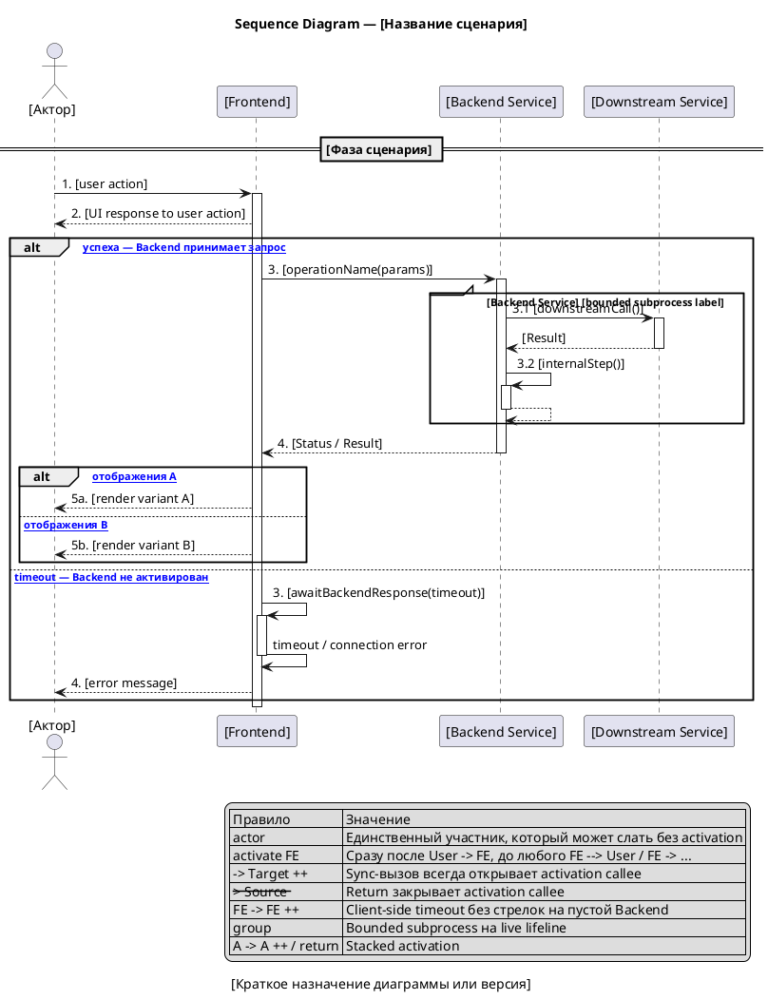

#### Sequence Diagram — [Название сценария]

**Назначение:**

[Кратко описать, какой сценарий взаимодействия показывает диаграмма.]

**Участники:**

| Участник | Тип | Роль |
|---|---|---|
| `[Actor]` | actor | [Внешний пользователь или система] |
| `[Service]` | participant | [Сервис или компонент] |
| `[Queue]` | queue | [Очередь или topic, если есть] |

**PlantUML:**

**Легенда:**

| Обозначение | Значение |
|---|---|
| `->` | Синхронный вызов (между participant только с `++` на callee) |
| `->>` | Асинхронный вызов |
| `-->` | Ответ / return (с `--` при закрытии callee) |
| `++` / `--` | Activation start / end на callee |
| `activate` / `deactivate` | Явное открытие/закрытие lifeline Frontend на scope обработки |
| `actor` | Может инициировать сообщение без activation bar |
| `participant` | Должен быть live на каждой исходящей/входящей sync-стрелке |
| `alt` / `else` | Все operands согласованы по activation state на merge-point |
| `group` | Bounded subprocess внутри live lifeline |
| `FE -> FE ++` | Client-side timeout/retry без стрелок на пустой Backend |

**Соответствие тексту:**

| Элемент на диаграмме | Номер | Описание в тексте |
|---|---|---|
| `[operationName(params)]` | 1 | [Ссылка на шаг текстового описания] |

**Gaps и допущения:**

| ID | Тип | Где найдено | Описание | Как закрыть |
|---|---|---|---|---|
| GAP-UML-001 | Gap | [Участники / PlantUML / Соответствие тексту] | [Какой информации не хватает] | [Что нужно уточнить] |
| ASM-UML-001 | Assumption | [Участники / PlantUML / Соответствие тексту] | [Что агент предположил] | [Как подтвердить] |
