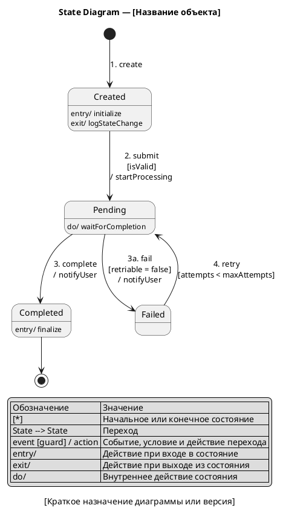

#### State Diagram — [Название объекта]

**Назначение:**

[Кратко описать объект, сущность или процесс, жизненный цикл которого показывает диаграмма.]

**Состояния и переходы:**

| № | Состояние / переход | Событие | Guard | Действие |
|---|---|---|---|---|
| 1 | `[State A] -> [State B]` | `[event]` | `[condition]` | `[action]` |

**PlantUML:**

**Легенда:**

| Обозначение | Значение |
|---|---|
| `[*]` | Начальное или конечное состояние |
| `State --> State` | Переход между состояниями |
| `event [guard] / action` | Событие, условие и действие перехода |
| `entry/` | Действие при входе в состояние |
| `exit/` | Действие при выходе из состояния |
| `do/` | Внутреннее действие состояния |

**Соответствие тексту:**

| Элемент на диаграмме | Номер | Описание в тексте |
|---|---|---|
| `Created --> Pending` | 2 | [Ссылка на описание события или бизнес-правила] |

**Gaps и допущения:**

| ID | Тип | Где найдено | Описание | Как закрыть |
|---|---|---|---|---|
| GAP-UML-001 | Gap | [Состояния / Переходы / PlantUML] | [Какой информации не хватает] | [Что нужно уточнить] |
| ASM-UML-001 | Assumption | [Состояния / Переходы / PlantUML] | [Что агент предположил] | [Как подтвердить] |
